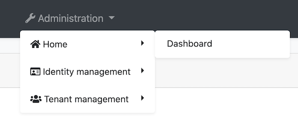
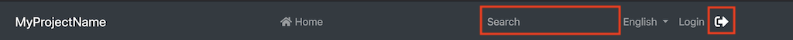

# Modifying the Menu

The menu is inside the `ApplicationLayoutComponent` in the @abp/ng.theme.basic package. There are several methods for modifying the menu elements. This document covers these methods. If you would like to replace the menu completely, please refer to [Component Replacement documentation](./Component-Replacement.md) and learn how to replace a layout.


## How to Add a Logo

The `logoUrl` property in the environment variables is the url of the logo. 

You can add your logo to `src/assets` folder and set the `logoUrl` as shown below:

```js
export const environment = {
  // other configurations
  application: {
    name: 'MyProjectName',
    logoUrl: 'assets/logo.png',
  },
  // other configurations
};
```

## How to Add a Navigation Element

### Via `RoutesService`

You can add routes to the menu by calling the `add` method of `RoutesService`. It is a singleton service, i.e. provided in root, so you can inject and use it immediately.

```js
import { RoutesService, eLayoutType } from '@abp/ng.core';
import { Component } from '@angular/core';

@Component(/* component metadata */)
export class AppComponent {
  constructor(routes: RoutesService) {
    routes.add([
      {
        path: '/your-path',
        name: 'Your navigation',
        order: 101,
        iconClass: 'fas fa-question-circle',
        requiredPolicy: 'permission key here',
        layout: eLayoutType.application,
      },
      {
        path: '/your-path/child',
        name: 'Your child navigation',
        parentName: 'Your navigation',
        order: 1,
        requiredPolicy: 'permission key here',
      },
    ]);
  }
}
```

An alternative and probably cleaner way is to use a route provider. First create a provider:

```js
// route.provider.ts
import { RoutesService, eLayoutType } from '@abp/ng.core';
import { APP_INITIALIZER } from '@angular/core';

export const APP_ROUTE_PROVIDER = [
  { provide: APP_INITIALIZER, useFactory: configureRoutes, deps: [RoutesService], multi: true },
];

function configureRoutes(routes: RoutesService) {
  return () => {
    routes.add([
      {
        path: '/your-path',
        name: 'Your navigation',
        requiredPolicy: 'permission key here',
        order: 101,
        iconClass: 'fas fa-question-circle',
        layout: eLayoutType.application,
      },
      {
        path: '/your-path/child',
        name: 'Your child navigation',
        parentName: 'Your navigation',
        requiredPolicy: 'permission key here',
        order: 1,
      },
    ]);
  };
}
```

...and then in app.module.ts...

```js
import { NgModule } from '@angular/core';
import { APP_ROUTE_PROVIDER } from './route.provider';

@NgModule({
  providers: [APP_ROUTE_PROVIDER],
  // imports, declarations, and bootstrap
})
export class AppModule {}
```

Here is what every property works as:

- `path` is the absolute path of the navigation element.
- `name` is the label of the navigation element. A localization key or a localization object can be passed.
- `parentName` is a reference to the `name` of the parent route in the menu and is used for creating multi-level menu items.
- `requiredPolicy` is the permission key to access the page. See the [Permission Management document](./Permission-Management.md)
- `order` is the order of the navigation element. "Administration" has an order of `100`, so keep that in mind when ordering top level menu items.
- `iconClass` is the class of the `i` tag, which is placed to the left of the navigation label.
- `layout` defines in which layout the route will be loaded. (default: `eLayoutType.empty`)
- `invisible` makes the item invisible in the menu. (default: `false`)

### Via `routes` Property in `AppRoutingModule`

You can define your routes by adding `routes` as a child property to `data` property of a route configuration in the `app-routing.module`. The `@abp/ng.core` package organizes your routes and stores them in the `RoutesService`.

You can add the `routes` property like below:

```js
{
  path: 'your-path',
  data: {
    routes: {
      name: 'Your navigation',
      order: 101,
      iconClass: 'fas fa-question-circle',
      requiredPolicy: 'permission key here',
      children: [
        {
          path: 'child',
          name: 'Your child navigation',
          order: 1,
          requiredPolicy: 'permission key here',
        },
      ],
    },
  },
}
```

Alternatively, you can do this:

```js
{
  path: 'your-path',
  data: {
    routes: [
      {
        path: '/your-path',
        name: 'Your navigation',
        order: 101,
        iconClass: 'fas fa-question-circle',
        requiredPolicy: 'permission key here',
      },
      {
        path: '/your-path/child',
        name: 'Your child navigation',
        parentName: 'Your navigation',
        order: 1,
        requiredPolicy: 'permission key here',
      },
    ] as ABP.Route[], // can be imported from @abp/ng.core
  },
}
```

The advantage of the second method is that you are not bound to the parent/child structure and use any paths you like.

After adding the `routes` property as described above, the navigation menu looks like this:


## How to Patch or Remove a Navigation Element

The `patch` method of `RoutesService` finds a route by its name and replaces its configuration with the new configuration passed as the second parameter. Similarly, `remove` method finds a route and removes it along with its children.

```js
// this.routes is instance of RoutesService
// eThemeSharedRouteNames enum can be imported from @abp/ng.theme.shared

const dashboardRouteConfig: ABP.Route = {
  path: '/dashboard',
  name: '::Menu:Dashboard',
  parentName: '::Menu:Home',
  order: 1,
  layout: eLayoutType.application,
};

const newHomeRouteConfig: Partial<ABP.Route> = {
  iconClass: 'fas fa-home',
  parentName: eThemeSharedRouteNames.Administration,
  order: 0,
};

this.routes.add([dashboardRouteConfig]);
this.routes.patch('::Menu:Home', newHomeRouteConfig);
this.routes.remove(['Your navigation']);
```

- Moved the _Home_ navigation under the _Administration_ dropdown based on given `parentName`.
- Added an icon to _Home_.
- Specified the order and made _Home_ the first item in list.
- Added a route named _Dashboard_ as a child of _Home_.
- Removed _Your navigation_ along with its child route.

After the operations above, the new menu looks like below:




## How to Add an Element to Right Part of the Menu

You can add elements to the right part of the menu by calling the `addItems` method of `NavItemsService`. It is a singleton service, i.e. provided in root, so you can inject and use it immediately.

```js
import { NavItemsService } from '@abp/ng.theme.shared';
import { Component } from '@angular/core';

@Component({
  template: `
    <input type="search" placeholder="Search" class="bg-transparent border-0 color-white" />
  `,
})
export class MySearchInputComponent {}


@Component(/* component metadata */)
export class AppComponent {
  constructor(private navItems: NavItemsService) {
    navItems.addItems([
      {
        id: 'MySearchInput',
        order: 1,
        component: MySearchInputComponent,
      },
      {
        id: 'SignOutIcon',
        html: '<i class="fas fa-sign-out-alt fa-lg text-white m-2"><i>',
        action: () => console.log('Clicked the sign out icon'),
        order: 101, // puts as last element
      },
    ]);
  }
}
```

This inserts a search input and a sign out icon to the menu. The final UI looks like below:



> The default elements have an order of `100`. If you want to place a custom element before the defaults, assign an order number up to `99`. If you want to place a custom element after the defaults, assign orders starting from `101`. Finally, if you must place an item between the defaults, patch the default element orders as described below. A warning though: We may add another default element in the future and it too will have an order number of `100`.

## How to Patch or Remove an Right Part Element

The `patchItem` method of `NavItemsService` finds an element by its `id` property and replaces its configuration with the new configuration passed as the second parameter. Similarly, `removeItem` method finds an element and removes it.

```js
export class AppComponent {
  constructor(private navItems: NavItemsService) {
    navItems.patchItem(eThemeBasicComponents.Languages, {
      requiredPolicy: 'new policy here',
      order: 1,
    });

    navItems.removeItem(eThemeBasicComponents.CurrentUser);
  }
}
```

* Patched the languages dropdown element with new `requiredPolicy` and new `order`.
* Removed the current user dropdown element.
