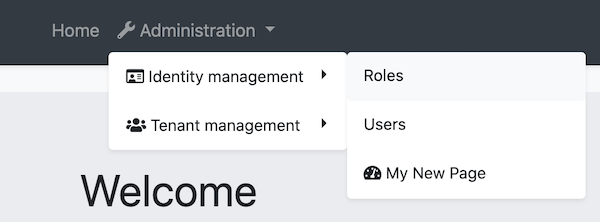

# Modifying the Menu

The menu is inside the `ApplicationLayoutComponent` in the @abp/ng.theme.basic package. There are several methods for modifying the menu elements. This document covers these methods. If you would like to replace the menu completely, please refer to [Component Replacement documentation](./Component-Replacement.md) and learn how to replace a layout.


<!-- TODO: Replace layout replacement document with component replacement. Layout replacement document will be created.-->


## How to Add a Logo

The `logoUrl` property in the environment variables is the url of the logo. 

You can add your logo to `src/assets` folder and set the `logoUrl` as shown below:

```js
export const environment = {
  // other configurations
  application: {
    name: 'MyProjectName',
    logoUrl: 'assets/logo.png',
  },
  // other configurations
};
```

## How to Add a Navigation Element

### Via `routes` Property in `AppRoutingModule`

You can define your routes by adding `routes` as a child property to `data` property of a route configuration in the `app-routing.module`. The `@abp/ng.core` package organizes your routes and stores them in the `ConfigState`. `ApplicationLayoutComponent` gets routes from store and displays them on the menu.

You can add the `routes` property like below:

```js
{
  path: 'your-path',
  data: {
    routes: {
      name: 'Your navigation',
      order: 3,
      iconClass: 'fas fa-question-circle',
      requiredPolicy: 'permission key here',
      children: [
        {
          path: 'child',
          name: 'Your child navigation',
          order: 1,
          requiredPolicy: 'permission key here',
        },
      ],
    } as ABP.Route, // can be imported from @abp/ng.core
  }
}
```

- `name` is the label of the navigation element. A localization key or a localization object can be passed.
- `order` is the order of the navigation element.
- `iconClass` is the class of the `i` tag, which is placed to the left of the navigation label.
- `requiredPolicy` is the permission key to access the page. See the [Permission Management document](./Permission-Management.md)
- `children` is an array and is used for declaring child navigation elements. The child navigation element will be placed as a child route which will be available at `'/your-path/child'` based on the given `path` property.

After adding the `routes` property as described above, the navigation menu looks like this:


## Via ConfigState

The `dispatchAddRoute` method of `ConfigStateService` adds a new navigation element to the menu.

```js
// this.config is instance of ConfigStateService

const newRoute: ABP.Route = {
  name: 'My New Page',
  iconClass: 'fa fa-dashboard',
  path: 'page',
  invisible: false,
  order: 2,
  requiredPolicy: 'MyProjectName.MyNewPage',
} as Omit<ABP.Route, 'children'>;

this.config.dispatchAddRoute(newRoute);
// returns a state stream which emits after dispatch action is complete
```

The `newRoute` will be placed as at root level, i.e. without any parent routes, and its url will be stored as `'/path'`.

If you want **to add a child route, you can do this:**

```js
// this.config is instance of ConfigStateService
// eIdentityRouteNames enum can be imported from @abp/ng.identity

const newRoute: ABP.Route = {
  parentName: eIdentityRouteNames.IdentityManagement,
  name: 'My New Page',
  iconClass: 'fa fa-dashboard',
  path: 'page',
  invisible: false,
  order: 3,
  requiredPolicy: 'MyProjectName.MyNewPage'
} as Omit<ABP.Route, 'children'>;

this.config.dispatchAddRoute(newRoute);
// returns a state stream which emits after dispatch action is complete
```

The `newRoute` will then be placed as a child of the parent route named `eIdentityRouteNames.IdentityManagement` and its url will be set as `'/identity/page'`.

The new route will be added like below:



## How to Patch a Navigation Element

The `dispatchPatchRouteByName` method finds a route by its name and replaces its configuration in the store with the new configuration passed as the second parameter.

```js
// this.config is instance of ConfigStateService
// eIdentityRouteNames enum can be imported from @abp/ng.identity

const newRouteConfig: Partial<ABP.Route> = {
  iconClass: 'fas fa-home',
  parentName: eIdentityRouteNames.Administration,
  order: 0,
  children: [
    {
      name: 'Dashboard',
      path: 'dashboard',
    },
  ],
};

this.config.dispatchPatchRouteByName('::Menu:Home', newRouteConfig);
// returns a state stream which emits after dispatch action is complete
```

* Moved the _Home_ navigation under the _Administration_ dropdown based on given `parentName`.
* Added an icon.
* Specified the order.
* Added a child route named _Dashboard_.

After the patch above, navigation elements looks like below:


## How to Add an Element to Right Part of the Menu

The right part elements are stored in the `LayoutState` that is in the @abp/ng.theme.basic package.

The `dispatchAddNavigationElement` method of the `LayoutStateService` adds an element to the right part of the menu. 

You can insert an element by adding your template to `app.component` and calling the `dispatchAddNavigationElement` method:

```js
import { Layout, LayoutStateService } from '@abp/ng.theme.basic'; // added this line

@Component({
  selector: 'app-root',
  template: `
  
    <!-- Added below content -->
    <ng-template #search
      ><input type="search" placeholder="Search" class="bg-transparent border-0"
    /></ng-template>
  `,
})
export class AppComponent {
  // Added ViewChild
  @ViewChild('search', { static: false, read: TemplateRef }) searchElementRef: TemplateRef<any>;

  constructor(private layout: LayoutStateService) {} // injected LayoutStateService

  // Added ngAfterViewInit
  ngAfterViewInit() {
    const newElement = {
      name: 'Search',
      element: this.searchElementRef,
      order: 1,
    } as Layout.NavigationElement;

    this.layout.dispatchAddNavigationElement(newElement);
  }
}
```

This inserts a search input to the menu. The final UI looks like below:


## How to Remove an Element From Right Part of the Menu

TODO


## What's Next

* [Component Replacement](./Component-Replacement.md)
