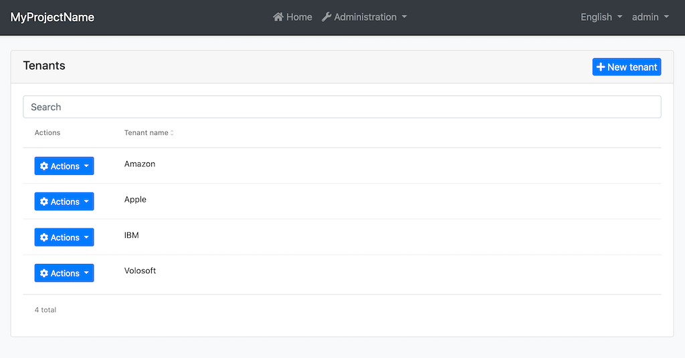
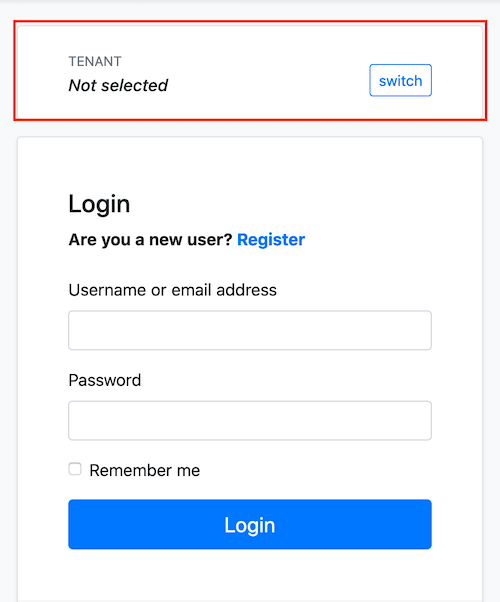

# Multi-Tenancy in Angular UI

ABP Angular UI supports the multi-tenancy. The following features related to multi-tenancy are available in the startup templates.



<p style="font-size:small;text-align:center;">Tenants page</p>

On the page above, you can;

- See all tenants.
- Create a new tenant.
- Edit an existing tenant.
- Delete a tenant.



<p style="font-size:small;text-align:center;">Tenant Switching Component</p>

You can switch between existing tenants by using the tenant switching box in the child pages of the MVC Account Public Module (like Login page). Angular UI gets selected tenant from `application-configuration` response and sends the tenant id to the backend as `__tenant` header on each request.

## Domain/Subdomain Tenant Resolver

> **Note:** If you are going to implement the steps below, you should also implement the domain/subdomain tenant resolver feature for the backend. See the [Domain/Subdomain Tenant Resolver section in Multi-Tenancy document](../../Multi-Tenancy#domain-subdomain-tenant-resolver) to learn the backend implementation.

Angular UI can get the tenant name from the app running URL. You can determine the current tenant by subdomain (like mytenant1.mydomain.com) or by the whole domain (like mytenant.com). To do this, you need to set the `application.baseUrl` property in the environment:

Subdomain resolver:

```js
// environment.prod.ts

export const environment = {
  //...
  application: {
    baseUrl: "https://{0}.mydomain.com/",
  },
  //...
};
```

**{0}** is the placeholder to determine current tenant's unique name.

After the configuration above, if your app runs on the `mytenant1.mydomain.com`, the app will get the tenant name as **mytenant1**. Then, the app will call the `/api/abp/multi-tenancy/tenants/by-name/mytenant1` endpoint to check if the tenant exists. If the tenant (mytenant1) exists, the app will keep this tenant data and send its `id` as `__tenant` header to the backend on each request. If the tenant does not exist, the app will not send `__tenant` header to the backend.

> **Important Note:** If you define the `baseUrl` with the placeholder (**{0}**), the tenant switching component in the child pages of the `AccountLayoutComponent` (like Login page) will be hidden.

Domain resolver:

```js
// environment.prod.ts

export const environment = {
  //...
  application: {
    baseUrl: "https://{0}.com/",
  },
  //...
};
```

After the configuration above, if your app runs on the `mytenant.com`, the app will get the tenant name as **mytenant**.

### Tenant Specific Remote Endpoints

The **{0}** placeholder can be put to the API URLs in the environment to determine tenant specific endpoints.

```js
// environment.prod.ts

export const environment = {
  //...
  application: {
    baseUrl: "https://{0}.mydomain.com/",
    //...
  },
  oAuthConfig: {
    issuer: "https://{0}.ids.mydomain.com",
    //...
  },
  apis: {
    default: {
      url: "https://{0}.api.mydomain.com",
    },
    AbpIdentity: {
      url: "https://{0}.identity.mydomain.com",
    },
  },
};
```

> **Important Note:** The `application.baseUrl` and the `{0}` placeholder in the value of the `baseUrl` property are required to be able to get tenant from running URL. Other placeholders in API URLs are optional.

After the configuration above, if your app runs on the `mytenant1.mydomain.com`, the app will get tenant name as **mytenant1** and replace the environment object in `EnvironmentService` on app initialization as follows:

```js
// environment object in EnvironmentService

{
  //...
  application: {
    baseUrl: 'https://mytenant1.mydomain.com/',
    //...
  },
  oAuthConfig: {
    issuer: 'https://mytenant1.ids.mydomain.com',
    //...
  },
  apis: {
    default: {
      url: 'https://mytenant1.api.mydomain.com',
    },
    AbpIdentity: {
      url: 'https://mytenant1.identity.mydomain.com',
    },
  },
}
```

After this replacement, the app will use the following URLs:

- `https://mytenant1.ids.mydomain.com` as IdentityServer URL.
- `https://mytenant1.api.mydomain.com` as default URL.
- `https://mytenant1.identity.mydomain.com` as `AbpIdentity` remote endpoint URL.

The app sends the `__tenant` header that contains the current tenant id on each request.

## See Also

- [Multi Tenancy in ABP](../../Multi-Tenancy.md)
