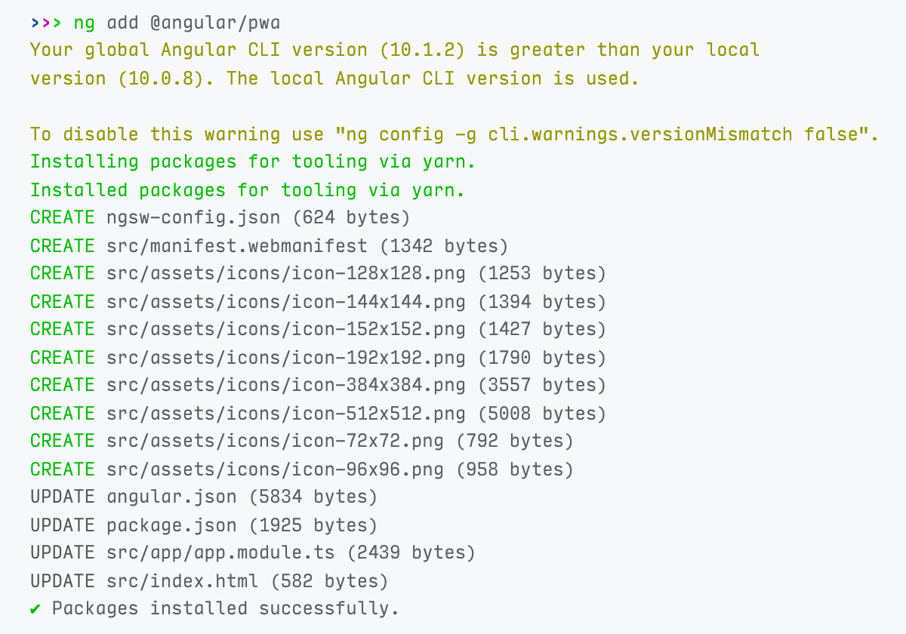

# PWA Configuration

[Progressive Web Apps](https://web.dev/progressive-web-apps/) are web applications which, although not as integrated to the OS as a native app, can take advantage of native features. They can be discovered via search engines, installed on devices with a single tap or click, and shared via a regular link. They also can work offline and get updates when new content is available.

Converting your Angular application to a PWA is easy.

## 1. Install Angular PWA

Run the following command in the root folder of your Angular application:

```shell
yarn ng add @angular/pwa
```

...or...

```shell
npm run ng add @angular/pwa
```

This will install the `@angular/service-worker` package and make your default app a PWA. Alternatively, you may add `project` parameter to target a specific app in your workspace:

```shell
yarn ng add @angular/pwa --project MyProjectName
```

Here is the output of the command:



So, Angular CLI updates some files and add a few others:

- **ngsw-config.json** is where the [service worker configuration](https://angular.io/guide/service-worker-config) is placed. Not all PWAs have this file. It is specific to Angular.
- **manifest.webmanifest** is a [web app manifest](https://developer.mozilla.org/en-US/docs/Web/Manifest) and provides information about your app in JSON format.
- **icons** are placeholder icons that are referred to in your web app manifest. We will replace these in a minute.
- **angular.json** has following modifications:
  - `assets` include _manifest.webmanifest_.
  - `serviceWorker` is `true` in production build.
  - `ngswConfigPath` refers to _ngsw-config.json_.
- **package.json** has _@angular/service-worker_ as a new dependency.
- **app.module.ts** imports `ServiceWorkerModule` and registers a service worker filename.
- **index.html** has following modifications:
  - A `<link>` element that refers to _manifest.webmanifest_.
  - A `<meta>` tag that sets a theme color.

## 2. Update the Web App Manifest

### 2.1. Set the Name of Your App

The `name` and the `short_name` properties in the generated manifest are derived from your project name. Let's change them.

Open the _manifest.webmanifest_ file and update `name` and `short_name` props:

```json
{
  /* rest of the manifest meta data */
  "short_name": "My Project",
  "name": "My Project: My Catch-Phrase"
}
```

The short name must be really short because it will be displayed on anywhere with limited space, like the launcher and the home screen.

### 2.2. Add a Description

The `@angular/pwa` schematic we just added does not insert a description to your manifest file, but, according to [web app manifest standards](https://www.w3.org/TR/appmanifest/#description-member), you should.

So, open the _manifest.webmanifest_ file and place the description as seen below:

```json
{
  /* rest of the manifest meta data */
  "description": "My short project description giving a slightly better idea about my app"
}
```

As a bonus, providing a description [along with other criteria](https://docs.microsoft.com/en-us/microsoft-edge/progressive-web-apps-edgehtml/microsoft-store#criteria-for-automatic-submission) helps Bing web crawler to index your app and automatically submit your app to Microsoft Store in `.appx` format.

### 2.3. Set App Colors

Angular generates the manifest file with a default `theme_color` and `background_color`. Change these according to your brand identity:

Open the _manifest.webmanifest_ file and update `theme_color` and `background_color` properties:

```json
{
  /* rest of the manifest meta data */
  "theme_color": "#000000",
  "background_color": "#ffffff"
}
```

Then open _index.html_ and change the theme color meta tag as below:

```html
<meta name="theme-color" content="#000000" />
```

### 2.4. Replace App Icons & Add Splash Screens

We need to update the icons and add some splash screens. This normally is time-consuming, but we will use the marvelous [pwa-asset-generator](https://github.com/onderceylan/pwa-asset-generator#readme) library.

First, open the _manifest.webmanifest_ file and remove all elements in the `icons` property:

```json
{
  /* rest of the manifest meta data */
  "icons": []
}
```

Then, run the following command in your terminal (changing the path of course):

```shell
npx pwa-asset-generator /path/to/your/logo.png ./src/assets/pwa -i ./src/index.html -m ./src/manifest.webmanifest
```

Open the _manifest.webmanifest_ file again. You will see this:

```json
{
  /* rest of the manifest meta data */
  "icons": [
    {
      "src": "../manifest-icon-192.png",
      "sizes": "192x192",
      "type": "image/png",
      "purpose": "maskable any"
    },
    {
      "src": "../manifest-icon-512.png",
      "sizes": "512x512",
      "type": "image/png",
      "purpose": "maskable any"
    }
  ]
}
```

In addition to updated icons, the library will generate splash screens. However, Apple requires all splash screens to be added in your _index.html_ and displays a blank screen at startup otherwise. So, the following tags will be inserted into the _index.html_ file:

```html
<link
  rel="apple-touch-icon"
  sizes="180x180"
  href="assets/pwa/apple-icon-180.jpg"
/>
<link
  rel="apple-touch-icon"
  sizes="167x167"
  href="assets/pwa/apple-icon-167.jpg"
/>
<link
  rel="apple-touch-icon"
  sizes="152x152"
  href="assets/pwa/apple-icon-152.jpg"
/>
<link
  rel="apple-touch-icon"
  sizes="120x120"
  href="assets/pwa/apple-icon-120.jpg"
/>

<meta name="apple-mobile-web-app-capable" content="yes" />

<link
  rel="apple-touch-startup-image"
  href="assets/pwa/apple-splash-2048-2732.jpg"
  media="(device-width: 1024px) and (device-height: 1366px) and (-webkit-device-pixel-ratio: 2) and (orientation: portrait)"
/>
<link
  rel="apple-touch-startup-image"
  href="assets/pwa/apple-splash-2732-2048.jpg"
  media="(device-width: 1024px) and (device-height: 1366px) and (-webkit-device-pixel-ratio: 2) and (orientation: landscape)"
/>
<link
  rel="apple-touch-startup-image"
  href="assets/pwa/apple-splash-1668-2388.jpg"
  media="(device-width: 834px) and (device-height: 1194px) and (-webkit-device-pixel-ratio: 2) and (orientation: portrait)"
/>
<link
  rel="apple-touch-startup-image"
  href="assets/pwa/apple-splash-2388-1668.jpg"
  media="(device-width: 834px) and (device-height: 1194px) and (-webkit-device-pixel-ratio: 2) and (orientation: landscape)"
/>
<link
  rel="apple-touch-startup-image"
  href="assets/pwa/apple-splash-1536-2048.jpg"
  media="(device-width: 768px) and (device-height: 1024px) and (-webkit-device-pixel-ratio: 2) and (orientation: portrait)"
/>
<link
  rel="apple-touch-startup-image"
  href="assets/pwa/apple-splash-2048-1536.jpg"
  media="(device-width: 768px) and (device-height: 1024px) and (-webkit-device-pixel-ratio: 2) and (orientation: landscape)"
/>
<link
  rel="apple-touch-startup-image"
  href="assets/pwa/apple-splash-1668-2224.jpg"
  media="(device-width: 834px) and (device-height: 1112px) and (-webkit-device-pixel-ratio: 2) and (orientation: portrait)"
/>
<link
  rel="apple-touch-startup-image"
  href="assets/pwa/apple-splash-2224-1668.jpg"
  media="(device-width: 834px) and (device-height: 1112px) and (-webkit-device-pixel-ratio: 2) and (orientation: landscape)"
/>
<link
  rel="apple-touch-startup-image"
  href="assets/pwa/apple-splash-1620-2160.jpg"
  media="(device-width: 810px) and (device-height: 1080px) and (-webkit-device-pixel-ratio: 2) and (orientation: portrait)"
/>
<link
  rel="apple-touch-startup-image"
  href="assets/pwa/apple-splash-2160-1620.jpg"
  media="(device-width: 810px) and (device-height: 1080px) and (-webkit-device-pixel-ratio: 2) and (orientation: landscape)"
/>
<link
  rel="apple-touch-startup-image"
  href="assets/pwa/apple-splash-1242-2688.jpg"
  media="(device-width: 414px) and (device-height: 896px) and (-webkit-device-pixel-ratio: 3) and (orientation: portrait)"
/>
<link
  rel="apple-touch-startup-image"
  href="assets/pwa/apple-splash-2688-1242.jpg"
  media="(device-width: 414px) and (device-height: 896px) and (-webkit-device-pixel-ratio: 3) and (orientation: landscape)"
/>
<link
  rel="apple-touch-startup-image"
  href="assets/pwa/apple-splash-1125-2436.jpg"
  media="(device-width: 375px) and (device-height: 812px) and (-webkit-device-pixel-ratio: 3) and (orientation: portrait)"
/>
<link
  rel="apple-touch-startup-image"
  href="assets/pwa/apple-splash-2436-1125.jpg"
  media="(device-width: 375px) and (device-height: 812px) and (-webkit-device-pixel-ratio: 3) and (orientation: landscape)"
/>
<link
  rel="apple-touch-startup-image"
  href="assets/pwa/apple-splash-828-1792.jpg"
  media="(device-width: 414px) and (device-height: 896px) and (-webkit-device-pixel-ratio: 2) and (orientation: portrait)"
/>
<link
  rel="apple-touch-startup-image"
  href="assets/pwa/apple-splash-1792-828.jpg"
  media="(device-width: 414px) and (device-height: 896px) and (-webkit-device-pixel-ratio: 2) and (orientation: landscape)"
/>
<link
  rel="apple-touch-startup-image"
  href="assets/pwa/apple-splash-1080-1920.jpg"
  media="(device-width: 360px) and (device-height: 640px) and (-webkit-device-pixel-ratio: 3) and (orientation: portrait)"
/>
<link
  rel="apple-touch-startup-image"
  href="assets/pwa/apple-splash-1920-1080.jpg"
  media="(device-width: 360px) and (device-height: 640px) and (-webkit-device-pixel-ratio: 3) and (orientation: landscape)"
/>
<link
  rel="apple-touch-startup-image"
  href="assets/pwa/apple-splash-750-1334.jpg"
  media="(device-width: 375px) and (device-height: 667px) and (-webkit-device-pixel-ratio: 2) and (orientation: portrait)"
/>
<link
  rel="apple-touch-startup-image"
  href="assets/pwa/apple-splash-1334-750.jpg"
  media="(device-width: 375px) and (device-height: 667px) and (-webkit-device-pixel-ratio: 2) and (orientation: landscape)"
/>
<link
  rel="apple-touch-startup-image"
  href="assets/pwa/apple-splash-640-1136.jpg"
  media="(device-width: 320px) and (device-height: 568px) and (-webkit-device-pixel-ratio: 2) and (orientation: portrait)"
/>
<link
  rel="apple-touch-startup-image"
  href="assets/pwa/apple-splash-1136-640.jpg"
  media="(device-width: 320px) and (device-height: 568px) and (-webkit-device-pixel-ratio: 2) and (orientation: landscape)"
/>
```

## 3. Configure Service Worker

### 3.1 Modify Asset Groups

Angular has defined some static files to be cached by the service worker, but they are not 100% accurate. Let's change it.

Open _ngsw-config.json_ file and replace its content with this:

```json
{
  "$schema": "./node_modules/@angular/service-worker/config/schema.json",
  "index": "/index.html",
  "assetGroups": [
    {
      "name": "app",
      "installMode": "prefetch",
      "resources": {
        "files": [
          "/favicon.ico",
          "/index.html",
          "/manifest.webmanifest",
          "/*.css",
          "/common-es2015.*.js",
          "/main-es2015.*.js",
          "/polyfills-es2015.*.js",
          "/runtime-es2015.*.js",
          "/vendor-es2015.*.js"
        ]
      }
    },
    {
      "name": "modules",
      "installMode": "lazy",
      "updateMode": "prefetch",
      "resources": {
        "files": [
          "/*-es2015.*.js",
          "!/common-es2015.*.js",
          "!/main-es2015.*.js",
          "!/polyfills-es2015.*.js",
          "!/runtime-es2015.*.js",
          "!/vendor-es2015.*.js"
        ]
      }
    },
    {
      "name": "assets",
      "installMode": "lazy",
      "updateMode": "prefetch",
      "resources": {
        "files": [
          "/assets/**",
          "/*.(eot|svg|cur|jpg|png|webp|gif|otf|ttf|woff|woff2|ani)"
        ]
      }
    }
  ]
}
```

In case you want to cache other static files, please refer to the [service worker configuration document](https://angular.io/guide/service-worker-config#assetgroups) on Angular.io.

### 3.2 Set Data Groups

This part is unique to your project. We recommend being very careful about which endpoints to cache. Please refer to [service worker configuration document](https://angular.io/guide/service-worker-config#datagroups) on Angular.io for details.
