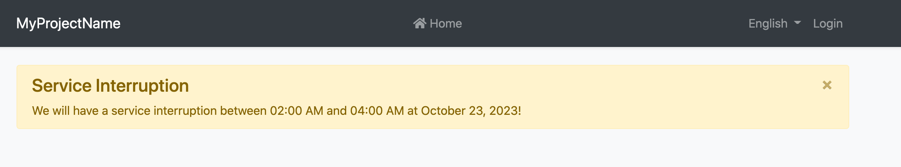
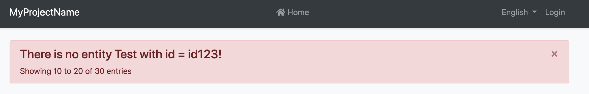

# Page Alerts

A page alert is useful for displaying an important message to the user. The ABP Framework provides an easy way to show the following alert to the user.



You can simply import `PageAlertService` from `@abp/ng.theme.shared` and utilize it as follows:

```js
import { PageAlertService } from '@abp/ng.theme.shared';

@Component({
  // ...
})
export class MyComponent {
  constructor(private service: PageAlertService) {}

  showWarning() {
    this.service.show({
      type: 'warning',
      message:
        'We will have a service interruption between 02:00 AM and 04:00 AM at October 23, 2023!',
      title: 'Service Interruption',
    });
  }
}
```

## `SHOW`

The method `show` accepts a single object that is type of `PageAlert`

```js
export interface PageAlert {
  type: 'primary' | 'secondary' | 'success' | 'danger' | 'warning' | 'info' | 'light' | 'dark';
  message: string;
  title?: string;
  dismissible?: boolean;
  messageLocalizationParams?: string[];
  titleLocalizationParams?: string[];
}
```

* `type` (Required): Defines what type of alert will be shown
* `message` (Required): The message who will be shown, also works with localization as well. 
* `title` (Optional): The title of the message. If it is not provided, the title will be hidden.
* `dismissible` (Optional): Default is `true`. If enabled, a button on the top right corner will be shown to the users so that they can dismiss the message.
* `messageLocalizationParams` and `titleLocalizationParams` (Optional): If the message and/or the title is a key for localization service and contains some parameters, these fields could be used to pass those parameters. 

### An example with Localization

```typescript
this.service.show({
  type: 'danger',
  message: 'AbpAccount::PagerInfo{0}{1}{2}',
  messageLocalizationParams: ['10', '20', '30'],
  title: 'AbpAccount::EntityNotFoundErrorMessage',
  titleLocalizationParams: ['Test', 'id123'],
});
```




