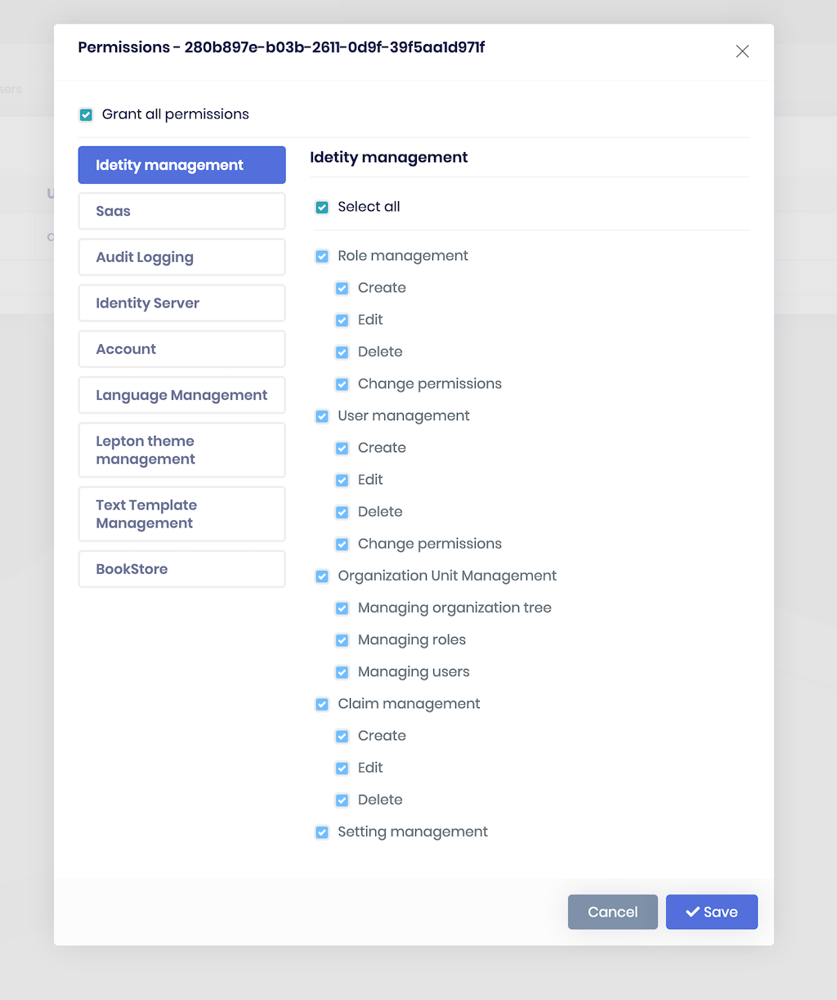

# How to Replace PermissionManagementComponent



Run the following command in `angular` folder to create a new component called `PermissionManagementComponent`.

```bash
yarn ng generate component permission-management --inlineStyle
```

Open the generated `permission-management.component.ts` in `src/app/permission-management` folder and replace the content with the following:

```js
import { ConfigStateService, CurrentUserDto, ReplaceableComponents } from '@abp/ng.core';
import {
  GetPermissionListResultDto,
  PermissionGrantInfoDto, PermissionGroupDto, PermissionManagement, PermissionsService, ProviderInfoDto, UpdatePermissionDto
} from '@abp/ng.permission-management';
import { LocaleDirection } from '@abp/ng.theme.shared';
import {
  Component,
  EventEmitter, Inject, Input, Optional, Output, TrackByFunction
} from '@angular/core';
import { of } from 'rxjs';
import { finalize, switchMap, tap } from 'rxjs/operators';

type PermissionWithStyle = PermissionGrantInfoDto & {
  style: string;
};

@Component({
  selector: 'app-permission-management',
  templateUrl: './permission-management.component.html',
  styles: [
    `
      .overflow-scroll {
        max-height: 70vh;
        overflow-y: scroll;
      }
    `,
  ],
})
export class PermissionManagementComponent
  implements
  PermissionManagement.PermissionManagementComponentInputs,
  PermissionManagement.PermissionManagementComponentOutputs {
  protected _providerName: string;
  @Input()
  get providerName(): string {
    if (this.replaceableData) return this.replaceableData.inputs.providerName;

    return this._providerName;
  }

  set providerName(value: string) {
    this._providerName = value;
  }

  protected _providerKey: string;
  @Input()
  get providerKey(): string {
    if (this.replaceableData) return this.replaceableData.inputs.providerKey;

    return this._providerKey;
  }

  set providerKey(value: string) {
    this._providerKey = value;
  }

  protected _hideBadges = false;
  @Input()
  get hideBadges(): boolean {
    if (this.replaceableData) return this.replaceableData.inputs.hideBadges;

    return this._hideBadges;
  }

  set hideBadges(value: boolean) {
    this._hideBadges = value;
  }

  protected _visible = false;
  @Input()
  get visible(): boolean {
    return this._visible;
  }

  set visible(value: boolean) {
    if (value === this._visible) return;

    if (value) {
      this.openModal().subscribe(() => {
        this._visible = true;
        this.visibleChange.emit(true);
        if (this.replaceableData) this.replaceableData.outputs.visibleChange(true);
      });
    } else {
      this.selectedGroup = null;
      this._visible = false;
      this.visibleChange.emit(false);
      if (this.replaceableData) this.replaceableData.outputs.visibleChange(false);
    }
  }

  @Output() readonly visibleChange = new EventEmitter<boolean>();

  data: GetPermissionListResultDto = { groups: [], entityDisplayName: null };

  selectedGroup: PermissionGroupDto;

  permissions: PermissionGrantInfoDto[] = [];

  selectThisTab = false;

  selectAllTab = false;

  modalBusy = false;

  trackByFn: TrackByFunction<PermissionGroupDto> = (_, item) => item.name;

  get selectedGroupPermissions(): PermissionWithStyle[] {
    if (!this.selectedGroup) return [];

    const margin = `margin-${
      (document.body.dir as LocaleDirection) === 'rtl' ? 'right' : 'left'
    }.px`;

    const permissions = this.data.groups.find(
      group => group.name === this.selectedGroup.name,
    ).permissions;

    return permissions.map(
      permission =>
        ({
          ...permission,
          style: { [margin]: findMargin(permissions, permission) },
          isGranted: this.permissions.find(per => per.name === permission.name).isGranted,
        } as unknown as PermissionWithStyle),
    );
  }

  get isVisible(): boolean {
    if (!this.replaceableData) return this.visible;

    return this.replaceableData.inputs.visible;
  }

  constructor(
    @Optional()
    @Inject('REPLACEABLE_DATA')
    public replaceableData: ReplaceableComponents.ReplaceableTemplateData<
      PermissionManagement.PermissionManagementComponentInputs,
      PermissionManagement.PermissionManagementComponentOutputs
    >,
    private service: PermissionsService,
    private configState: ConfigStateService
  ) {}

  getChecked(name: string) {
    return (this.permissions.find(per => per.name === name) || { isGranted: false }).isGranted;
  }

  isGrantedByOtherProviderName(grantedProviders: ProviderInfoDto[]): boolean {
    if (grantedProviders.length) {
      return grantedProviders.findIndex(p => p.providerName !== this.providerName) > -1;
    }
    return false;
  }

  onClickCheckbox(clickedPermission: PermissionGrantInfoDto, value) {
    if (
      clickedPermission.isGranted &&
      this.isGrantedByOtherProviderName(clickedPermission.grantedProviders)
    )
      return;

    setTimeout(() => {
      this.permissions = this.permissions.map(per => {
        if (clickedPermission.name === per.name) {
          return { ...per, isGranted: !per.isGranted };
        } else if (clickedPermission.name === per.parentName && clickedPermission.isGranted) {
          return { ...per, isGranted: false };
        } else if (clickedPermission.parentName === per.name && !clickedPermission.isGranted) {
          return { ...per, isGranted: true };
        }

        return per;
      });

      this.setTabCheckboxState();
      this.setGrantCheckboxState();
    }, 0);
  }

  setTabCheckboxState() {
    const selectedPermissions = this.selectedGroupPermissions.filter(per => per.isGranted);
    const element = document.querySelector('#select-all-in-this-tabs') as any;

    if (selectedPermissions.length === this.selectedGroupPermissions.length) {
      element.indeterminate = false;
      this.selectThisTab = true;
    } else if (selectedPermissions.length === 0) {
      element.indeterminate = false;
      this.selectThisTab = false;
    } else {
      element.indeterminate = true;
    }
  }

  setGrantCheckboxState() {
    const selectedAllPermissions = this.permissions.filter(per => per.isGranted);
    const checkboxElement = document.querySelector('#select-all-in-all-tabs') as any;

    if (selectedAllPermissions.length === this.permissions.length) {
      checkboxElement.indeterminate = false;
      this.selectAllTab = true;
    } else if (selectedAllPermissions.length === 0) {
      checkboxElement.indeterminate = false;
      this.selectAllTab = false;
    } else {
      checkboxElement.indeterminate = true;
    }
  }

  onClickSelectThisTab() {
    this.selectedGroupPermissions.forEach(permission => {
      if (permission.isGranted && this.isGrantedByOtherProviderName(permission.grantedProviders))
        return;

      const index = this.permissions.findIndex(per => per.name === permission.name);

      this.permissions = [
        ...this.permissions.slice(0, index),
        { ...this.permissions[index], isGranted: !this.selectThisTab },
        ...this.permissions.slice(index + 1),
      ];
    });

    this.setGrantCheckboxState();
  }

  onClickSelectAll() {
    this.permissions = this.permissions.map(permission => ({
      ...permission,
      isGranted:
        this.isGrantedByOtherProviderName(permission.grantedProviders) || !this.selectAllTab,
    }));

    this.selectThisTab = !this.selectAllTab;
  }

  onChangeGroup(group: PermissionGroupDto) {
    this.selectedGroup = group;
    this.setTabCheckboxState();
  }


  submit() {
    const unchangedPermissions = getPermissions(this.data.groups);

    const changedPermissions: UpdatePermissionDto[] = this.permissions
      .filter(per =>
        unchangedPermissions.find(unchanged => unchanged.name === per.name).isGranted ===
        per.isGranted
          ? false
          : true,
      )
      .map(({ name, isGranted }) => ({ name, isGranted }));

    if (!changedPermissions.length) {
      this.visible = false;
      return;
    }

    this.modalBusy = true;
    this.service
      .update(this.providerName, this.providerKey, { permissions: changedPermissions })
      .pipe(
        switchMap(() =>
          this.shouldFetchAppConfig() ? this.configState.refreshAppState() : of(null),
        ),
        finalize(() => (this.modalBusy = false)),
      )
      .subscribe(() => {
        this.visible = false;
      });
  }

  openModal() {
    if (!this.providerKey || !this.providerName) {
      throw new Error('Provider Key and Provider Name are required.');
    }

    return this.service.get(this.providerName, this.providerKey).pipe(
      tap((permissionRes: GetPermissionListResultDto) => {
        this.data = permissionRes;
        this.selectedGroup = permissionRes.groups[0];
        this.permissions = getPermissions(permissionRes.groups);
      }),
    );
  }

  initModal() {
    this.setTabCheckboxState();
    this.setGrantCheckboxState();
  }

  getAssignedCount(groupName: string) {
    return this.permissions.reduce(
      (acc, val) => (val.name.split('.')[0] === groupName && val.isGranted ? acc + 1 : acc),
      0,
    );
  }

  onVisibleChange(visible: boolean) {
    this.visible = visible;

    if (this.replaceableData) {
      this.replaceableData.inputs.visible = visible;
      this.replaceableData.outputs.visibleChange(visible);
    }
  }
  
  shouldFetchAppConfig() {
    const currentUser = this.configState.getOne('currentUser') as CurrentUserDto;

    if (this.providerName === 'R') return currentUser.roles.some(role => role === this.providerKey);

    if (this.providerName === 'U') return currentUser.id === this.providerKey;

    return false;
  }
}

function findMargin(permissions: PermissionGrantInfoDto[], permission: PermissionGrantInfoDto) {
  const parentPermission = permissions.find(per => per.name === permission.parentName);

  if (parentPermission && parentPermission.parentName) {
    let margin = 20;
    return (margin += findMargin(permissions, parentPermission));
  }

  return parentPermission ? 20 : 0;
}

function getPermissions(groups: PermissionGroupDto[]): PermissionGrantInfoDto[] {
  return groups.reduce((acc, val) => [...acc, ...val.permissions], []);
}
```

Open the generated `permission-management.component.html` in `src/app/permission-management` folder and replace the content with the below:

```html
<abp-modal [visible]="isVisible" (visibleChange)="onVisibleChange($event)" [busy]="modalBusy">
  <ng-container *ngIf="data.entityDisplayName">
    <ng-template #abpHeader>
      <h4>
         -
        
      </h4>
    </ng-template>
    <ng-template #abpBody>
      <div class="custom-checkbox custom-control mb-2">
        <input
          type="checkbox"
          id="select-all-in-all-tabs"
          name="select-all-in-all-tabs"
          class="custom-control-input"
          [(ngModel)]="selectAllTab"
          (click)="onClickSelectAll()"
        />
        <label class="custom-control-label" for="select-all-in-all-tabs"></label>
      </div>

      <hr class="mt-2 mb-2" />
      <div class="row">
        <div class="overflow-scroll col-md-4">
          <ul class="nav nav-pills flex-column">
            <li *ngFor="let group of data.groups; trackBy: trackByFn" class="nav-item">
              <a
                *ngIf="{ assignedCount: getAssignedCount(group.name) } as count"
                class="nav-link pointer"
                [class.active]="selectedGroup?.name === group?.name"
                (click)="onChangeGroup(group)"
              >
                <div [class.font-weight-bold]="count.assignedCount">
                  
                  <span>()</span>
                </div>
              </a>
            </li>
          </ul>
        </div>
        <div class="col-md-8 overflow-scroll">
          <h4></h4>
          <hr class="mt-2 mb-3" />
          <div class="pl-1 pt-1">
            <div class="custom-checkbox custom-control mb-2">
              <input
                type="checkbox"
                id="select-all-in-this-tabs"
                name="select-all-in-this-tabs"
                class="custom-control-input"
                [(ngModel)]="selectThisTab"
                (click)="onClickSelectThisTab()"
              />
              <label class="custom-control-label" for="select-all-in-this-tabs"></label>
            </div>
            <hr class="mb-3" />
            <div
              *ngFor="let permission of selectedGroupPermissions; let i = index; trackBy: trackByFn"
              [ngStyle]="permission.style"
              class="custom-checkbox custom-control mb-2"
            >
              <input
                #permissionCheckbox
                type="checkbox"
                [checked]="getChecked(permission.name)"
                [value]="getChecked(permission.name)"
                [attr.id]="permission.name"
                class="custom-control-input"
                [disabled]="isGrantedByOtherProviderName(permission.grantedProviders)"
              />
              <label
                class="custom-control-label"
                [attr.for]="permission.name"
                (click)="onClickCheckbox(permission, permissionCheckbox.value)"
                >
                <ng-container *ngIf="!hideBadges">
                  <span
                    *ngFor="let provider of permission.grantedProviders"
                    class="badge badge-light"
                    >: </span
                  >
                </ng-container>
              </label>
            </div>
          </div>
        </div>
      </div>
    </ng-template>
    <ng-template #abpFooter>
      <button type="button" class="btn btn-secondary" abpClose>
        
      </button>
      <abp-button iconClass="fa fa-check" (click)="submit()"></abp-button>
    </ng-template>
  </ng-container>
</abp-modal>
```

Open `app.component.ts` in `src/app` folder and modify it as shown below:

```js
import { ReplaceableComponentsService } from '@abp/ng.core';
import { ePermissionManagementComponents } from '@abp/ng.permission-management';
import { Component, OnInit } from '@angular/core';
import { PermissionManagementComponent } from './permission-management/permission-management.component';

//...
export class AppComponent implements OnInit {
  constructor(private replaceableComponents: ReplaceableComponentsService) {} // injected ReplaceableComponentsService

  ngOnInit() {
    this.replaceableComponents.add({
        component: PermissionManagementComponent,
        key: ePermissionManagementComponents.PermissionManagement,
      });
  }
}
```

## See Also

- [Component Replacement](./Component-Replacement.md)
