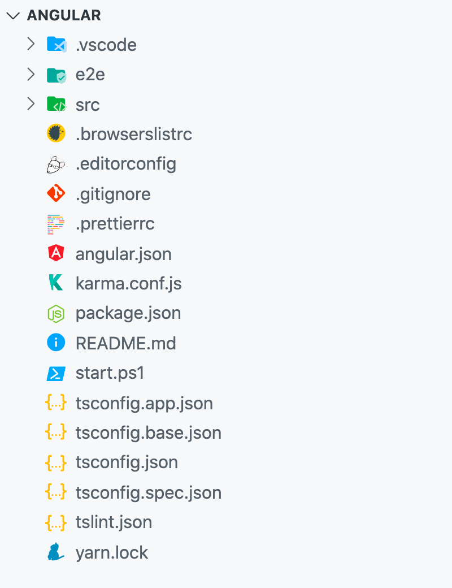
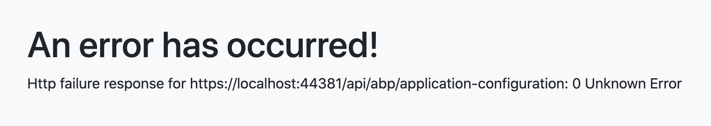

# ABP Angular Quick Start

## How to Prepare Development Environment

Please follow the steps below to prepare your development environment for Angular.

1. **Install Node.js:** Please visit [Node.js downloads page](https://nodejs.org/en/download/) and download proper Node.js v12 or v14 installer for your OS. An alternative is to install [NVM](https://github.com/nvm-sh/nvm) and use it to have multiple versions of Node.js in your operating system.
2. **[Optional] Install Yarn:** You may install Yarn v1 (not v2) following the instructions on [the installation page](https://classic.yarnpkg.com/en/docs/install). Yarn v1 delivers an arguably better developer experience compared to npm v6 and below. You may skip this step and work with npm, which is built-in in Node.js, instead.
3. **[Optional] Install VS Code:** [VS Code](https://code.visualstudio.com/) is a free, open-source IDE which works seamlessly with TypeScript. Although you can use any IDE including Visual Studio or Rider, VS Code will most likely deliver the best developer experience when it comes to Angular projects. ABP project templates even contain plugin recommendations for VS Code users, which VS Code will ask you to install when you open the Angular project folder. Here is a list of recommended extensions:
   - [Angular Language Service](https://marketplace.visualstudio.com/items?itemName=angular.ng-template)
   - [Prettier - Code formatter](https://marketplace.visualstudio.com/items?itemName=esbenp.prettier-vscode)
   - [TSLint](https://marketplace.visualstudio.com/items?itemName=ms-vscode.vscode-typescript-tslint-plugin)
   - [Visual Studio IntelliCode](https://marketplace.visualstudio.com/items?itemName=visualstudioexptteam.vscodeintellicode)
   - [Path Intellisense](https://marketplace.visualstudio.com/items?itemName=christian-kohler.path-intellisense)
   - [npm Intellisense](https://marketplace.visualstudio.com/items?itemName=christian-kohler.npm-intellisense)
   - [Angular 10 Snippets - TypeScript, Html, Angular Material, ngRx, RxJS & Flex Layout](https://marketplace.visualstudio.com/items?itemName=Mikael.Angular-BeastCode)
   - [JavaScript (ES6) code snippets](https://marketplace.visualstudio.com/items?itemName=xabikos.JavaScriptSnippets)
   - [Debugger for Chrome](https://marketplace.visualstudio.com/items?itemName=msjsdiag.debugger-for-chrome)
   - [Git History](https://marketplace.visualstudio.com/items?itemName=donjayamanne.githistory)
   - [indent-rainbow](https://marketplace.visualstudio.com/items?itemName=oderwat.indent-rainbow)

## How to Start a New Angular Project

You have multiple options to initiate a new Angular project that works with ABP:

### 1. Using ABP CLI

ABP CLI is probably the most convenient and flexible way to initiate an ABP solution with an Angular frontend. Simply [install the ABP CLI](../../CLI.md) and run the following command in your terminal:

```shell
abp new MyCompanyName.MyProjectName -csf -u angular
```

> To see further options in the CLI, please visit the [CLI manual](../../CLI.md).

This command will prepare a solution with an Angular and a .NET Core project in it. Please visit [Getting Started section](../../Getting-Started.md?UI=NG&DB=EF&Tiered=No#abp-cli-commands-options) for further instructions on how to set up the backend of your solution.

To continue reading without checking other methods, visit [Angular project structure section](#angular-project-structure).

### 2. Direct Download

You may [download a solution scaffold directly on ABP.io](https://abp.io/get-started) if you are more comfortable with GUI or simply want to try ABP without installing the CLI.

Please do the following:

1. Click on the "DIRECT DOWNLOAD" tab.
2. Fill out the short form about your project.
3. Click on the "Create now" button.

...and a customized download will start in a few seconds.

To avoid IDE warnings, run `yarn` or `npm install` in the Angular root folder before you continue to the next section. It is not imperative but recommended.

## Angular Project Structure

After creating a solution, open its "angular" directory in your IDE. This is how the contents of the root folder looks like:



Here is what these folders and files are for:

- **.vscode** has extension recommendations in it.
- **e2e** is a separate app for possible end-to-end tests.
- **src** is where the source files for your application are placed. We will have a closer look in a minute.
- **.browserlistrc** helps [configuring browser compatibility of your Angular app](https://angular.io/guide/build#configuring-browser-compatibility).
- **.editorconfig** helps you have a shared coding style for separate editors and IDEs. Check [EditorConfig.org](https://editorconfig.org/) for details.
- **.gitignore** defined which files and folders should not be tracked by git. Check [git documentation](https://git-scm.com/docs/gitignore) for details.
- **.prettierrc** includes simple coding style choices for [Prettier](https://prettier.io/), an auto-formatter for TypeScript, HTML, CSS, and more. If you install recommended extensions to VS Code, you will never have to format your code anymore.
- **angular.json** is where Angular workspace is defined. It holds project configurations and workspace preferences. Please refer to [Angular workspace configuration](https://angular.io/guide/workspace-config) for details.
- **karma.conf.js** holds [Karma test runner](https://karma-runner.github.io/) configurations.
- **package.json** is where your [package dependencies](https://angular.io/guide/npm-packages) are listed. It also includes some useful scripts for developing, testing, and building your application.
- **README.md** includes some of Angular CLI command examples. You either have to install Angular CLI globally or run these commands starting with `yarn` or `npx` to make them work.
- **start.ps1** is a simple PowerShell script to install dependencies and start a [development server via Angular CLI](https://angular.io/cli/serve), but you probably will not need that after reading this document.
- **tsconfig.json** and all other [tsconfig files](https://angular.io/guide/typescript-configuration) in general, include some TypeScript and Angular compile options.
- **yarn.lock** enables installing consistent package versions across different devices so that working application build will not break because of a package update. Please read [Yarn documentation](https://classic.yarnpkg.com/en/docs/yarn-lock/) if you are interested in more information on the topic. If you have decided to use npm, please remove this file and keep the [package-lock.json](https://docs.npmjs.com/files/package-lock.json) instead.

Now let us take a look at the contents of the source folder.


- **app** is the main directory you put your application files in. Any module, component, directive, service, pipe, guard, interceptor, etc. should be placed here. You are free to choose any folder structure, but [organizing Angular applications based on modules](https://angular.io/guide/module-types) is generally a fine practice.
- **home** is a predefined module and acts as a welcome page. It also demonstrates how a feature-based folder structure may look like. More complex features will probably have sub-features, thus inner folders. You may change the home folder however you like.
- **shared** is spared for reusable code that works for several modules. Some, including yours truly, may disagree with using a single module for all shared code, so consider adding standalone sub-modules inside this folder instead of adding everything into **shared.module.ts**.
- **app-routing.module.ts** is where your top-level routes are defined. Angular is capable of [lazy loading feature modules](https://angular.io/guide/lazy-loading-ngmodules), so not all routes will be here. You may think of Angular routing as a tree and this file is the top of the tree.
- **app.component.ts** is essentially the top component that holds the dynamic application layout.
- **app.module.ts** is the [root module](https://angular.io/guide/bootstrapping) that includes information about how parts of your application are related and what to run at the initiation of your application.
- **route.provider.ts** is used for [modifying the menu](https://docs.abp.io/en/abp/latest/UI/Angular/Modifying-the-Menu).
- **assets** is for static files. A file (e.g. an image) placed in this folder will be available as is when the application is served.
- **environments** includes one file per environment configuration. There are two configurations by default, but you may always introduce another one. These files are directly referred to in _angular.json_ and help you have different builds and application variables. Please refer to [configuring Angular application environments](https://angular.io/guide/build#configuring-application-environments) for details.
- **index.html** is the HTML page served to visitors and will contain everything required to run your application. Servers should be configured to redirect every request to this page so that the Angular router can take over. Do not worry about how to add JavaScript and CSS files to it, because Angular CLI will do it automatically.
- **main.ts** bootstraps and configures Angular application to run in the browser. It is production-ready, so forget about it.
- **polyfill.ts** is where you can add polyfills if you want to [support legacy browsers](https://angular.io/guide/browser-support).
- **style.scss** is the default entry point for application styles. You can change this or add new entry points in _angular.json_.
- **test.ts** helps the unit test runner discover and bootstrap spec files.

Phew! So many files, right? Yet, **most of them are typically not subject to change** or, even when they are so, the CLI tooling will do the job for you. The main focus should be on the app folder and its content.

Next, we will take a look at the commands used to prepare, build, and serve our application.

## How to Run the Angular Application

Now that you know about the files and folders, we can get the application up and running.

1. Make sure the [database migration is complete](../../Getting-Started?UI=NG&DB=EF&Tiered=No#create-the-database) and the [API is up and running](../../Getting-Started?UI=NG&DB=EF&Tiered=No#run-the-application).
2. Run `yarn` or `npm install` if you have not already.
3. Run `yarn start` or `npm start`. The first compilation may take a while. This will start a [live development server](#angular-live-development-server) and launch your default browser in the end.
4. Visit the browser page that opens after the compilation <sup id="a-certificate-error">[1](#f-certificate-error)</sup>.


You may modify the behavior of the **start script** (in the package.json file) by changing the parameters passed to the `ng serve` command. For instance, if you do not want a browser window to open next time you run the script, remove `--open` from the end of it. Please check [ng serve documentation](https://angular.io/cli/serve) for all available options.

### Angular Live Development Server

The development server of Angular is based on [Webpack DevServer](https://webpack.js.org/configuration/dev-server/). It tracks changes to source files and syncs the browser window after an incremental re-compilation every time <sup id="a-dev-server">[2](#f-dev-server)</sup> you make one. Your experience will be like this:


Please keep in mind that you should not use this server in production. To provide the fastest experience, the compiler skips some heavy optimizations and the development server is simply not built for multiple clients. The next section will describe what to do.

---



<sup id="f-certificate-error"><b>1</b></sup> _If you see the error above when you run the Angular app, your browser might be blocking access to the API because of the self-signed certificate. Visit that address and allow access to it (once). When you see the Swagger interface, you are good to go._ <sup>[↩](#a-certificate-error)</sup>

<sup id="f-dev-server"><b>2</b></sup> _Sometimes, depending on the file changed, Webpack may miss the change and cannot reflect it in the browser. For example, tsconfig files are not being tracked. In such a case, please restart the development server._ <sup>[↩](#a-dev-server)</sup>

---

## How to Build the Angular Application

An Angular application can have multiple [build targets](https://angular.io/guide/glossary#target), i.e. **configurations in angular.json** which define how [Architect](https://angular.io/guide/glossary#architect) will build applications and libraries. Usually, each build configuration has a separate environment variable file. Currently, the project has two: One for development and one for production.

```js
// this is what environment variables look like
// can be found at /src/environments/environment.ts

import { Config } from '@abp/ng.core';

const baseUrl = 'http://localhost:4200';

export const environment = {
  production: false,
  application: {
    baseUrl,
    name: 'MyProjectName',
    logoUrl: '',
  },
  oAuthConfig: {
    issuer: 'https://localhost:44381',
    redirectUri: baseUrl,
    clientId: 'MyProjectName_App',
    responseType: 'code',
    scope: 'offline_access MyProjectName',
  },
  apis: {
    default: {
      url: 'https://localhost:44381',
      rootNamespace: 'MyCompanyName.MyProjectName',
    },
  },
} as Config.Environment;
```

When you run the development server, variables defined in _environment.ts_ take effect. Similarly, in production mode, the default environment is replaced by _environment.prod.ts_ and completely different variables become effective. You may even [create a new build configuration](https://angular.io/guide/workspace-config#build-configs) and set [file replacements](https://angular.io/guide/build#configure-target-specific-file-replacements) to use a completely new environment. For now, we will start a production build:

1. Open your terminal and navigate to the root Angular folder.
2. Run `yarn` or `npm install` if you have not installed dependencies already.
3. Run `yarn build:prod` or `npm run build:prod`.


Depending on project size, the compilation may take a few minutes. When it is finished, the compiled output will be placed inside the _/dist_ folder. Voila! You have deployment-ready build artifacts.

> The amount of optimization performed on the source is the main difference between a regular build and a production one. Production builds have a much smaller size and are more performant.

## How to Deploy the Angular Application

Angular web applications run on the browser and require no server except for a [static web server](https://developer.mozilla.org/en-US/docs/Learn/Common_questions/What_is_a_web_server) to deliver files to the client. To see that it works, please make sure the backend application is up and then run the following command in your terminal:

```shell
# please replace MyProjectName with your project name

npx servor dist/MyProjectName index.html 4200 --browse
```

This command will download and start a simple static server, a browser window at `http://localhost:4200` will open, and the compiled output of your project will be served.

Of course, you need your application to run on an optimized web server and become available to everyone. This is quite straight-forward:

1. Create a new static web server instance. You can use a service like [Azure App Service](https://azure.microsoft.com/tr-tr/services/app-service/web/), [Firebase](https://firebase.google.com/docs/hosting), [Netlify](https://www.netlify.com/), [Vercel](https://vercel.com/), or even [GitHub Pages](https://angular.io/guide/deployment#deploy-to-github-pages). Another option is maintaining own web server with [NGINX](https://www.nginx.com/), [IIS](https://www.iis.net/), [Apache HTTP Server](https://httpd.apache.org/), or equivalent.
2. Copy the files from `dist/MyProjectName` <sup id="a-dist-folder-name">[1](#f-dist-folder-name)</sup> to a publicly served destination on the server via CLI of the service provider, SSH, or FTP (whichever is available). This step would be defined as a job if you have a CI/CD flow.
3. [Configure the server](https://angular.io/guide/deployment#server-configuration) to redirect all requests to the _index.html_ file. Some services do that automatically. Others require you [to add a file to the bundle via assets](https://angular.io/guide/workspace-config#assets-configuration) which describes the server how to do the redirections. Occasionally, you may need to do manual configuration.

In addition, you can [deploy your application to certain targets using the Angular CLI](https://angular.io/guide/deployment#automatic-deployment-with-the-cli). Here are some deploy targets:

- [Azure](https://github.com/Azure/ng-deploy-azure#readme)
- [Firebase](https://github.com/angular/angularfire#readme)
- [Netlify](https://github.com/ngx-builders/netlify-builder#readme)
- [Vercel `vercel init angular`](https://github.com/vercel/vercel/tree/main/examples/angular)
- [GitHub Pages](https://github.com/angular-schule/angular-cli-ghpages/#readme)

---

<sup id="f-dist-folder-name"><b>1</b></sup> _The compiled output will be placed under `/dist` in a folder by the project name._ <sup>[↩](#a-dist-folder-name)</sup>
