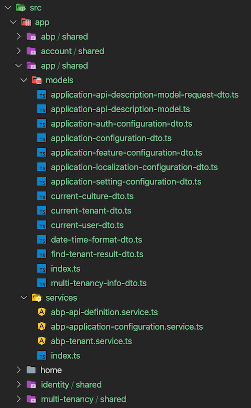

## Service Proxies

Calling a REST endpoint from Angular applications is common. We usually create **services** matching server-side controllers and **interfaces** matching [DTOs](../../Data-Transfer-Objects) to interact with the server. This often results in manually transforming C# code into TypeScript equivalents and that is unfortunate, if not intolerable.

To avoid manual effort, we might use a tool like [NSWAG](https://github.com/RicoSuter/NSwag) that generates service proxies. However, NSWAG has some disadvantages:

- It generates **a single .ts file** which gets **too large** as your application grows. Also, this single file does not fit the **[modular](../../Module-Development-Basics) approach** of ABP.
- To be honest, the generated code is a bit **ugly**. We would like to produce code that looks as if someone wrote it.
- Since swagger.json **does not reflect the exact method signature** of backend services, NSWAG cannot reflect them on the client-side as well.

ABP introduces an endpoint that exposes server-side method contracts. When the `generate-proxy` command is run, ABP CLI makes an HTTP request to this endpoint and generates better-aligned client proxies in TypeScript. It organizes folders according to namespaces, adds barrel exports, and reflects method signatures in Angular services.

> Before you start, please make sure you start the backend application with `dotnet run`. There is a [known limitation about Visual Studio](#known-limitations), so please do not run the project using its built-in web server.

Run the following command in the **root folder** of the angular application:

```bash
abp generate-proxy -t ng
```

The command without any parameters creates proxies only for your own application's services and places them in your default Angular application. There are several parameters you may use to modify this behavior. See the [CLI documentation](../../CLI) for details.

The generated files will be placed in a folder called `proxy` at the root of the target project.



Each folder will have models, enums, and services defined at related namespace accompanied by a barrel export, i.e. an `index.ts` file for easier imports.

> The command can find application/library roots by reading the `angular.json` file. Make sure you have either defined your target project as the `defaultProject` or pass the `--target` parameter to the command. This also means that you may have a monorepo workspace.

### Angular Project Configuration

> If you've created your project with version 3.1 or later, you can skip this part since it will be already installed in your solution.

For a solution that was created before v3.1, follow the steps below to configure your Angular application:

1. Add `@abp/ng.schematics` package to the `devDependencies` of the Angular project. Run the following command in the root folder of the angular application:

```bash
npm install @abp/ng.schematics -D
```

2. Add `rootNamespace` property to the `/src/environments/environment.ts` in your application project as shown below. `MyCompanyName.MyProjectName` should be replaced by the root namespace of your .NET project.

```js
export const environment: Config.Environment = {
  // other environment variables...
  apis: {
    default: {
      rootNamespace: "MyCompanyName.MyProjectName",
      // other environment variables...
    },
  },
};
```

3. [OPTIONAL] Add the following paths to `tsconfig.base.json` in order to have a shortcut for importing proxies:

```json
{
  // other TS configuration...
  "compilerOptions": {
    // other TS configuration...
    "paths": {
      "@proxy": ["src/app/proxy/index.ts"],
      "@proxy/*": ["src/app/proxy/*"]
    }
  }
}
```

> The destination the `proxy` folder is created and the paths above may change based on your project structure.

### Services

The `generate-proxy` command generates one service per back-end controller and a method (property with a function value actually) for each action in the controller. These methods call backend APIs via [RestService](./Http-Requests#restservice).

A variable named `apiName` (available as of v2.4) is defined in each service. `apiName` matches the module's `RemoteServiceName`. This variable passes to the `RestService` as a parameter at each request. If there is no microservice API defined in the environment, `RestService` uses the default. See [getting a specific API endpoint from application config](./Http-Requests#how-to-get-a-specific-api-endpoint-from-application-config)

The `providedIn` property of the services is defined as `'root'`. Therefore there is no need to provide them in a module. You can use them directly by injecting them into the constructor as shown below:

```js
import { BookService } from '@proxy/books';

@Component(/* component metadata here */)
export class BookComponent implements OnInit {
  constructor(private service: BookService) {}

  ngOnInit() {
    this.service.get().subscribe(
      // do something with the response
    );
  }
}
```

The Angular compiler removes the services that have not been injected anywhere from the final output. See the [tree-shakable providers documentation](https://angular.io/guide/dependency-injection-providers#tree-shakable-providers).

### Models

The `generate-proxy` command generates interfaces matching DTOs in the back-end. There are also a few [core DTOs](https://github.com/abpframework/abp/blob/dev/npm/ng-packs/packages/core/src/lib/models/dtos.ts) in the `@abp/ng.core` package. In combination, these models can be used to reflect the APIs.

```js
import { PagedResultDto } from "@abp/ng.core";
import { BookDto } from "@proxy/books";

@Component(/* component metadata here */)
export class BookComponent implements OnInit {
  data: PagedResultDto<BookDto> = {
    items: [],
    totalCount: 0,
  };
}
```

### Enums

Enums have always been difficult to populate in the frontend. The `generate-proxy` command generates enums in a separate file and exports a ready-to-use "options constant" from the same file. So you can import them as follows:

```js
import { bookGenreOptions } from "@proxy/books";

@Component(/* component metadata here */)
export class BookComponent implements OnInit {
  genres = bookGenreOptions;
}
```

...and consume the options in the template as follows:

```html
<!-- simplified for sake of clarity -->
<select formControlName="genre">
  <option [ngValue]="null">Select a genre</option>
  <option *ngFor="let genre of genres" [ngValue]="genre.value">
    
  </option>
</select>
```

> Please [see this article](https://github.com/abpframework/abp/blob/dev/docs/en/Blog-Posts/2020-09-07%20Angular-Service-Proxies/POST.md) to learn more about service proxies.

### Known Limitations

When you run a project on Visual Studio using IIS Express as the web server, there will be no remote access to your endpoints. This is the default behavior of IIS Express since it explicitly protects you from the security risks of running over the network. However, that will cause the proxy generator to fail because it needs a response from the `/api/abp/api-definition` endpoint. You may serve your endpoints via Kestrel to avoid this. Running `dotnet run` in your command line (at your project folder) will do that for you.
