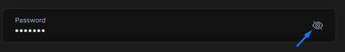
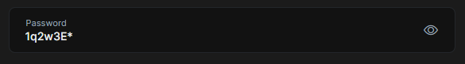

# Show Password Directive

In password input, text can be shown easily via changing input type attribute to `text`. To make this even easier, you can use the `ShowPasswordDirective` which has been exposed by the `@abp/ng.core` package.


## Getting Started

In order to use the `ShowPasswordDirective` in an HTML template, the **`CoreModule`** should be imported into your module like this:

```ts
// ...
import { CoreModule } from '@abp/ng.core';

@NgModule({
  //...
  imports: [..., CoreModule],
})
export class MyFeatureModule {}
```

## Usage

The `ShowPasswordDirective` is very easy to use. The directive's selector is **`abpShowPassword`**. By adding the `abpShowPassword` attribute to an input element, you can activate the `ShowPasswordDirective` for the input element.

See an example usage:

```ts
@Component({
  selector: 'test-component',
  standalone: true,
  template: `
    <div class="d-flex flex-column">
      <label>Password</label>
      <input [abpShowPassword]="showPassword"/>
      <i (click)="showPassword = !showPassword">icon</i>
    </div>
  `
})
export class TestComponent{
  showPassword = false;
}
```

The `abpShowPassword` attribute has been added to the `<input>` element. Click icon to activate the `ShowPasswordDirective`.

See the result:



To see password input click icon.

