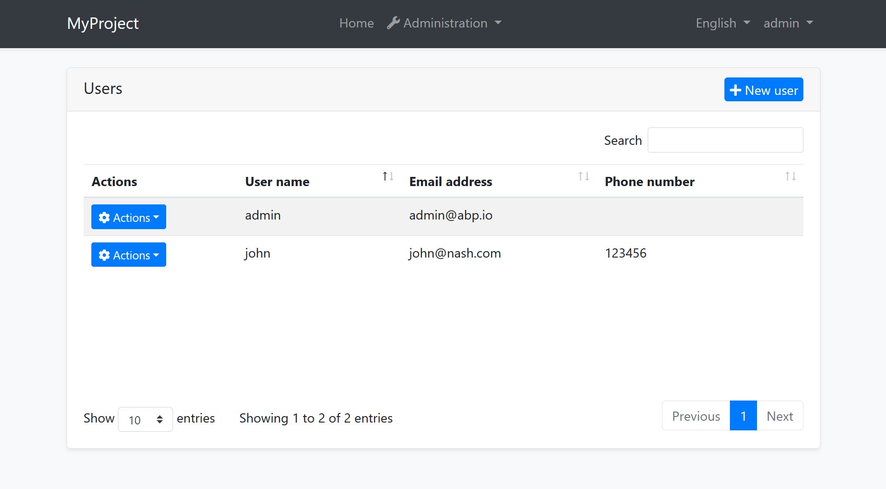
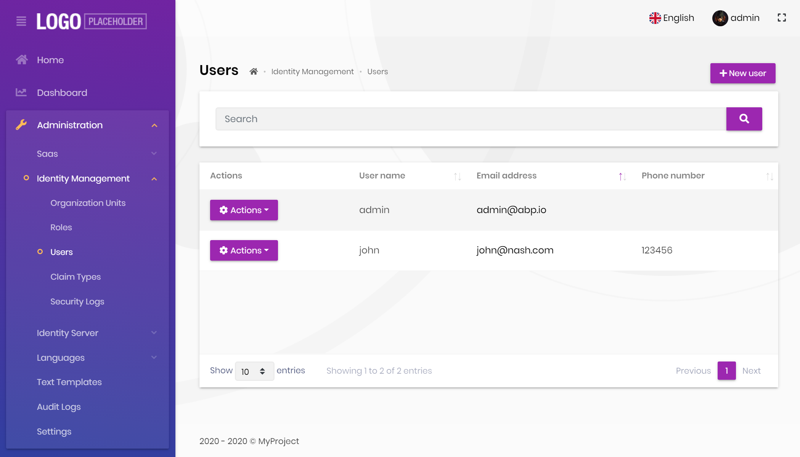

# Angular UI: Theming

## Introduction

ABP Framework provides a complete **UI Theming** system with the following goals:

* Reusable [application modules](../../Modules/Index.md) are developed **theme-independent**, so they can work with any UI theme.
* UI theme is **decided by the final application**.
* The theme is distributed via an NPM package, so it is **easily upgradable**.
* The final application can **customize** the selected theme.

In order to accomplish these goals, ABP Framework;

* Determines a set of **base libraries** used and adapted by all the themes. So, module and application developers can depend on and use these libraries without depending on a particular theme.
* Provides a system that consists of layout parts (like navigation menus and toolbars) that is implemented by all the themes. So, the modules and the application contribute to the layout to compose a consistent application UI.

### Current Themes

Currently, two themes are **officially provided**:

* The [Basic Theme](Basic-Theme.md) is the minimalist theme with the plain Bootstrap style. It is **open source and free**.
* The [Lepton Theme](https://commercial.abp.io/themes) is a **commercial** theme developed by the core ABP team and is a part of the [ABP Commercial](https://commercial.abp.io/) license.

## Overall

### The Base Libraries

All the themes must depend on the [@abp/ng.theme.shared](https://www.npmjs.com/package/@abp/ng.theme.shared) NuGet package, so they are indirectly depending on the following libraries:

* [Twitter Bootstrap](https://getbootstrap.com/) as the fundamental HTML/CSS framework.
* [FontAwesome](https://fontawesome.com/) as the fundamental CSS font library.
* [NG Bootstrap](https://ng-bootstrap.github.io/#/home) as a component library that supports the Bootstrap and adds extra components like modal and datepicker.
* [Ngx-Datatable](https://swimlane.gitbook.io/ngx-datatable/) as a datatable library.
* [ngx-validate](https://github.com/ng-turkey/ngx-validate) a dynamic validation of reactive forms library.
* [Chart.js](https://www.chartjs.org/) as a widget library.

These libraries are selected as the base libraries and available to the applications and modules.

> Bootstrap's JavaScript part is not used since the NG Bootstrap library already provides the necessary functionalities to the Bootstrap components in a native way.

### The Layout

All themes must define a layout for the application. The following image shows the user management page in the [Basic Theme](Basic-Theme.md) application layout:



And the same page is shown below with the [Lepton Theme](https://commercial.abp.io/themes) application layout:



As you can see, the page is the same, but the look is completely different in the themes above.

The application layout typically includes the following parts;

* Main menu
* Nav items area with the following components;
  * User menu
  * Language switch dropdown
* [Page alerts](Page-Alerts.md)
* The page content (aka `<router-outlet>`)

## Implementing a Theme

A theme is simply an NPM package and comes with startup templates. 

### The Easy Way

The easiest way to create a new theme is to add Basic Theme Source Code to your project via [ABP CLI](../../CLI.md) command and customize it.

You can run the following command in **Angular** project directory to copy the source code to your solution:

`abp add-package @abp/ng.theme.basic --with-source-code`

### Global/Component Styles

Angular can bundle global style files and component styles with components. 
See the [component styles](https://angular.io/guide/component-styles) guide on Angular documentation for more information. 

### Layout Parts

A typical layout consists of several parts. The theme should include the necessary parts in each layout.

**Example: The Basic Theme has the following parts for the Application Layout**


The application code and the modules can only show contents in the Page Content part. If they need to change the other parts (to add a menu item, to add a nav item, to change the application name in the logo area...) they should use the ABP Framework APIs.

The following sections explain the fundamental parts pre-defined by the ABP Framework and can be implemented by the themes.

> It is a good practice to split the layout into components/partials, so the final application can override them partially for customization purpose.

#### Logo

The `application` object of an environment file should be configured to get the name and the logo URL of the application to render in the logo part. Additionally, `LogoComponent` can be replaced. See [Component Replacement](Component-Replacement.md) document for more.

The [Application Startup Template](../../Startup-Templates/Application.md) has an implementation of this interface to set the values by the application developer.

#### Main Menu / Routes

`RoutesService` service is used to manage the main menu items and render them on the layout.

**Example: Adding a route to the main menu**

```ts
import { RoutesService, eLayoutType } from '@abp/ng.core';
import { Component } from '@angular/core';

@Component(/* component metadata */)
export class AppComponent {
  constructor(routes: RoutesService) {
    routes.add([
      {
        path: '/your-path',
        name: 'Your navigation',
        order: 101,
        iconClass: 'fas fa-question-circle',
        requiredPolicy: 'permission key here',
        layout: eLayoutType.application,
      },
      {
        path: '/your-path/child',
        name: 'Your child navigation',
        parentName: 'Your navigation',
        order: 1,
        requiredPolicy: 'permission key here',
      },
    ]);
  }
}
```

See the [Modifying the Menu](Modifying-the-Menu.md) document to learn more about the navigation system.

#### Toolbar / Nav Items

`NavItemsService` service is used to get the menu's right part items and render on the layout. You can add an HTML content or Angular component as an element to render.

**Example: Adding an element to right part of the menu**

````ts
import { NavItemsService } from '@abp/ng.theme.shared';
import { Component } from '@angular/core';

@Component({
  template: `
    <input type="search" placeholder="Search" class="bg-transparent border-0 color-white" />
  `,
})
export class MySearchInputComponent {}


@Component(/* component metadata */)
export class AppComponent {
  constructor(private navItems: NavItemsService) {
    navItems.addItems([
      {
        id: 'MySearchInput',
        order: 1,
        component: MySearchInputComponent,
      },
      {
        id: 'SignOutIcon',
        html: '<i class="fas fa-sign-out-alt fa-lg text-white m-2"><i>',
        action: () => console.log('Clicked the sign out icon'),
        order: 101, // puts as last element
      },
    ]);
  }
}
````

> See the [How to Add an Element to Right Part of the Menu](Modifying-the-Menu#how-to-add-an-element-to-right-part-of-the-menu) document to learn more on the nav items system.

The theme has a responsibility to add two pre-defined items to the toolbar: Language Selection and User Menu.

##### Language Selection

Language Selection toolbar item is generally a dropdown that is used to switch between languages. `ConfigStateService` is used to get the list of available languages and `SessionStateService` is used to learn the current language.

`SessionStateService` is used to get and set the current language.

**Example: Get the currently selected language**

````ts
import {SessionStateService} from '@abp/ng.core';

//...

constructor(private sessionState: SessionStateService) {
    const lang = this.sessionState.getLanguage()
}
````

**Example: Set the selected language**

````ts
import {SessionStateService} from '@abp/ng.core';

//...

constructor(private sessionState: SessionStateService) {
    const lang = this.sessionState.setLanguage('en')
}
````

##### User Menu

User menu is a component that can be replaceable. See an example to learn how can you replace it:

````ts
import { eThemeBasicComponents } from '@abp/ng.theme.basic';
import { NavItemsService } from '@abp/ng.theme.shared';
import { Component } from '@angular/core';

@Component({/* component metadata */})
export class AppComponent {
  constructor(private navItems: NavItemsService) {
    this.navItems.patchItem(eThemeBasicComponents.CurrentUser, { component: MyUserMenuComponent });
  }
}
````

[`ConfigStateService`](Config-State-Service.md) service can be used to obtain the `application-configuration` API response (e.g. getting current user or tenant).

#### Page Alerts

`PageAlertService` service is used to get the current page alerts to render on the layout. See the [Page Alerts](Page-Alerts.md) document to learn more.