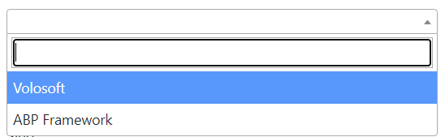
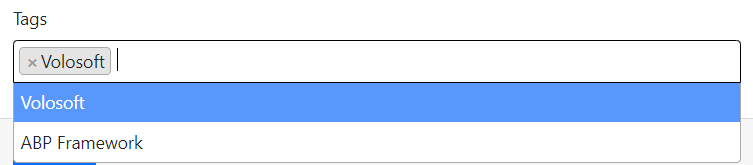

# ASP.NET Core MVC / Razor Pages: Auto-Complete Select
A simple select component sometimes isn't useful with huge a amount of data. ABP Provides a select implementation that works with pagination and server-side search via using [Select2](https://select2.org/). It works with single or multiple choices well.

A screenshot can be shown below.

| Single | Multiple |
| --- | --- |
|  | |

## Getting Started

This is a core feature and it's used by the ABP Framework. There is no custom installation or additional packages required.

## Usage

A simple usage is presented below.

```html
<select asp-for="Book.AuthorId" 
    class="auto-complete-select"
    data-autocomplete-api-url="/api/app/author"
    data-autocomplete-display-property="name"
    data-autocomplete-value-property="id"
    data-autocomplete-items-property="items"
    data-autocomplete-filter-param-name="filter">

    <!-- You can define selected option(s) here  -->
    <option value="@SelectedAuthor.Id">@SelectedAuthor.Name</option>
</select>
```

The select must have the `auto-complete-select` class and the following attributes:

- `data-autocomplete-api-url`: * API Endpoint url to get select items. **GET** request will be sent to this url.
- `data-autocomplete-display-property`: * Property name to display. _(For example: `name` or `title`. Property name of entity/dto.)_.
- `data-autocomplete-value-property`: * Identifier property name. _(For example: `id`)_.
- `data-autocomplete-items-property`: * Property name of collection in response object. _(For example: `items`)_
- `data-autocomplete-filter-param-name`: * Filter text property name. _(For example: `filter`)_.
- `data-autocomplete-selected-item-name`: Text to display as selected item.
- `data-autocomplete-parent-selector`: jQuery selector expression for parent DOM. _(If it's in a modal, it's suggested to send the modal selector as this parameter)_.

Also, selected value(s) should be defined with the `<option>` tags inside select, since pagination is applied and the selected options might haven't loaded yet.


### Multiple Choices
AutoComplete Select supports multiple choices. If the select tag has a `multiple` attribute, it'll allow to choose multiple options.

```html
<select asp-for="Book.TagIds" 
    class="auto-complete-select"
    multiple="multiple"
    data-autocomplete-api-url="/api/app/tags"
    data-autocomplete-display-property="name"
    data-autocomplete-value-property="id"
    data-autocomplete-items-property="items"
    data-autocomplete-filter-param-name="filter">
    @foreach(var tag in SelectedTags)
    {
        <option value="@tag.Id">@tag.Name</option>
    }
</select>
```

It'll be automatically bound to a collection of defined value type.
```csharp
    public List<Guid> TagIds { get; set; }
```

## Notices
If the authenticated user doesn't have permission on the given URL, the user will get an authorization error. Be careful while designing this kind of UIs.
You can create a specific, [unauthorized](../../Authorization.md) endpoint/method to get the list of items, so the page can retrieve lookup data of dependent entity without giving the entire read permission to users.