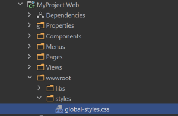

# ASP.NET Core MVC / Razor Pages: The Basic Theme

The Basic Theme is a theme implementation for the ASP.NET Core MVC / Razor Pages UI. It is a minimalist theme that doesn't add any styling on top of the plain [Bootstrap](https://getbootstrap.com/). You can take the Basic Theme as the **base theme** and build your own theme or styling on top of it. See the *Customization* section.

The Basic Theme has RTL (Right-to-Left language) support.

> If you are looking for a professional, enterprise ready theme, you can check the [Lepton Theme](https://commercial.abp.io/themes), which is a part of the [ABP Commercial](https://commercial.abp.io/).

> See the [Theming document](Theming.md) to learn about themes.

## Installation

**This theme is already installed** when you create a new solution using the [startup templates](../../Startup-Templates/Index.md). If you need to manually install it, follow the steps below:

* Install the [Volo.Abp.AspNetCore.Mvc.UI.Theme.Basic](https://www.nuget.org/packages/Volo.Abp.AspNetCore.Mvc.UI.Theme.Basic) NuGet package to your web project.
* Add `AbpAspNetCoreMvcUiBasicThemeModule` into the `[DependsOn(...)]` attribute for your [module class](../../Module-Development-Basics.md) in the web project.
* Install the [@abp/aspnetcore.mvc.ui.theme.basic](https://www.npmjs.com/package/@abp/aspnetcore.mvc.ui.theme.basic) NPM package to your web project (e.g. `npm install @abp/aspnetcore.mvc.ui.theme.basic` or `yarn add @abp/aspnetcore.mvc.ui.theme.basic`).
* Run `gulp` command in a command line terminal in the web project's folder.

## Layouts

The Basic Theme implements the standard layouts. All the layouts implement the following parts;

* Global [Bundles](Bundling-Minification.md)
* [Page Alerts](Page-Alerts.md)
* [Layout Hooks](Layout-Hooks.md)
* [Widget](Widgets.md) Resources

### The Application Layout


Application Layout implements the following parts, in addition to the common parts mentioned above;

* Branding
* Main [Menu](Navigation-Menu.md)
* Main [Toolbar](Toolbars.md) with Language Selection & User Menu

### The Account Layout


Application Layout implements the following parts, in addition to the common parts mentioned above;

* Branding
* Main [Menu](Navigation-Menu.md)
* Main [Toolbar](Toolbars.md) with Language Selection & User Menu
* Tenant Switch Area

### Empty Layout

Empty layout is empty, as its name stands for. However, it implements the common parts mentioned above.

## Customization

You have two options two customize this theme:

### Overriding Styles/Components

In this approach, you continue to use the the theme as NuGet and NPM packages and customize the parts you need to. There are several ways to customize it;

#### Override the Styles

1. Create a CSS file in the `wwwroot` folder of your project:



2. Add the style file to the global bundle, in the `ConfigureServices` method of your [module](../../Module-Development-Basics.md):

````csharp
Configure<AbpBundlingOptions>(options =>
{
    options.StyleBundles.Configure(BasicThemeBundles.Styles.Global, bundle =>
    {
        bundle.AddFiles("/styles/global-styles.css");
    });
});
````

#### Override the Components

See the [User Interface Customization Guide](Customization-User-Interface.md) to learn how you can replace components, customize and extend the user interface.

### Copy & Customize

You can run the following [ABP CLI](../../CLI.md) command to copy the source code to your solution:

`abp add-package Volo.Abp.AspNetCore.Components.Server.BasicTheme --with-source-code --add-to-solution-file`

----

Or, you can download the [source code](https://github.com/abpframework/abp/tree/dev/modules/basic-theme/src/Volo.Abp.AspNetCore.Mvc.UI.Theme.Basic) of the Basic Theme, manually copy the project content into your solution, re-arrange the package/module dependencies (see the Installation section above to understand how it was installed to the project) and freely customize the theme based on your application requirements.

## See Also

* [Theming](Theming.md)