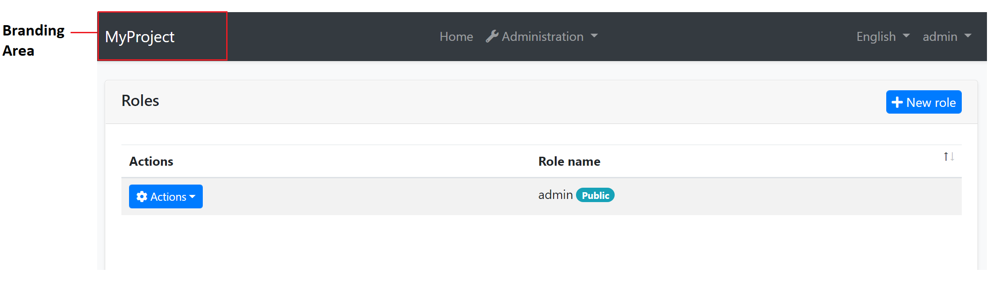

# ASP.NET Core MVC / Razor Pages: Branding

## IBrandingProvider

`IBrandingProvider` is a simple interface that is used to show the application name and logo on the layout.

The screenshot below shows *MyProject* as the application name:



You can implement the `IBrandingProvider` interface or inherit from the `DefaultBrandingProvider` to set the application name:

````csharp
using Volo.Abp.Ui.Branding;
using Volo.Abp.DependencyInjection;

namespace MyProject.Web
{
    [Dependency(ReplaceServices = true)]
    public class MyProjectBrandingProvider : DefaultBrandingProvider
    {
        public override string AppName => "Book Store";

        public override string LogoUrl => "logo.png";
    }
}
````

The result will be like shown below:


`IBrandingProvider` has the following properties:

* `AppName`: The application name.
* `LogoUrl`: A URL to show the application logo.
* `LogoReverseUrl`: A URL to show the application logo on a reverse color theme (dark, for example).

> **Tip**: `IBrandingProvider` is used in every page refresh. For a multi-tenant application, you can return a tenant specific application name to customize it per tenant.

## Overriding the Branding Area

You can see the [UI Customization Guide](Customization-User-Interface.md) to learn how you can replace the branding area with a custom view component.
