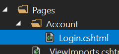
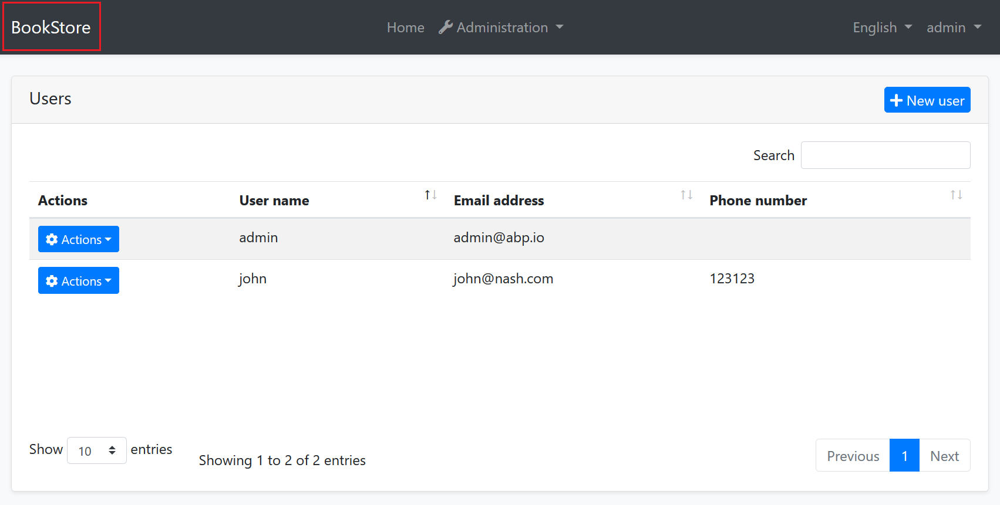
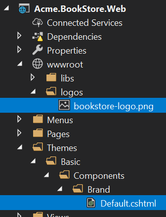
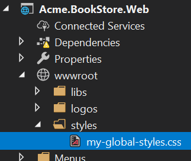
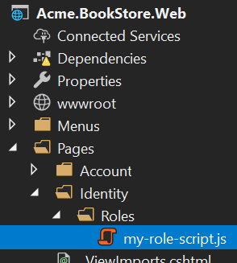
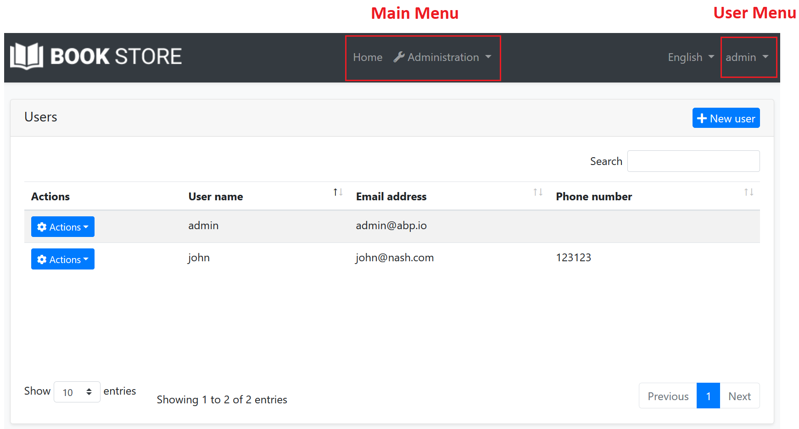

# ASP.NET Core (MVC / Razor Pages) User Interface Customization Guide

This document explains how to override the user interface of a depended [application module](../../Modules/Index.md) or [theme](Theming.md) for ASP.NET Core MVC / Razor Page applications.

## Overriding a Page

This section covers the [Razor Pages](https://docs.microsoft.com/en-us/aspnet/core/razor-pages/) development, which is the recommended approach to create server rendered user interface for ASP.NET Core. Pre-built modules typically uses the Razor Pages approach instead of the classic MVC pattern (next sections will cover the MVC pattern too).

You typically have three kind of override requirement for a page:

* Overriding **only the Page Model** (C#) side to perform additional logic without changing the page UI.
* Overriding **only the Razor Page** (.chtml file) to change the UI without changing the c# behind the page.
* **Completely overriding** the page.

### Overriding a Page Model (C#)

````csharp
using System.Threading.Tasks;
using Microsoft.AspNetCore.Mvc;
using Volo.Abp.DependencyInjection;
using Volo.Abp.Identity;
using Volo.Abp.Identity.Web.Pages.Identity.Users;

namespace Acme.BookStore.Web.Pages.Identity.Users
{
    [Dependency(ReplaceServices = true)]
    [ExposeServices(typeof(EditModalModel))]
    public class MyEditModalModel : EditModalModel
    {
        public MyEditModalModel(
            IIdentityUserAppService identityUserAppService,
            IIdentityRoleAppService identityRoleAppService
            ) : base(
                identityUserAppService,
                identityRoleAppService)
        {
        }

        public async override Task<IActionResult> OnPostAsync()
        {
            //TODO: Additional logic
            await base.OnPostAsync();
            //TODO: Additional logic
        }
    }
}
````

* This class inherits from and replaces the `EditModalModel` for the users and overrides the `OnPostAsync` method to perform additional logic before and after the underlying code.
* It uses `ExposeServices` and `Dependency` attributes to replace the class.

### Overriding a Razor Page (.CSHTML)

Overriding a `.cshtml` file (razor page, razor view, view component... etc.) is possible through creating the same `.cshtml` file under the same path.

#### Example

This example overrides the **login page** UI defined by the [Account Module](../../Modules/Account.md).

The account module defines a `Login.cshtml` file under the `Pages/Account` folder. So, you can override it by creating a file in the same path:



You typically want to copy the original `.cshtml` file of the module, then make the necessary changes. You can find the original file [here](https://github.com/abpframework/abp/blob/dev/modules/account/src/Volo.Abp.Account.Web/Pages/Account/Login.cshtml). Do not copy the `Login.cshtml.cs` file which is the code behind file for the razor page and we don't want to override it yet (see the next section).

Also IF NOT exist you need to create _ViewImports.cshtml with content to load js files. 


That's all, you can change the file content however you like.

### Completely Overriding a Razor Page

You may want to completely override a page; the razor and the c# file related to the page.

In such a case;

1. Override the C# page model class just like described above, but don't replace the existing page model class.
2. Override the Razor Page just described above, but also change the @model directive to point your new page model.

#### Example

This example overrides the **login page** defined by the [Account Module](../../Modules/Account.md).

Create a page model class deriving from the ` LoginModel ` (defined in the ` Volo.Abp.Account.Web.Pages.Account ` namespace):

````csharp
public class MyLoginModel : LoginModel
{
    public MyLoginModel(
        IAuthenticationSchemeProvider schemeProvider,
        IOptions<AbpAccountOptions> accountOptions
        ) : base(
        schemeProvider,
        accountOptions)
    {

    }

    public override Task<IActionResult> OnPostAsync(string action)
    {
        //TODO: Add logic
        return base.OnPostAsync(action);
    }

    //TODO: Add new methods and properties...
}
````

You can override any method or add new properties/methods if needed.

> Notice that we didn't use `[Dependency(ReplaceServices = true)]` or `[ExposeServices(typeof(LoginModel))]` since we don't want to replace the existing class in the dependency injection, we define a new one.

Copy `Login.cshtml` file into your solution as just described above. Change the **@model** directive to point to the `MyLoginModel`:

````xml
@page
...
@model Acme.BookStore.Web.Pages.Account.MyLoginModel
...
````

That's all! Make any change in the view and run your application.

#### Replacing Page Model Without Inheritance

You don't have to inherit from the original page model class (like done in the previous example). Instead, you can completely **re-implement** the page yourself. In this case, just derive from `PageModel`, `AbpPageModel` or any suitable base class you need.

## Overriding a View Component

The ABP Framework, pre-built themes and modules define some **re-usable view components**. These view components can be replaced just like a page described above.

### Example

The screenshot below was taken from the [Basic Theme](Basic-Theme.md) comes with the application startup template.



The [Basic Theme](Basic-Theme.md) defines some view components for the layout. For example, the highlighted area with the red rectangle above is called **Brand component**. You probably want to customize this component by adding your **own application logo**. Let's see how to do it.

First, create your logo and place under a folder in your web application. We used `wwwroot/logos/bookstore-logo.png` path. Then copy the Brand component's view ([from here](https://github.com/abpframework/abp/blob/dev/modules/basic-theme/src/Volo.Abp.AspNetCore.Mvc.UI.Theme.Basic/Themes/Basic/Components/Brand/Default.cshtml)) from the basic theme files under the `Themes/Basic/Components/Brand` folder. The result should be similar the picture below:



Then change the `Default.cshtml` as you like. Example content can be like that:

````xml
<a href="/">
    
</a>
````

Now, you can run the application to see the result:


If you need, you can also replace [the code behind c# class](https://github.com/abpframework/abp/blob/dev/modules/basic-theme/src/Volo.Abp.AspNetCore.Mvc.UI.Theme.Basic/Themes/Basic/Components/Brand/MainNavbarBrandViewComponent.cs) of the component just using the dependency injection system.

### Overriding the Theme

Just as explained above, you can replace any component, layout or c# class of the used theme. See the [theming document](Theming.md) for more information on the theming system.

## Overriding Static Resources

Overriding a static embedded resource (like JavaScript, Css or image files) of a module is pretty easy. Just place a file in the same path in your solution and let the [Virtual File System](../../Virtual-File-System.md) to handle it.

## Manipulating the Bundles

The [Bundling & Minification](Bundling-Minification.md) system provides an **extensible and dynamic** system to create **script** and **style** bundles. It allows you to extend and manipulate the existing bundles.

### Example: Add a Global CSS File

For example, ABP Framework defines a **global style bundle** which is added to every page (actually, added to the layout by the themes). Let's add a **custom style file** to the end of the bundle files, so we can override any global style.

First, create a CSS file and locate it in a folder inside the `wwwroot`:



Define some custom CSS rules inside the file. Example:

````css
.card-title {
    color: orange;
    font-size: 2em;
    text-decoration: underline;
}

.btn-primary {
    background-color: red;
}
````

Then add this file to the standard global style bundle in the `ConfigureServices` method of your [module](../../Module-Development-Basics.md):

````csharp
Configure<AbpBundlingOptions>(options =>
{
    options.StyleBundles.Configure(
        StandardBundles.Styles.Global, //The bundle name!
        bundleConfiguration =>
        {
            bundleConfiguration.AddFiles("/styles/my-global-styles.css");
        }
    );
});
````

#### The Global Script Bundle

Just like the `StandardBundles.Styles.Global`, there is a `StandardBundles.Scripts.Global` that you can add files or manipulate the existing ones.

### Example: Manipulate the Bundle Files

The example above adds a new file to the bundle. You can do more if you create a **bundle contributor** class. Example:

````csharp
public class MyGlobalStyleBundleContributor : BundleContributor
{
    public override void ConfigureBundle(BundleConfigurationContext context)
    {
        context.Files.Clear();
        context.Files.Add("/styles/my-global-styles.css");
    }
}
````

Then you can add the contributor to an existing bundle:

````csharp
Configure<AbpBundlingOptions>(options =>
{
    options.StyleBundles.Configure(
        StandardBundles.Styles.Global,
        bundleConfiguration =>
        {
            bundleConfiguration.AddContributors(typeof(MyGlobalStyleBundleContributor));
        }
    );
});
````

It is not a good idea to clear all CSS files. In a real world scenario, you can find and replace a specific file with your own file.

### Example: Add a JavaScript File for a Specific Page

The examples above works with the global bundle added to the layout. What if you want to add a CSS/JavaScript file (or replace a file) for a specific page defines inside a depended module?

Assume that you want to run a **JavaScript code** once the user enters to the **Role Management** page of the Identity Module.

First, create a standard JavaScript file under the `wwwroot`, `Pages` or `Views` folder (ABP support to add static resources inside these folders by default). We prefer the `Pages/Identity/Roles` folder to follow the conventions:



Content of the file is simple:

````js
$(function() {
    abp.log.info('My custom role script file has been loaded!');
});
````

Then add this file to the bundle of the role management page:

````csharp
Configure<AbpBundlingOptions>(options =>
{
    options.ScriptBundles
        .Configure(
            typeof(Volo.Abp.Identity.Web.Pages.Identity.Roles.IndexModel).FullName,
            bundleConfig =>
            {
                bundleConfig.AddFiles("/Pages/Identity/Roles/my-role-script.js");
            });
});
````

`typeof(Volo.Abp.Identity.Web.Pages.Identity.Roles.IndexModel).FullName` is the safe way to get the bundle name for the role management page.

> Notice that not every page defines such page bundles. They define only if needed.

In addition to adding new CSS/JavaScript file to a page, you also can replace the existing one (by defining a bundle contributor).

## Layout Customization

Layouts are defined by the theme ([see the theming](Theming.md)) by design. They are not included in a downloaded application solution. In this way you can easily **upgrade** the theme and get new features. You can not **directly change** the layout code in your application unless you replace it by your own layout (will be explained in the next sections).

There are some common ways to **customize the layout** described in the next sections.

### Menu Contributors

There are two **standard menus** defined by the ABP Framework:



* `StandardMenus.Main`: The main menu of the application.
* `StandardMenus.User`: The user menu (generally at the top right of the screen).

Rendering the menus is a responsibility of the theme, but **menu items** are determined by the modules and your application code. Just implement the `IMenuContributor` interface and **manipulate the menu items** in the `ConfigureMenuAsync` method.

Menu contributors are executed whenever need to render the menu. There is already a menu contributor defined in the **application startup template**, so you can take it as an example and improve if necessary. See the [navigation menu](Navigation-Menu.md) document for more.

### Toolbar Contributors

[Toolbar system](Toolbars.md) is used to define **toolbars** on the user interface. Modules (or your application) can add **items** to a toolbar, then the theme renders the toolbar on the **layout**.

There is only one **standard toolbar** (named "Main" - defined as a constant: `StandardToolbars.Main`). For the basic theme, it is rendered as shown below:

In the screenshot above, there are two items added to the main toolbar: Language switch component & user menu. You can add your own items here.

#### Example: Add a Notification Icon

In this example, we will add a **notification (bell) icon** to the left of the language switch item. A item in the toolbar should be a **view component**. So, first, create a new view component in your project:


**NotificationViewComponent.cs**

````csharp
public class NotificationViewComponent : AbpViewComponent
{
    public async Task<IViewComponentResult> InvokeAsync()
    {
        return View("/Pages/Shared/Components/Notification/Default.cshtml");
    }
}
````

**Default.cshtml**

````xml
<div id="MainNotificationIcon" style="color: white; margin: 8px;">
    <i class="far fa-bell"></i>
</div>
````

Now, we can create a class implementing the `IToolbarContributor` interface:

````csharp
public class MyToolbarContributor : IToolbarContributor
{
    public Task ConfigureToolbarAsync(IToolbarConfigurationContext context)
    {
        if (context.Toolbar.Name == StandardToolbars.Main)
        {
            context.Toolbar.Items
                .Insert(0, new ToolbarItem(typeof(NotificationViewComponent)));
        }

        return Task.CompletedTask;
    }
}
````

This class adds the `NotificationViewComponent` as the first item in the `Main` toolbar.

Finally, you need to add this contributor to the `AbpToolbarOptions`, in the `ConfigureServices` of your module:

````csharp
Configure<AbpToolbarOptions>(options =>
{
    options.Contributors.Add(new MyToolbarContributor());
});
````

That's all, you will see the notification icon on the toolbar when you run the application:


`NotificationViewComponent` in this sample simply returns a view without any data. In real life, you probably want to **query database** (or call an HTTP API) to get notifications and pass to the view. If you need, you can add a `JavaScript` or `CSS` file to the global bundle (as described before) for your toolbar item.

See the [toolbars document](Toolbars.md) for more about the toolbar system.

### Layout Hooks

[Layout Hooks](Layout-Hooks.md) system allows you to **add code** at some specific parts of the layout. All layouts of all themes should implement these hooks. Then you can then add a **view component** into a hook point.

#### Example: Add Google Analytics Script

Assume that you need to add the Google Analytics script to the layout (that will be available for all the pages). First, **create a view component** in your project:


**GoogleAnalyticsViewComponent.cs**

````csharp
public class GoogleAnalyticsViewComponent : AbpViewComponent
{
    public IViewComponentResult Invoke()
    {
        return View("/Pages/Shared/Components/GoogleAnalytics/Default.cshtml");
    }
}
````

**Default.cshtml**

````html
<script>
    (function(i,s,o,g,r,a,m){i['GoogleAnalyticsObject']=r;i[r]=i[r]||function(){
            (i[r].q=i[r].q||[]).push(arguments)},i[r].l=1*new Date();a=s.createElement(o),
            m=s.getElementsByTagName(o)[0];a.async=1;a.src=g;m.parentNode.insertBefore(a,m)
    })(window,document,'script','//www.google-analytics.com/analytics.js','ga');

    ga('create', 'UA-xxxxxx-1', 'auto');
    ga('send', 'pageview');
</script>
````

Change `UA-xxxxxx-1` with your own code.

You can then add this component to any of the hook points in the `ConfigureServices` of your module:

````csharp
Configure<AbpLayoutHookOptions>(options =>
{
    options.Add(
        LayoutHooks.Head.Last, //The hook name
        typeof(GoogleAnalyticsViewComponent) //The component to add
    );
});
````

Now, the GA code will be inserted in the `head` of the page as the last item. You (or the modules you are using) can add multiple items to the same hook. All of them will be added to the layout.

The configuration above adds the `GoogleAnalyticsViewComponent` to all layouts. You may want to only add to a specific layout:

````csharp
Configure<AbpLayoutHookOptions>(options =>
{
    options.Add(
        LayoutHooks.Head.Last,
        typeof(GoogleAnalyticsViewComponent),
        layout: StandardLayouts.Application //Set the layout to add
    );
});
````

See the layouts section below to learn more about the layout system.

### Layouts

Layout system allows themes to define standard, named layouts and allows any page to select a proper layout for its purpose. There are three pre-defined layouts:

* "**Application**": The main (and the default) layout for an application. It typically contains header, menu (sidebar), footer, toolbar... etc.
* "**Account**": This layout is used by login, register and other similar pages. It is used for the pages under the `/Pages/Account` folder by default.
* "**Empty**": Empty and minimal layout.

These names are defined in the `StandardLayouts` class as constants. You can definitely create your own layouts, but these are the standard layout names and implemented by all the themes out of the box.

#### Layout Location

You can find the layout files [here](https://github.com/abpframework/abp/blob/dev/modules/basic-theme/src/Volo.Abp.AspNetCore.Mvc.UI.Theme.Basic/Themes/Basic/Layouts) for the basic theme. You can take them as references to build your own layouts or you can override them if necessary.

#### ITheme

ABP Framework uses the `ITheme` service to get the layout location by the layout name. You can replace this service to dynamically select the layout location.

#### IThemeManager

`IThemeManager` is used to obtain the current theme and get the layout path. Any page can determine the layout of its own. Example:

````html
@using Volo.Abp.AspNetCore.Mvc.UI.Theming
@inject IThemeManager ThemeManager
@{
    Layout = ThemeManager.CurrentTheme.GetLayout(StandardLayouts.Empty);
}
````

This page will use the empty layout. You use `ThemeManager.CurrentTheme.GetEmptyLayout();` extension method as a shortcut.

If you want to set the layout for all the pages under a specific folder, then write the code above in a `_ViewStart.cshtml` file under that folder.
