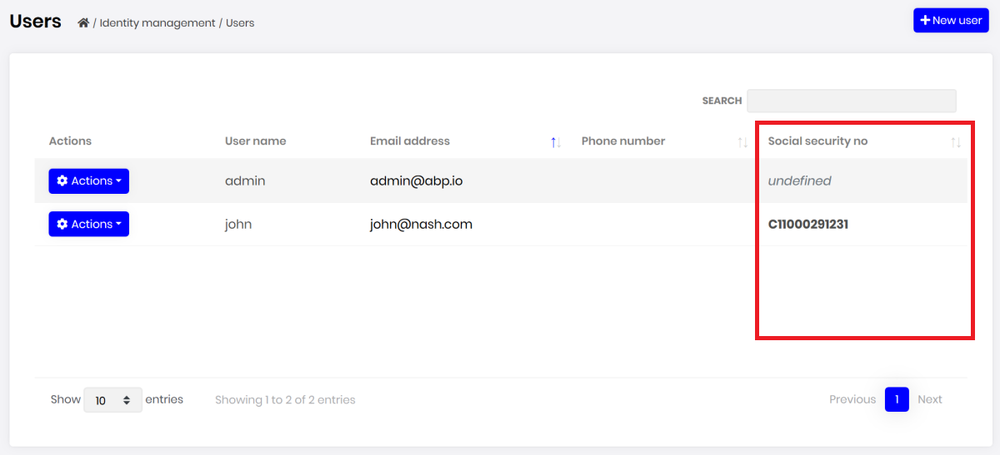

# Data Table Column Extensions for ASP.NET Core UI

## Introduction

Data table column extension system allows you to add a **new table column** on the user interface. The example below adds a new column with the "Social security no" title:



You can use the standard column options to fine control the table column.

> Note that this is a low level API to find control the table column. If you want to show an extension property on the table, see the [module entity extension](../../Module-Entity-Extensions.md) document.

## How to Set Up

### Create a JavaScript File

First, add a new JavaScript file to your solution. We added inside the `/Pages/Identity/Users` folder of the `.Web` project:


Here, the content of this JavaScript file:

```js
abp.ui.extensions.tableColumns
    .get('identity.user')
    .addContributor(function (columnList) {
        columnList.addTail({ //add as the last column
            title: 'Social security no',
            data: 'extraProperties.SocialSecurityNumber',
            orderable: false,
            render: function (data, type, row) {
                if (row.extraProperties.SocialSecurityNumber) {
                    return '<strong>' + 
                        row.extraProperties.SocialSecurityNumber + 
                        '<strong>';
                } else {
                    return '<i class="text-muted">undefined</i>';
                }
            }
        });
    });
```

This example defines a custom `render` function to return a custom HTML to render in the column.

### Add the File to the User Management Page

Then you need to add this JavaScript file to the user management page. You can take the power of the [Bundling & Minification system](https://docs.abp.io/en/abp/latest/UI/AspNetCore/Bundling-Minification).

Write the following code inside the `ConfigureServices` of your module class:

```csharp
Configure<AbpBundlingOptions>(options =>
{
    options.ScriptBundles.Configure(
        typeof(Volo.Abp.Identity.Web.Pages.Identity.Users.IndexModel).FullName,
        bundleConfiguration =>
        {
            bundleConfiguration.AddFiles(
                "/Pages/Identity/Users/my-user-extensions.js"
            );
        });
});
```

This configuration adds `my-user-extensions.js` to the user management page of the Identity Module. `typeof(Volo.Abp.Identity.Web.Pages.Identity.Users.IndexModel).FullName` is the name of the bundle in the user management page. This is a common convention used for all the ABP Commercial modules.

### Rendering the Column

This example assumes that you've defined a `SocialSecurityNumber` extra property using the [module entity extension](../../Module-Entity-Extensions.md) system. However;

* You can add a new column that is related to an existing property of the user (that was not added to the table by default). Example:

````js
abp.ui.extensions.tableColumns
    .get('identity.user')
    .addContributor(function (columnList) {
        columnList.addTail({
            title: 'Phone confirmed?',
            data: 'phoneNumberConfirmed',
            render: function (data, type, row) {
                if (row.phoneNumberConfirmed) {
                    return '<strong style="color: green">YES<strong>';
                } else {
                    return '<i class="text-muted">NO</i>';
                }
            }
        });
    });
````

* You can add a new custom column that is not related to any entity property, but a completely custom information. Example:

````js
abp.ui.extensions.tableColumns
    .get('identity.user')
    .addContributor(function (columnList) {
        columnList.addTail({
            title: 'Custom column',
            data: {},
            orderable: false,
            render: function (data) {
                if (data.phoneNumber) {
                    return "call: " + data.phoneNumber;
                } else {
                    return '';
                }
            }
        });
    });
````

## API

This section explains details of the `abp.ui.extensions.tableColumns` JavaScript API.

### abp.ui.extensions.tableColumns.get(entityName)

This method is used to access the table columns for an entity of a specific module. It takes one parameter:

* **entityName**: The name of the entity defined by the related module.

### abp.ui.extensions.tableColumns.get(entityName).columns

The `columns` property is used to retrieve a [doubly linked list](../Common/Utils/Linked-List.md) of previously defined columns for a table. All contributors are executed in order to prepare the final column list. This is normally called by the modules to show the columns in the table. However, you can use it if you are building your own extensible UIs.

### abp.ui.extensions.tableColumns.get(entityName).addContributor(contributeCallback [, order])

The `addContributor` method covers all scenarios, e.g. you want to add your column in a different position in the list, change or remove an existing column. `addContributor` has the following parameters:

* **contributeCallback**: A callback function that is called whenever the column list should be created. You can freely modify the column list inside this callback method.
* **order** (optional): The order of the callback in the callback list. Your callback is added to the end of the list (so, you have opportunity to modify columns added by the previous contributors). You can set it `0` to add your contributor as the first item.

#### Example

```js
var myColumnDefinition = {
    title: 'Custom column',
    data: {},
    orderable: false,
    render: function(data) {
        if (data.phoneNumber) {
            return "call: " + data.phoneNumber;
        } else {
            return '';
        }
    }
};

abp.ui.extensions.tableColumns
    .get('identity.user')
    .addContributor(function (columnList) {
        // Remove an item from actionList
        columnList.dropHead();

        // Add a new item to the actionList
        columnList.addHead(myColumnDefinition);
    });
```

> `columnList` is [linked list](../Common/Utils/Linked-List.md). You can use its methods to build a list of columns however you need.
