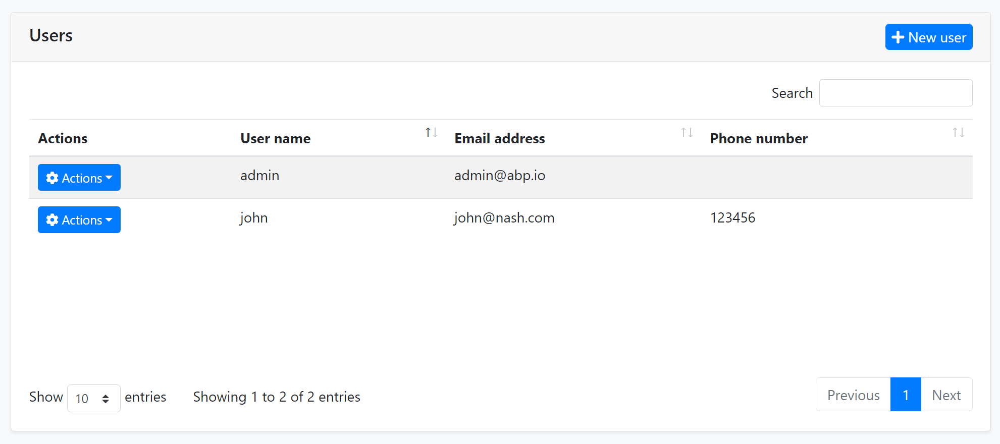
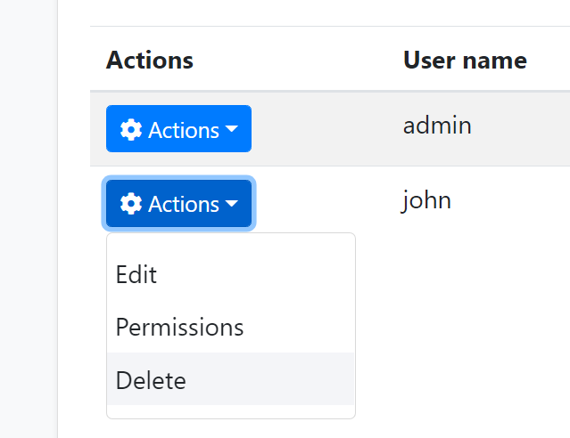
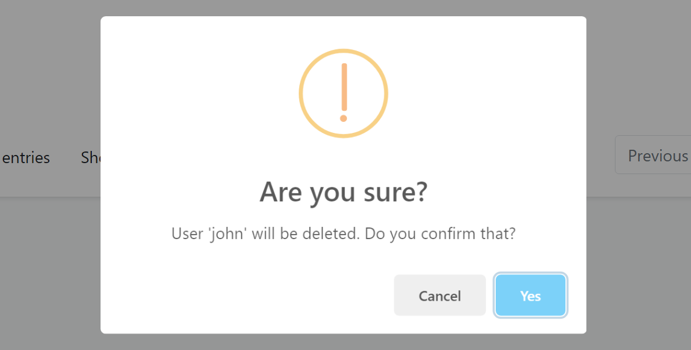
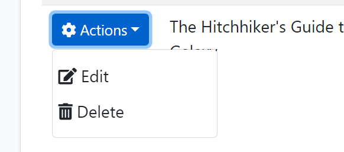
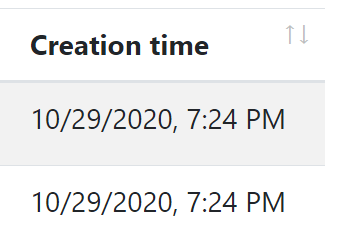
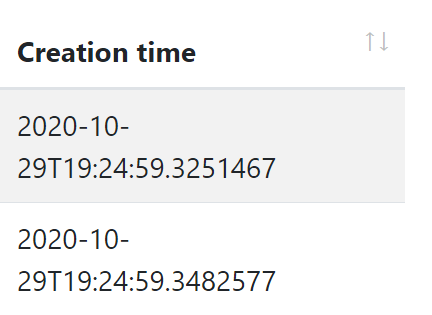

# ASP.NET Core MVC / Razor Pages: Data Tables

A Data Table (aka Data Grid) is a UI component to show tabular data to the users. There are a lot of Data table components/libraries and **you can use any one you like** with the ABP Framework. However, the startup templates come with the [DataTables.Net](https://datatables.net/) library as **pre-installed and configured**. ABP Framework provides adapters for this library and make it easy to use with the API endpoints.

An example screenshot from the user management page that shows the user list in a data table:



## DataTables.Net Integration

First of all, you can follow the official documentation to understand how the [DataTables.Net](https://datatables.net/) works. This section will focus on the ABP addons & integration points rather than fully covering the usage of this library.

### A Quick Example

You can follow the [web application development tutorial](https://docs.abp.io/en/abp/latest/Tutorials/Part-1?UI=MVC) for a complete example application that uses the DataTables.Net as the Data Table. This section shows a minimalist example.

You do nothing to add DataTables.Net library to the page since it is already added to the global [bundle](Bundling-Minification.md) by default.

First, add an `abp-table` as shown below, with an `id`:

````html
<abp-table striped-rows="true" id="BooksTable"></abp-table>
````

> `abp-table` is a [Tag Helper](Tag-Helpers/Index.md) defined by the ABP Framework, but a simple `<table...>` tag would also work.

Then call the `DataTable` plugin on the table selector:

````js
var dataTable = $('#BooksTable').DataTable(
    abp.libs.datatables.normalizeConfiguration({
        serverSide: true,
        paging: true,
        order: [[1, "asc"]],
        searching: false,
        ajax: abp.libs.datatables.createAjax(acme.bookStore.books.book.getList),
        columnDefs: [
            {
                title: l('Actions'),
                rowAction: {
                    items:
                        [
                            {
                                text: l('Edit'),
                                action: function (data) {
                                    ///...
                                }
                            }
                        ]
                }
            },
            {
                title: l('Name'),
                data: "name"
            },
            {
                title: l('PublishDate'),
                data: "publishDate",
                render: function (data) {
                    return luxon
                        .DateTime
                        .fromISO(data, {
                            locale: abp.localization.currentCulture.name
                        }).toLocaleString();
                }
            },
            {
                title: l('Price'),
                data: "price"
            }
        ]
    })
);
````

The example code above uses some ABP integration features those will be explained in the next sections.

### Configuration Normalization

`abp.libs.datatables.normalizeConfiguration` function takes a DataTables configuration and normalizes to simplify it;

* Sets `scrollX` option to `true`, if not set.
* Sets `target` index for the column definitions.
* Sets the `language` option to [localize](../../Localization.md) the table in the current language.

#### Default Configuration

`normalizeConfiguration` uses the default configuration. You can change the default configuration using the `abp.libs.datatables.defaultConfigurations` object. Example:

````js
abp.libs.datatables.defaultConfigurations.scrollX = false;
````

Here, the all configuration options;

* `scrollX`: `false` by default.
* `dom`: Default value is `<"dataTable_filters"f>rt<"row dataTable_footer"<"col-auto"l><"col-auto"i><"col"p>>`.
* `language`: A function that returns the localization text using the current language.

### AJAX Adapter

DataTables.Net has its own expected data format while getting results of an AJAX call to the server to get the table data. They are especially related how paging and sorting parameters are sent and received. ABP Framework also offers its own conventions for the client-server [AJAX](JavaScript-API/Ajax.md) communication. 

The `abp.libs.datatables.createAjax` method (used in the example above) adapts request and response data format and perfectly works with the [Dynamic JavaScript Client Proxy](Dynamic-JavaScript-Proxies.md) system.

This works automatically, so most of the times you don't need to know how it works. See the [DTO document](../../Data-Transfer-Objects.md) if you want to learn more about `IPagedAndSortedResultRequest`, `IPagedResult` and other standard interfaces and base DTO classes those are used in client to server communication.

The `createAjax` also supports you to customize request parameters and handle the responses.

**Example:**

````csharp
var inputAction = function () {
    return {
        id: $('#Id').val(),
        name: $('#Name').val(),
    };
};

var responseCallback = function(result) {

    // your custom code.

    return {
        recordsTotal: result.totalCount,
        recordsFiltered: result.totalCount,
        data: result.items
    };
};

ajax: abp.libs.datatables.createAjax(acme.bookStore.books.book.getList, inputAction, responseCallback)
````

### Row Actions

`rowAction` is an option defined by the ABP Framework to the column definitions to show a drop down button to take actions for a row in the table.

The example screenshot below shows the actions for each user in the user management table:



`rowAction` is defined as a part of a column definition:

````csharp
{
    title: l('Actions'),
    rowAction: {
        //TODO: CONFIGURATION
    }
},
````

**Example: Show *Edit* and *Delete* actions for a book row**

````js
{
    title: l('Actions'),
    rowAction: {
        items:
            [
                {
                    text: l('Edit'),
                    action: function (data) {
                        //TODO: Open a modal to edit the book
                    }
                },
                {
                    text: l('Delete'),
                    confirmMessage: function (data) {
                        return "Are you sure to delete the book " + data.record.name;
                    },
                    action: function (data) {
                        acme.bookStore.books.book
                            .delete(data.record.id)
                            .then(function() {
                                abp.notify.info("Successfully deleted!");
                                data.table.ajax.reload();
                            });
                    }
                }
            ]
    }
},
````

#### Action Items

`items` is an array of action definitions. An action definition can have the following options;

* `text`: The text (a `string`) for this action to be shown in the actions drop down.
* `action`: A `function` that is executed when the user clicks to the action. The function takes a `data` argument that has the following fields;
  * `data.record`: This is the data object related to the row. You can access the data fields like `data.record.id`, `data.record.name`... etc.
  * `data.table`: The DataTables instance.
* `confirmMessage`: A `function` (see the example above) that returns a message (`string`) to show a dialog to get a confirmation from the user before executing the `action`. Example confirmation dialog:



You can use the [localization](JavaScript-API/Localization.md) system to show a localized message.

* `visible`: A `bool` or a `function` that returns a `bool`. If the result is `false`, then the action is not shown in the actions dropdown. This is generally combined by the [authorization](JavaScript-API/Auth.md) system to hide the action if the user has no permission to take this action. Example:

````js
visible: abp.auth.isGranted('BookStore.Books.Delete');
````

If you define a `function`, then the `function` has two arguments: `record` (the data object of the related row) and the `table` (the DataTable instance). So, you can decide to show/hide the action dynamically, based on the row data and other conditions.

* `iconClass`: Can be used to show a font-icon, like a [Font-Awesome](https://fontawesome.com/) icon (ex: `fas fa-trash-alt`), near to the action text. Example screenshot:



* `enabled`: A `function` that returns a `bool` to disable the action. The `function` takes a `data` object with two fields: `data.record` is the data object related to the row and `data.table` is the DataTables instance.
* `displayNameHtml`: Set this to `true` is the `text` value contains HTML tags.

There are some rules with the action items;

* If none of the action items is visible then the actions column is not rendered.

### Data Format

#### The Problem

See the *Creation Time* column in the example below:

````js
{
    title: l('CreationTime'),
    data: "creationTime",
    render: function (data) {
        return luxon
            .DateTime
            .fromISO(data, {
                locale: abp.localization.currentCulture.name
            }).toLocaleString(luxon.DateTime.DATETIME_SHORT);
    }
}
````

The `render` is a standard DataTables option to render the column content by a custom function. This example uses the [luxon](https://moment.github.io/luxon/) library (which is installed by default) to write a human readable value of the `creationTime` in the current user's language. Example output of the column:



If you don't define the render option, then the result will be ugly and not user friendly:



However, rendering a `DateTime` is almost same and repeating the same rendering logic everywhere is against to the DRY (Don't Repeat Yourself!) principle.

#### dataFormat Option

`dataFormat` column option specifies the data format that is used to render the column data. The same output could be accomplished using the following column definition:

````js
{
    title: l('CreationTime'),
    data: "creationTime",
    dataFormat: 'datetime'
}
````

`dataFormat: 'datetime'` specifies the data format for this column. There are a few pre-defined `dataFormat`s:

* `boolean`: Shows a `check` icon for `true` and `times` icon for `false` value and useful to render `bool` values.
* `date`: Shows date part of a `DateTime` value, formatted based on the current culture.
* `datetime`: Shows date & time (excluding seconds) of a `DateTime` value, formatted based on the current culture.

### Default Renderers

`abp.libs.datatables.defaultRenderers` option allows you to define new data formats and set renderers for them.

**Example: Render male / female icons based on the gender**

````js
abp.libs.datatables.defaultRenderers['gender'] = function(value) {
    if (value === 'f') {
        return '<i class="fa fa-venus"></i>';
    } else {
        return '<i class="fa fa-mars"></i>';
    }
};
````

Assuming that the possible values for a column data is `f` and `m`, the `gender` data format shows female/male icons instead of `f` and `m` texts. You can now set `dataFormat: 'gender'` for a column definition that has the proper data values.

> You can write the default renderers in a single JavaScript file and add it to the [Global Script Bundle](Bundling-Minification.md), so you can reuse them in all the pages.

## Other Data Grids

You can use any library you like. For example, [see this article](https://community.abp.io/articles/using-devextreme-components-with-the-abp-framework-zb8z7yqv) to learn how to use DevExtreme Data Grid in your applications.
