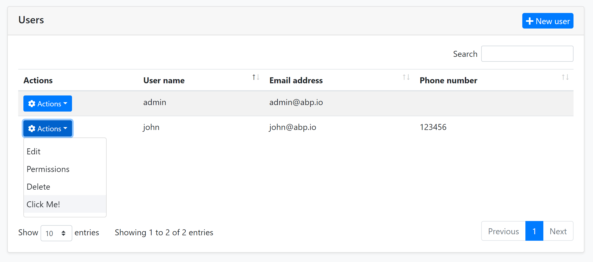
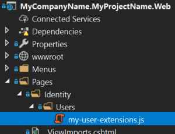

# Entity Action Extensions for ASP.NET Core UI

## Introduction

Entity action extension system allows you to add a **new action** to the action menu for an entity. A **Click Me** action was added to the *User Management* page below:



You can take any action (open a modal, make an HTTP API call, redirect to another page... etc) by writing your custom code. You can access to the current entity in your code.

## How to Set Up

In this example, we will add a "Click Me!" action and execute a JavaScript code for the user management page of the [Identity Module](../../Modules/Identity.md).

### Create a JavaScript File

First, add a new JavaScript file to your solution. We added inside the `/Pages/Identity/Users` folder of the `.Web` project:



Here, the content of this JavaScript file:

```js
var clickMeAction = {
    text: 'Click Me!',
    action: function(data) {
        //TODO: Write your custom code
        alert(data.record.userName);
    }
};

abp.ui.extensions.entityActions
    .get('identity.user')
    .addContributor(function(actionList) {
        actionList.addTail(clickMeAction);
    });
```

In the `action` function, you can do anything you need. See the API section for a detailed usage.

### Add the File to the User Management Page

Then you need to add this JavaScript file to the user management page. You can take the power of the [Bundling & Minification System](Bundling-Minification.md).

Write the following code inside the `ConfigureServices` of your module class:

```csharp
Configure<AbpBundlingOptions>(options =>
{
    options.ScriptBundles.Configure(
        typeof(Volo.Abp.Identity.Web.Pages.Identity.Users.IndexModel).FullName,
        bundleConfiguration =>
        {
            bundleConfiguration.AddFiles(
                "/Pages/Identity/Users/my-user-extensions.js"
            );
        });
});
```

This configuration adds `my-user-extensions.js` to the user management page of the Identity Module. `typeof(Volo.Abp.Identity.Web.Pages.Identity.Users.IndexModel).FullName` is the name of the bundle in the user management page. This is a common convention used for all the ABP Commercial modules.

That's all. Run your application to see the result.

## API

This section explains details of the `abp.ui.extensions.entityActions` JavaScript API.

### abp.ui.extensions.entityActions.get(entityName)

This method is used to access the entity actions of a specific module. It takes one parameter:

* **entityName**: The name of the entity defined by the related module.

### abp.ui.extensions.entityActions.get(entityName).actions

The `actions` property is used to retrieve a [doubly linked list](../Common/Utils/Linked-List.md) of previously defined actions for an entity. All contributors are executed in order to prepare the final actions list. This is normally called by the modules to show the actions in the grid. However, you can use it if you are building your own extensible UIs.

### abp.ui.extensions.entityActions.get(entityName).addContributor(contributeCallback)

The `addContributor` method covers all scenarios, e.g. you want to add your action in a different position in the list, change or remove an existing action item. `addContributor` with the following parameter:

* **contributeCallback**: A callback function that is called whenever the action list should be created. You can freely modify the action list inside this callback method.

#### Example

```js
var clickMe2Action = {
    text: 'Click Me 2!',
    icon: 'fas fa-hand-point-right',
    action: function(data) {
        //TODO: Write your custom code
        alert(data.record.userName);
    }
};

abp.ui.extensions.entityActions
    .get('identity.user')
    .addContributor(function(actionList) {
        // Remove an item from actionList
        actionList.dropHead();
        
        // Add the new item to the actionList
        actionList.addHead(clickMe2Action);
    });
```

> `actionList` is [linked list](../Common/Utils/Linked-List.md). You can use its methods to build a list of columns however you need.
