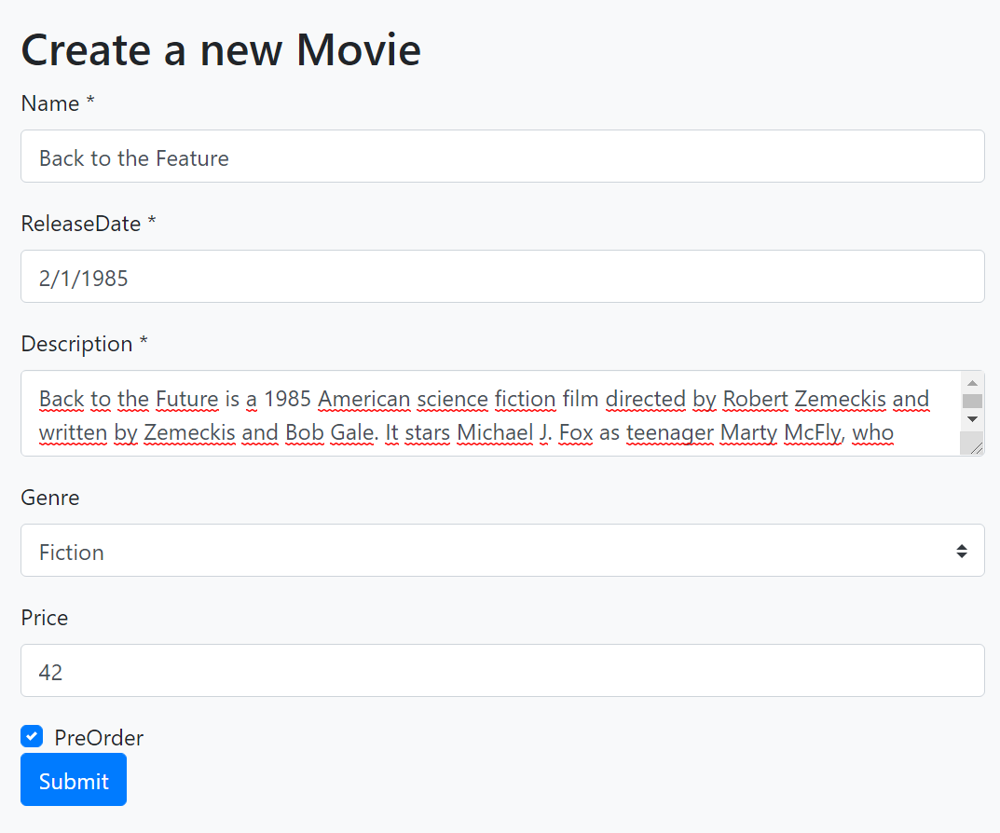
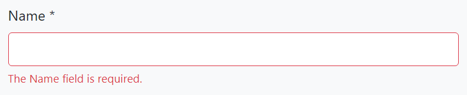
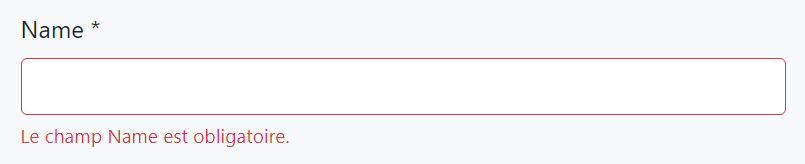
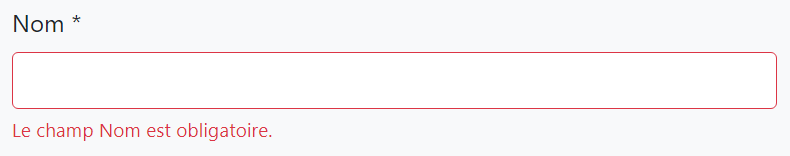

# ASP.NET Core MVC / Razor Pages: Forms & Validation

ABP Framework provides infrastructure and conventions to make easier to create forms, localize display names for the form elements and handle server & client side validation;

* [abp-dynamic-form](Tag-Helpers/Dynamic-Forms.md) tag helper automates **creating a complete form** from a C# model class: Creates the input elements, handles localization and client side validation.
* [ABP Form tag helpers](Tag-Helpers/Form-elements.md) (`abp-input`, `abp-select`, `abp-radio`...) render **a single form element** with handling localization and client side validation.
* ABP Framework automatically **localizes the display name** of a form element without needing to add a `[DisplayName]` attribute.
* **Validation errors** are automatically localized based on the user culture.

> This document is for the **client side validation** and it doesn't cover the server side validation. Check the [validation document](../../Validation.md) for server side validation infrastructure.

## The Classic Way

In a typical Bootstrap based ASP.NET Core MVC / Razor Pages UI, you [need to write](https://docs.microsoft.com/en-us/aspnet/core/mvc/models/validation#client-side-validation) such a boilerplate code to create a simple form element:

````html
<div class="form-group">
    <label asp-for="Movie.ReleaseDate" class="control-label"></label>
    <input asp-for="Movie.ReleaseDate" class="form-control" />
    <span asp-validation-for="Movie.ReleaseDate" class="text-danger"></span>
</div>
````

You can continue to use this approach if you need or prefer it. However, ABP Form tag helpers can produce the same output with a minimal code.

## ABP Dynamic Forms

[abp-dynamic-form](Tag-Helpers/Dynamic-Forms.md) tag helper completely automates the form creation. Take this model class as an example:

```csharp
using System;
using System.ComponentModel.DataAnnotations;
using Volo.Abp.AspNetCore.Mvc.UI.Bootstrap.TagHelpers.Form;

namespace MyProject.Web.Pages
{
    public class MovieViewModel
    {
        [Required]
        [StringLength(256)]
        public string Name { get; set; }

        [Required]
        [DataType(DataType.Date)]
        public DateTime ReleaseDate { get; set; }

        [Required]
        [TextArea]
        [StringLength(1000)]
        public string Description { get; set; }

        public Genre Genre { get; set; }

        public float? Price { get; set; }

        public bool PreOrder { get; set; }
    }
}
```

It uses the data annotation attributes to define validation rules and UI styles for the properties. `Genre`, is an `enum` in this example:

````csharp
namespace MyProject.Web.Pages
{
    public enum Genre
    {
        Classic,
        Action,
        Fiction,
        Fantasy,
        Animation
    }
}
````

In order to create the form in a razor page, create a property in your `PageModel` class:

```csharp
using System.Threading.Tasks;
using Microsoft.AspNetCore.Mvc;
using Microsoft.AspNetCore.Mvc.RazorPages;

namespace MyProject.Web.Pages
{
    public class CreateMovieModel : PageModel
    {
        [BindProperty]
        public MovieViewModel Movie { get; set; }

        public void OnGet()
        {
            Movie = new MovieViewModel();
        }

        public async Task OnPostAsync()
        {
            if (ModelState.IsValid)
            {
                //TODO: Save the Movie
            }
        }
    }
}
```

Then you can render the form in the `.cshtml` file:

```html
@page
@model MyProject.Web.Pages.CreateMovieModel

<h2>Create a new Movie</h2>

<abp-dynamic-form abp-model="Movie" submit-button="true" />
```

The result is shown below:



See the *Localization & Validation* section below to localize the field display names and see how the validation works.

> See [its own document](Tag-Helpers/Dynamic-Forms.md) for all options of the `abp-dynamic-form` tag helper.

## ABP Form Tag Helpers

`abp-dynamic-form` covers most of the scenarios and allows you to control and customize the form using the attributes.

However, if you want to **render the form body yourself** (for example, you may want to fully control the **form layout**), you can directly use the [ABP Form Tag Helpers](Tag-Helpers/Form-elements.md). The same auto-generated form above can be created using the ABP Form Tag Helpers as shown below:

```html
@page
@model MyProject.Web.Pages.CreateMovieModel

<h2>Create a new Movie</h2>

<form method="post">
    <abp-input asp-for="Movie.Name"/>
    <abp-input asp-for="Movie.ReleaseDate"/>
    <abp-input asp-for="Movie.Description"/>
    <abp-select asp-for="Movie.Genre"/>
    <abp-input asp-for="Movie.Price"/>
    <abp-input asp-for="Movie.PreOrder"/>
    <abp-button button-type="Primary" type="submit">Save</abp-button>
</form>
```

> See the [ABP Form Tag Helpers](Tag-Helpers/Form-elements.md) document for details of these tag helpers and their options.

## Validation & Localization

Both of the Dynamic Form and the Form Tag Helpers **automatically validate** the input based on the data annotation attributes and shows validation error messages on the user interface. Error messages are **automatically localized** based on the current culture.

**Example: User leaves empty a required string property**



The error message below is shown if the language is French:



Validation errors are already [translated](https://github.com/abpframework/abp/tree/dev/framework/src/Volo.Abp.Validation/Volo/Abp/Validation/Localization) a lot of languages. You can [contribute](../../Contribution/Index.md) to the translation for your own language or override the texts for your own application by following the [localization](../../Localization.md) documentation.

## Display Name Localization

ABP Framework uses the property name as the field name on the user interface. You typically want to [localize](../../Localization.md) this name based on the current culture.

ABP Framework can conventionally localize the fields on the UI when you add the localization keys to the localization JSON files.

Example: French localization for the *Name* property (add into the `fr.json` in the application):

````js
"Name": "Nom"
````

Then the UI will use the given name for French language:



### Using the `DisplayName:` Prefix

Directly using the property name as the localization key may be a problem if you need to use the property name for other purpose, which a different translation value. In this case, use the `DisplayName:` prefix for the localization key:

````js
"DisplayName:Name": "Nom"
````

ABP prefers to use the `DisplayName:Name` key over the `Name` key if it does exists.

### Using a Custom Localization Key

If you need, you can use the `[DisplayName]` attribute to specify the localization key for a specific property:

````csharp
[DisplayName("MyNameKey")]
public string Name { get; set; }
````

In this case, you can add an entry to the localization file using the key `MyNameKey`.

> If you use the `[DisplayName]` but not add a corresponding entity to the localization file, then ABP Framework shows the given key as the field name, `MyNameKey` for this case. So, it provides a way to specify a hard coded display name even if you don't need to use the localization system.

## See Also

* [Server Side Validation](../../Validation.md)
