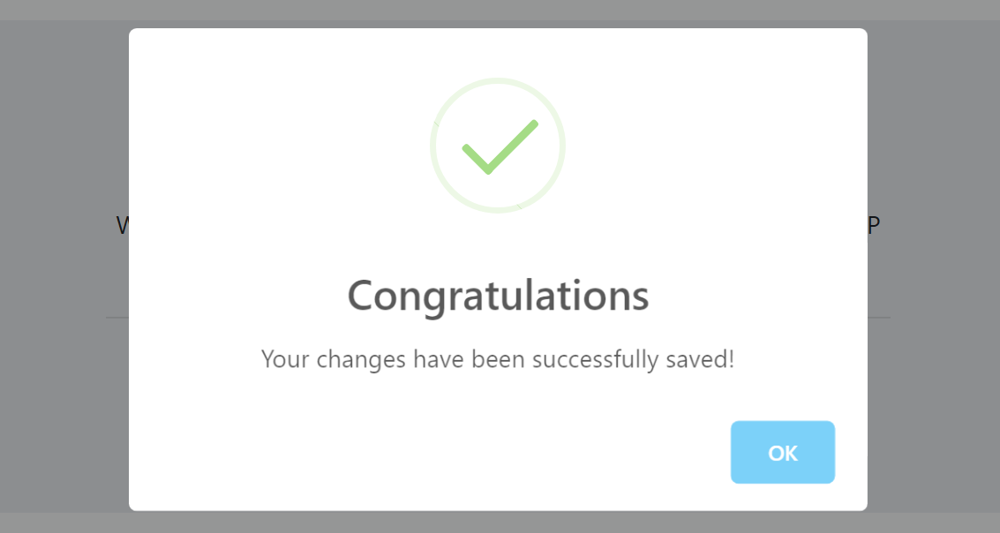
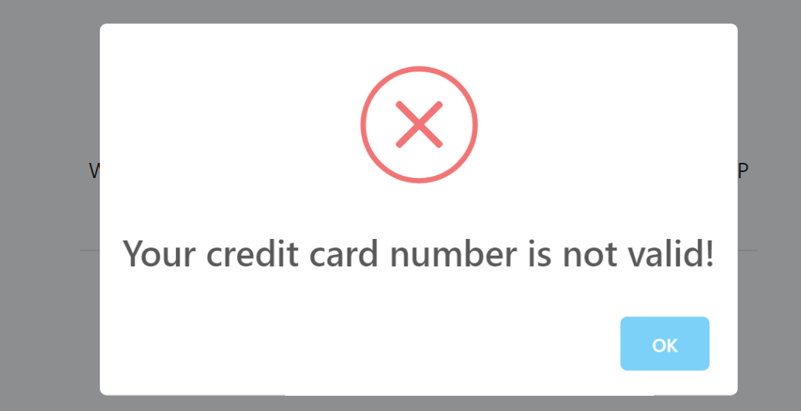
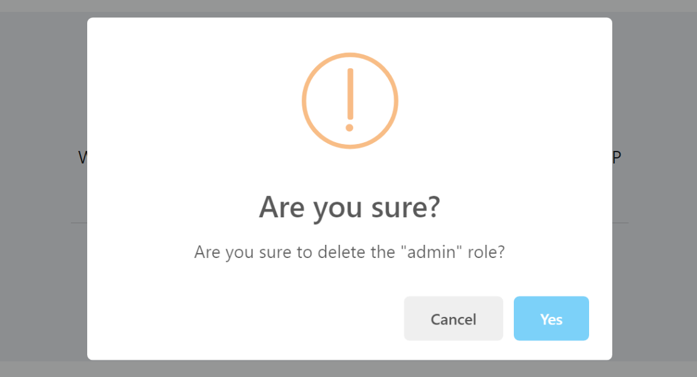

# ASP.NET Core MVC / Razor Pages UI: JavaScript Message API

Message API is used to show nice looking messages to the user as a blocking dialog. Message API is an abstraction provided by the ABP Framework and implemented using the [SweetAlert](https://sweetalert.js.org/) library by default.

## Quick Example

Use `abp.message.success(...)` function to show a success message:

````js
abp.message.success('Your changes have been successfully saved!', 'Congratulations');
````

It will show a dialog on the UI:



## Informative Messages

There are four types of informative message functions:

* `abp.message.info(...)`
* `abp.message.success(...)`
* `abp.message.warn(...)`
* `abp.message.error(...)`

All these methods get two parameters:

* `message`: The message (`string`) to be shown.
* `title`: An optional (`string`) title.

**Example: Show an error message**

````js
abp.message.error('Your credit card number is not valid!');
````



## Confirmation Message

`abp.message.confirm(...)` function can be used to get a confirmation from the user.

**Example**

Use the following code to get a confirmation result from the user:

````js
abp.message.confirm('Are you sure to delete the "admin" role?')
.then(function(confirmed){
  if(confirmed){
    console.log('TODO: deleting the role...');
  }
});
````

The resulting UI will be like shown below:



If user has clicked the `Yes` button, the `confirmed` argument in the `then` callback function will be `true`.

> "*Are you sure?*" is the default title (localized based on the current language) and you can override it.

### The Return Value

The return value of the `abp.message.confirm(...)` function is a promise, so you can chain a `then` callback as shown above.

### Parameters

`abp.message.confirm(...)` function has the following parameters:

* `message`: A message (string) to show to the user.
* `titleOrCallback` (optional): A title or a callback function. If you supply a string, it is shown as the title. If you supply a callback function (that gets a `bool` parameter) then it's called with the result.
* `callback` (optional): If you've passes a title to the second parameter, you can pass your callback function as the 3rd parameter.

Passing a callback function is an alternative to the `then` callback shown above.

**Example: Providing all the parameters and getting result with the callback function**

````js
abp.message.confirm(
  'Are you sure to delete the "admin" role?',
  'Be careful!',
  function(confirmed){
    if(confirmed){
      console.log('TODO: deleting the role...');
    }
  });
````

## SweetAlert Configuration

The Message API is implemented using the [SweetAlert](https://sweetalert.js.org/) library by default. If you want to change its configuration, you can set the options in the `abp.libs.sweetAlert.config` object. The default configuration object is shown below:

````js
{
    'default': {
    },
    info: {
        icon: 'info'
    },
    success: {
        icon: 'success'
    },
    warn: {
        icon: 'warning'
    },
    error: {
        icon: 'error'
    },
    confirm: {
        icon: 'warning',
        title: 'Are you sure?',
        buttons: ['Cancel', 'Yes']
    }
}
````

> "Are you sure?", "Cancel" and "Yes" texts are automatically localized based on the current language.

So, if you want to set the `warn` icon, you can set it like:

````js
abp.libs.sweetAlert.config.warn.icon = 'error';
````

See the [SweetAlert](https://sweetalert.js.org/) for all the configuration options.

