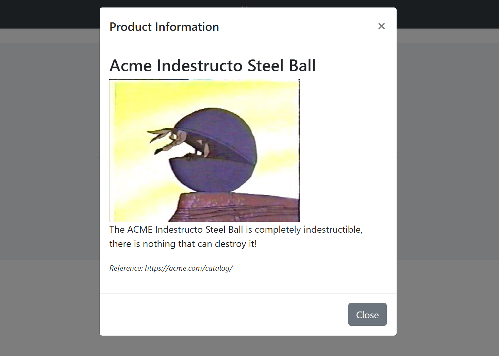

# ASP.NET Core MVC / Razor Pages UI: JavaScript Modal Manager

`abp.ModalManager` is used to easily manage a modal dialog in your application.

**Example: A modal dialog to create a new role entity**


While you can always use the standard Bootstrap API (or another library) to create modal dialogs, `abp.ModalManager` provides the following benefits;

* **Lazy loads** the modal HTML into the page and **removes** it from the DOM once its closed. This makes easy to consume a reusable modal dialog. Also, every time you open the modal, it will be a fresh new modal, so you don't have to deal with resetting the modal content.
* **Auto-focuses** the first input of the form once the modal has been opened.
* Automatically determines the **form** inside a modal and posts the form via **AJAX** instead of normal page post.
* Automatically checks if the form inside the modal **has changed, but not saved**. It warns the user in this case.
* Automatically **disables the modal buttons** (save & cancel) until the AJAX operation completes.
* Makes it easy to register a **JavaScript object that is initialized** once the modal has loaded.

So, the `ModalManager` makes you write less code when you deal with the modals, especially the modals with a form inside.

## Basic Usage

### Creating a Modal as a Razor Page

To demonstrate the usage, we are creating a simple Razor Page, named `ProductInfoModal.cshtml`, under the `/Pages/Products` folder:


**ProductInfoModal.cshtml Content:**

````html
@page
@model MyProject.Web.Pages.Products.ProductInfoModalModel
@{
    Layout = null;
}
<abp-modal>
    <abp-modal-header title="Product Information"></abp-modal-header>
    <abp-modal-body>
        <h3>@Model.ProductName</h3>
        <div>
            
        </div>
        <p>
            @Model.ProductDescription
        </p>
        <p>
            <small><i>Reference: https://acme.com/catalog/</i></small>
        </p>
    </abp-modal-body>
    <abp-modal-footer buttons="Close"></abp-modal-footer>
</abp-modal>

````

* This page sets the `Layout` to `null` since we will show this as a modal. So, no need to wrap with a layout.
* It uses [abp-modal tag helper](../Tag-Helpers/Modals.md) to simplify creating the modal HTML code. You can use the standard  Bootstrap modal code if you prefer it.

**ProductInfoModalModel.cshtml.cs Content:**

```csharp
using Microsoft.AspNetCore.Mvc.RazorPages;

namespace MyProject.Web.Pages.Products
{
    public class ProductInfoModalModel : PageModel
    {
        public string ProductName { get; set; }

        public string ProductDescription { get; set; }

        public void OnGet()
        {
            ProductName = "Acme Indestructo Steel Ball";
            ProductDescription = "The ACME Indestructo Steel Ball is completely indestructible, there is nothing that can destroy it!";
        }
    }
}
```

### Defining the Modal Manager

Once you have a modal, you can open it in any page.

First, create an `abp.ModalManager` object by setting the `viewUrl`:

````js
var productInfoModal = new abp.ModalManager({
    viewUrl: '/Products/ProductInfoModal'
});
````

### Opening the Modal

Then open the modal whenever you need:

````js
productInfoModal.open();
````

You typically want to open the modal when something happens; For example, when the user clicks a button:

````js
$('#OpenProductInfoModal').click(function(){
    productInfoModal.open();
});
````

The resulting modal will be like that:



## Modals with Forms

TODO