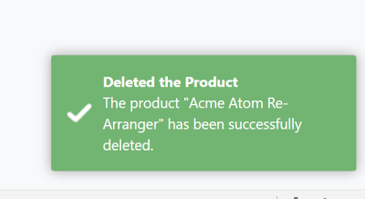

# ASP.NET Core MVC / Razor Pages UI: JavaScript Notify API

Notify API is used to show toast style, auto disappearing UI notifications to the end user. It is implemented by the [Toastr](https://github.com/CodeSeven/toastr) library by default.

## Quick Example

Use `abp.notify.success(...)` function to show a success message:

````js
abp.notify.success(
    'The product "Acme Atom Re-Arranger" has been successfully deleted.',
    'Deleted the Product'
);
````

A notification message is shown at the bottom right of the page:



## Notification Types

There are four types of pre-defined notifications;

* `abp.notify.success(...)`
* `abp.notify.info(...)`
* `abp.notify.warn(...)`
* `abp.notify.error(...)`

All of the methods above gets the following parameters;

* `message`: A message (`string`) to show to the user.
* `title`: An optional title (`string`).
* `options`: Additional options to be passed to the underlying library, to the Toastr by default.

## Toastr Configuration

The notification API is implemented by the [Toastr](https://github.com/CodeSeven/toastr) library by default. You can see its own configuration options.

**Example: Show toast messages on the top right of the page**

````js
toastr.options.positionClass = 'toast-top-right';
````

> ABP sets this option to `toast-bottom-right` by default. You can override it just as shown above.