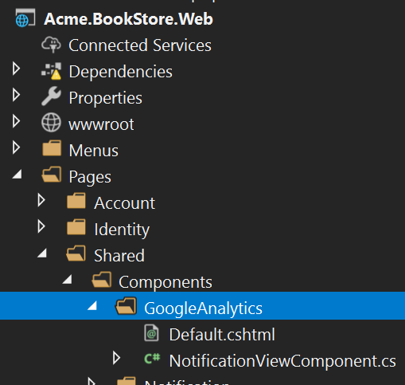

# ASP.NET Core MVC / Razor Pages: Layout Hooks

ABP Framework theming system places the page layout into the [theme](Theming.md) NuGet packages. That means the final application doesn't include a `Layout.cshtml`, so you can't directly change the layout code to customize it.

You copy the theme code into your solution. In this case you are completely free to customize it. However, then you won't be able to get automatic updates of the theme (by upgrading the theme NuGet package).

ABP Framework provides different ways of [customizing the UI](Customization-User-Interface.md).

The **Layout Hook System** allows you to **add code** at some specific parts of the layout. All layouts of all themes should implement these hooks. Finally, you can add a **view component** into a hook point.

## Example: Add Google Analytics Script

Assume that you need to add the Google Analytics script to the layout (that will be available for all the pages). First, **create a view component** in your project:



**NotificationViewComponent.cs**

````csharp
public class GoogleAnalyticsViewComponent : AbpViewComponent
{
    public IViewComponentResult Invoke()
    {
        return View("/Pages/Shared/Components/GoogleAnalytics/Default.cshtml");
    }
}
````

**Default.cshtml**

````html
<script>
    (function(i,s,o,g,r,a,m){i['GoogleAnalyticsObject']=r;i[r]=i[r]||function(){
            (i[r].q=i[r].q||[]).push(arguments)},i[r].l=1*new Date();a=s.createElement(o),
            m=s.getElementsByTagName(o)[0];a.async=1;a.src=g;m.parentNode.insertBefore(a,m)
    })(window,document,'script','//www.google-analytics.com/analytics.js','ga');

    ga('create', 'UA-xxxxxx-1', 'auto');
    ga('send', 'pageview');
</script>
````

Change `UA-xxxxxx-1` with your own code.

You can then add this component to any of the hook points in the `ConfigureServices` of your module:

````csharp
Configure<AbpLayoutHookOptions>(options =>
{
    options.Add(
        LayoutHooks.Head.Last, //The hook name
        typeof(GoogleAnalyticsViewComponent) //The component to add
    );
});
````

Now, the GA code will be inserted in the `head` of the page as the last item.

### Specifying the Layout

The configuration above adds the `GoogleAnalyticsViewComponent` to all layouts. You may want to only add to a specific layout:

````csharp
Configure<AbpLayoutHookOptions>(options =>
{
    options.Add(
        LayoutHooks.Head.Last,
        typeof(GoogleAnalyticsViewComponent),
        layout: StandardLayouts.Application //Set the layout to add
    );
});
````

See the *Layouts* section below to learn more about the layout system.

## Layout Hook Points

There are some pre-defined layout hook points. The `LayoutHooks.Head.Last` used above was one of them. The standard hook points are;

* `LayoutHooks.Head.First`: Used to add a component as the first item in the HTML head tag.
* `LayoutHooks.Head.Last`: Used to add a component as the last item in the HTML head tag.
* `LayoutHooks.Body.First`: Used to add a component as the first item in the HTML body tag.
* `LayoutHooks.Body.Last`: Used to add a component as the last item in the HTML body tag.
* `LayoutHooks.PageContent.First`: Used to add a component just before the page content (the `@RenderBody()` in the layout).
* `LayoutHooks.PageContent.Last`: Used to add a component just after the page content (the `@RenderBody()` in the layout).

> You (or the modules you are using) can add **multiple items to the same hook point**. All of them will be added to the layout by the order they were added.

## Layouts

Layout system allows themes to define standard, named layouts and allows any page to select a proper layout for its purpose. There are three pre-defined layouts:

* "**Application**": The main (and the default) layout for an application. It typically contains header, menu (sidebar), footer, toolbar... etc. 
* "**Account**": This layout is used by login, register and other similar pages. It is used for the pages under the `/Pages/Account` folder by default.
* "**Empty**": Empty and minimal layout.

These names are defined in the `StandardLayouts` class as constants. You can definitely create your own layouts, but these are the standard layout names and implemented by all the themes out of the box.

### Layout Location

You can find the layout files [here](https://github.com/abpframework/abp/blob/dev/modules/basic-theme/src/Volo.Abp.AspNetCore.Mvc.UI.Theme.Basic/Themes/Basic/Layouts) for the basic theme. You can take them as references to build your own layouts or you can override them if necessary.

## See Also

* [Customizing the User Interface](Customization-User-Interface.md)