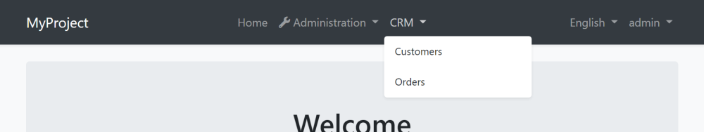
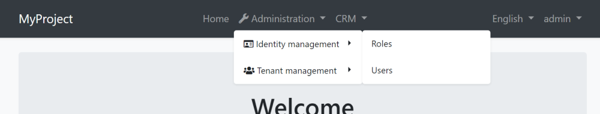
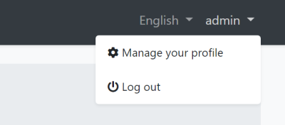

# Navigation Menu

Every application has a main menu to allow users to navigate to pages/screens of the application. Some applications may contain more than one menu in different sections of the UI.

ABP Framework is a [modular](../../Module-Development-Basics.md) application development framework. **Every module may need to add items to the menu**.

So, ABP Framework **provides a menu infrastructure** where;

* The application or the modules can add items to a menu, without knowing how the menu is rendered.
* The [theme](Theming.md) properly renders the menu.

## Adding Menu Items

In order to add menu items (or manipulate the existing items) you need to create a class implementing the `IMenuContributor` interface.

**Example: Add a *CRM* menu item with *Customers* and *Orders* sub menu items**

```csharp
using System.Threading.Tasks;
using MyProject.Localization;
using Volo.Abp.UI.Navigation;

namespace MyProject.Web.Menus
{
    public class MyProjectMenuContributor : IMenuContributor
    {
        public async Task ConfigureMenuAsync(MenuConfigurationContext context)
        {
            if (context.Menu.Name == StandardMenus.Main)
            {
                await ConfigureMainMenuAsync(context);
            }
        }

        private async Task ConfigureMainMenuAsync(MenuConfigurationContext context)
        {
            var l = context.GetLocalizer<MyProjectResource>();

            context.Menu.AddItem(
                new ApplicationMenuItem("MyProject.Crm", l["Menu:CRM"])
                    .AddItem(new ApplicationMenuItem(
                        name: "MyProject.Crm.Customers", 
                        displayName: l["Menu:Customers"], 
                        url: "/crm/customers")
                    ).AddItem(new ApplicationMenuItem(
                        name: "MyProject.Crm.Orders", 
                        displayName: l["Menu:Orders"],
                        url: "/crm/orders")
                     )
            );
        }
    }
}
```

* This example adds items only to the main menu (`StandardMenus.Main`: see the *Standard Menus* section below).
* It gets a `IStringLocalizer` from `context` to localize the display names of the menu items.
* Adds the Customers and Orders as children of the CRM menu.

Once you create a menu contributor, you need to add it to the `AbpNavigationOptions` in the `ConfigureServices` method of your module:

````csharp
Configure<AbpNavigationOptions>(options =>
{
    options.MenuContributors.Add(new MyProjectMenuContributor());
});
````

When you run the application, you will see the menu items added to the main menu:



> The menu is rendered by the current UI theme. So, the look of the main menu can be completely different based on your theme.

Here, a few notes on the menu contributors;

* ABP Framework calls the `ConfigureMenuAsync` method **whenever need to render** the menu.
* Every menu item can have **children**. So, you can add menu items with **unlimited depth** (however, your UI theme may not support unlimited depth).
* Only leaf menu items have `url`s normally. When you click to a parent menu, its sub menu is opened or closed, you don't navigate the `url` of a parent menu item.
* If a menu item has no children and has no `url` defined, then it is not rendered on the UI. This simplifies to authorize the menu items: You only authorize the child items (see the next section). If none of the children are authorized, then the parent automatically disappears.

### Authorization

As seen above, a menu contributor contributes to the menu dynamically. So, you can perform any custom logic or get menu items from any source.

One use case is the [authorization](Authorization.md). You typically want to add menu items by checking a permission.

**Example: Check if the current user has a permission**

````csharp
if (await context.IsGrantedAsync("MyPermissionName"))
{
    //...add menu items
}
````

> You can use `context.AuthorizationService` to directly access to the `IAuthorizationService`.

### Resolving Dependencies

`context.ServiceProvider` can be used to resolve any service dependency.

**Example: Get a service**

````csharp
var myService = context.ServiceProvider.GetRequiredService<IMyService>();
//...use the service
````

> You don't need to care about releasing/disposing services. ABP Framework handles it.

### The Administration Menu

There is a special menu item in the menu menu that is added by the ABP Framework: The *Administration* menu. It is typically used by the pre-built admin [application modules](../../Modules/Index.md):



If you want to add menu items under the *Administration* menu item, you can use the `context.Menu.GetAdministration()` extension method:

````csharp
context.Menu.GetAdministration().AddItem(...)
````

## Standard Menus

A menu is a **named** component. An application may contain more than one menus with different, unique names. There are two pre-defined standard menus:

* `Main`: The main menu of the application. Contains links to the page of the application. Defined as a constant: `Volo.Abp.UI.Navigation.StandardMenus.Main`.
* `User`: User profile menu. Defined as a constant: `Volo.Abp.UI.Navigation.StandardMenus.User`.

The `Main` menu already covered above. The `User` menu is available when a user has logged in:



You can add items to the `User` menu by checking the `context.Menu.Name` as shown below:

```csharp
if (context.Menu.Name == StandardMenus.User)
{
    //...add items
}
```

## IMenuManager

TODO