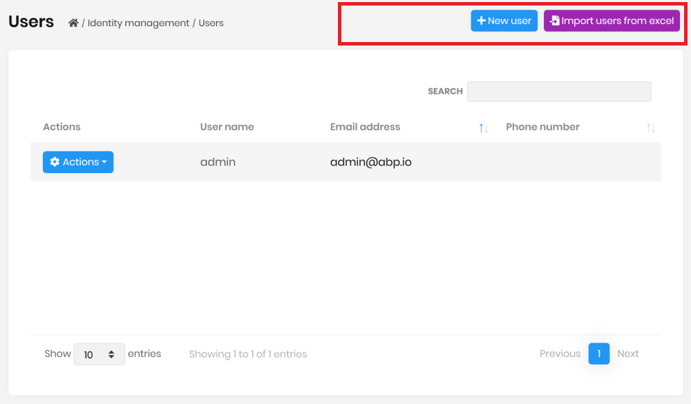
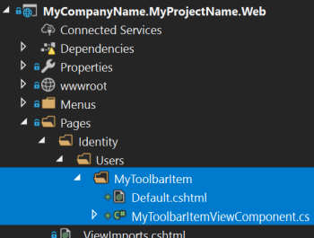

# Page Toolbar Extensions for ASP.NET Core UI

Page toolbar system allows you to add components to the toolbar of any page. The page toolbar is the area right to the header of a page. A button ("Import users from excel") was added to the user management page below:



You can add any type of view component item to the page toolbar or modify existing items.

## How to Set Up

In this example, we will add an "Import users from excel" button and execute a JavaScript code for the user management page of the [Identity Module](../../Modules/Identity.md).

### Add a New Button to the User Management Page

Write the following code inside the `ConfigureServices` of your web module class:

````csharp
Configure<AbpPageToolbarOptions>(options =>
{
    options.Configure<Volo.Abp.Identity.Web.Pages.Identity.Users.IndexModel>(toolbar =>
    {
        toolbar.AddButton(
            LocalizableString.Create<MyProjectNameResource>("ImportFromExcel"),
            icon: "file-import",
            id: "ImportUsersFromExcel",
            type: AbpButtonType.Secondary
        );
    });
});
````

`AddButton` is a shortcut to simply add a button component. Note that you need to add the `ImportFromExcel` to your localization dictionary (json file) to localize the text.

When you run the application, you will see the button added next to the current button list. There are some other parameters of the `AddButton` method (for example, use `order` to set the order of the button component relative to the other components).

### Create a JavaScript File

Now, we can go to the client side to handle click event of the new button. First, add a new JavaScript file to your solution. We added inside the `/Pages/Identity/Users` folder of the `.Web` project:


Here, the content of this JavaScript file:

````js
$(function () {
    $('#ImportUsersFromExcel').click(function (e) {
        e.preventDefault();
        alert('TODO: import users from excel');
    });
});
````

In the `click` event, you can do anything you need to do.

### Add the File to the User Management Page

Then you need to add this JavaScript file to the user management page. You can take the power of the [Bundling & Minification system](Bundling-Minification.md).

Write the following code inside the `ConfigureServices` of your module class:

````csharp
Configure<AbpBundlingOptions>(options =>
{
    options.ScriptBundles.Configure(
        typeof(Volo.Abp.Identity.Web.Pages.Identity.Users.IndexModel).FullName,
        bundleConfiguration =>
        {
            bundleConfiguration.AddFiles(
                "/Pages/Identity/Users/my-user-extensions.js"
            );
        });
});
````

This configuration adds `my-user-extensions.js` to the user management page of the Identity Module. `typeof(Volo.Abp.Identity.Web.Pages.Identity.Users.IndexModel).FullName` is the name of the bundle in the user management page. This is a common convention used for all the ABP Commercial modules.

## Advanced Use Cases

While you typically want to add a button action to the page toolbar, it is possible to add any type of component.

### Add View Component to a Page Toolbar

First, create a new view component in your project:



For this example, we've created a `MyToolbarItem` view component under the `/Pages/Identity/Users/MyToolbarItem` folder.

`MyToolbarItemViewComponent.cs` content:

````csharp
public class MyToolbarItemViewComponent : AbpViewComponent
{
    public IViewComponentResult Invoke()
    {
        return View("~/Pages/Identity/Users/MyToolbarItem/Default.cshtml");
    }
}
````

`Default.cshtml` content:

````xml
<span>
    <button type="button" class="btn btn-dark">CLICK ME</button>
</span>
````

* `.cshtml` file can contain any type of component(s). It is a typical view component.
* `MyToolbarItemViewComponent` can inject and use any service if you need.

Then you can add the `MyToolbarItemViewComponent` to the user management page:

````csharp
Configure<AbpPageToolbarOptions>(options =>
{
    options.Configure<Volo.Abp.Identity.Web.Pages.Identity.Users.IndexModel>(
        toolbar =>
        {
            toolbar.AddComponent<MyToolbarItemViewComponent>();
        }
    );
});
````

* If your component accepts arguments (in the `Invoke`/`InvokeAsync` method), you can pass them to the `AddComponent` method as an anonymous object.

#### Permissions

If your button/component should be available based on a [permission/policy](../../Authorization.md), you can pass the permission/policy name as the `requiredPolicyName` parameter to the `AddButton` and `AddComponent` methods.

### Add a Page Toolbar Contributor

If you perform advanced custom logic while adding an item to a page toolbar, you can create a class that implements the `IPageToolbarContributor` interface or inherits from the `PageToolbarContributor` class:

````csharp
public class MyToolbarContributor : PageToolbarContributor
{
    public override Task ContributeAsync(PageToolbarContributionContext context)
    {
        context.Items.Insert(0, new PageToolbarItem(typeof(MyToolbarItemViewComponent)));

        return Task.CompletedTask;
    }
}
````

* You can use `context.ServiceProvider` to resolve dependencies if you need.

Then add your class to the `Contributors` list:

````csharp
Configure<AbpPageToolbarOptions>(options =>
{
    options.Configure<Volo.Abp.Identity.Web.Pages.Identity.Users.IndexModel>(
        toolbar =>
        {
            toolbar.Contributors.Add(new MyToolbarContributor());
        }
    );
});
````

