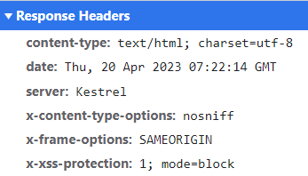

# Security Headers

ABP Framework allows you to add frequently used security headers into your application. The following security headers will be added as response headers to your application if you use the `UseAbpSecurityHeaders` middleware:

* `X-Content-Type-Options`: Tells the browser to not try and guess what a mime-type of a resource might be, and to just take what mime-type the server has returned.
* `X-XSS-Protection`: This is a feature of Internet Explorer, Chrome, and Safari that stops pages from loading when they detect reflected cross-site scripting (XSS) attacks.
* `X-Frame-Options`: This header can be used to indicate whether or not a browser should be allowed to render a page in a `<iframe>` tag. By specifying this header value as *SAMEORIGIN*, you can make it displayed in a frame on the same origin as the page itself.
* `Content-Security-Policy`: This response header allows you to restrict which resources (such as JavaScript, CSS, images, manifests, etc.) can be loaded, and the URLs that they can be loaded from. This security header only will be added if you configure the `AbpSecurityHeadersOptions` class and enable it.

## Configuration

### AbpSecurityHeadersOptions

`AbpSecurityHeadersOptions` is the main class to enable the `Content-Security-Policy` header, define its value and set other security headers that you want to add to your application.

**Example:**

```csharp
Configure<AbpSecurityHeadersOptions>(options => 
{
    options.UseContentSecurityPolicyHeader = true; //false by default
    options.ContentSecurityPolicyValue = "object-src 'none'; form-action 'self'; frame-ancestors 'none'";

    //adding additional security headers
    options.Headers["Referrer-Policy"] = "no-referrer";
});
```

> If the header is the same, the additional security headers you defined take precedence over the default security headers. In other words, it overrides the default security headers' values.

## Security Headers Middleware

Security Headers middleware is an ASP.NET Core request pipeline [middleware](https://docs.microsoft.com/en-us/aspnet/core/fundamentals/middleware) that adds pre-defined security headers to your application, including `X-Content-Type-Options`, `X-XSS-Protection`, and `X-Frame-Options`. Additionally, this middleware also includes those unique security headers in your application if you configure the `AbpSecurityHeadersOptions` as mentioned above.

**Example:**

```csharp
app.UseAbpSecurityHeaders();
```

> You can add this middleware into the `OnApplicationInitialization` method of your module class to register it to the request pipeline. This middleware is already configured in the [ABP Commercial Startup Templates](https://docs.abp.io/en/commercial/latest/startup-templates/index), so you don't need to manually add it if you are using one of these startup templates.

After, you have registered the `UseAbpSecurityHeaders` middleware into the request pipeline, the defined security headers will be shown in the response headers as in the figure:

