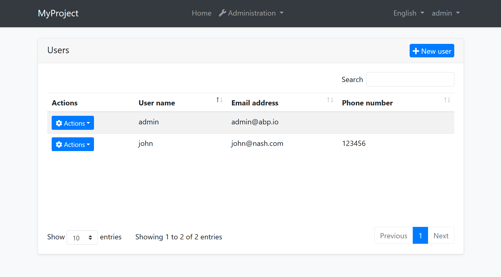
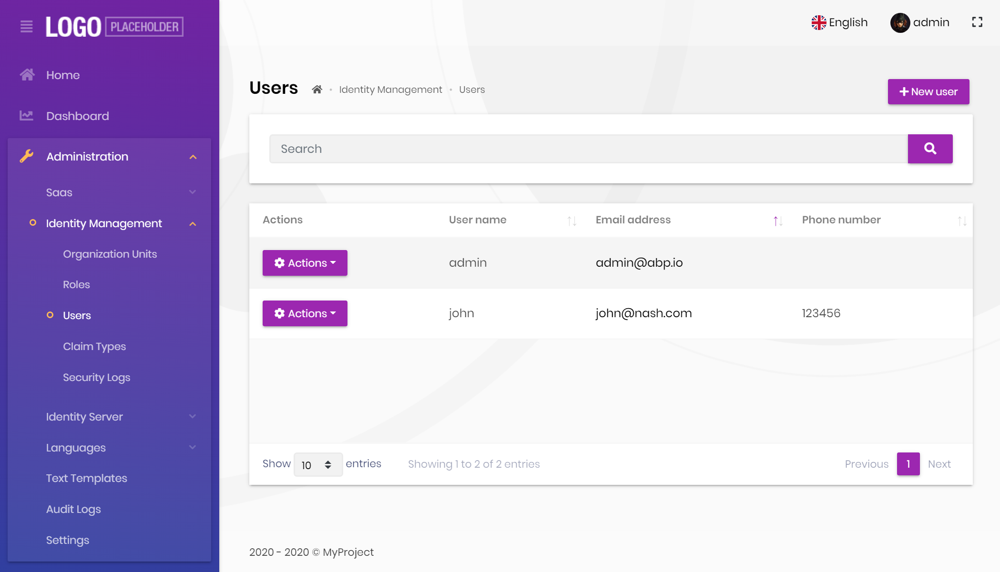
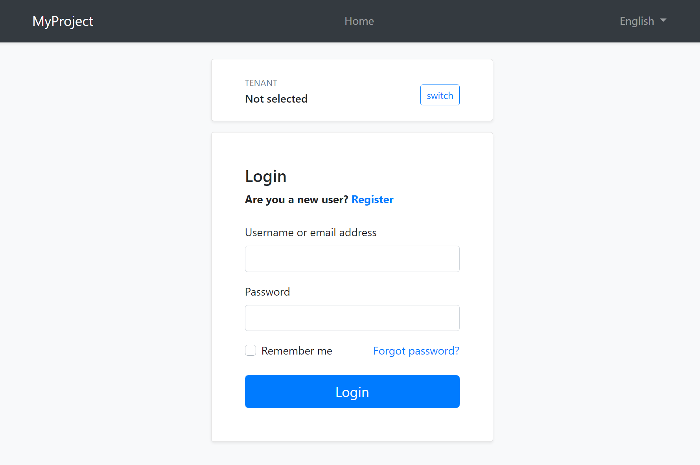
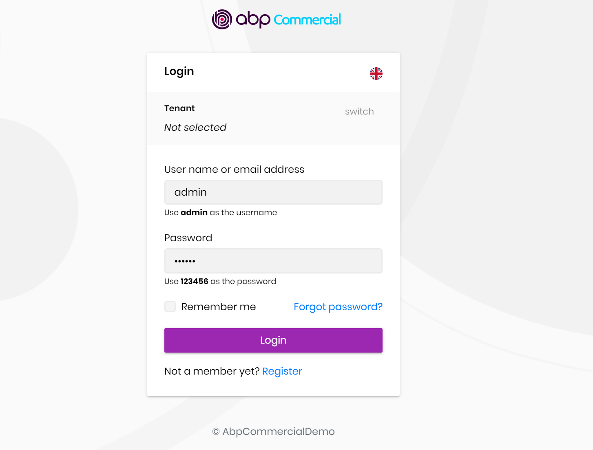
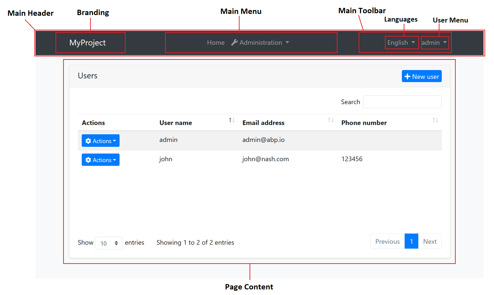
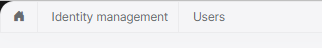

# ASP.NET Core MVC / Razor Pages: UI Theming

## Introduction

ABP Framework provides a complete **UI Theming** system with the following goals:

* Reusable [application modules](../../Modules/Index.md) are developed **theme-independent**, so they can work with any UI theme.
* UI theme is **decided by the final application**.
* The theme is distributed via NuGet/NPM packages, so it is **easily upgradable**.
* The final application can **customize** the selected theme.

In order to accomplish these goals, ABP Framework;

* Determines a set of **base libraries** used and adapted by all the themes. So, module and application developers can depend on and use these libraries without depending on a particular theme.
* Provides a system that consists of [navigation menus](Navigation-Menu.md), [toolbars](Toolbars.md), [layout hooks](Layout-Hooks.md)... that is implemented by all the themes. So, the modules and the application to contribute to the layout to compose a consistent application UI.

### Current Themes

Currently, two themes are **officially provided**:

* The [Basic Theme](Basic-Theme.md) is the minimalist theme with the plain Bootstrap style. It is **open source and free**.
* The [Lepton Theme](https://commercial.abp.io/themes) is a **commercial** theme developed by the core ABP team and is a part of the [ABP Commercial](https://commercial.abp.io/) license.

There are also some community-driven themes for the ABP Framework (you can search on the web).

## Overall

### The Base Libraries

All the themes must depend on the [@abp/aspnetcore.mvc.ui.theme.shared](https://www.npmjs.com/package/@abp/aspnetcore.mvc.ui.theme.shared) NPM package, so they are indirectly depending on the following libraries:

* [Twitter Bootstrap](https://getbootstrap.com/) as the fundamental HTML/CSS framework.
* [JQuery](https://jquery.com/) for DOM manipulation.
* [DataTables.Net](https://datatables.net/) for data grids.
* [JQuery Validation](https://github.com/jquery-validation/jquery-validation) for client side & [unobtrusive](https://github.com/aspnet/jquery-validation-unobtrusive) validation
* [FontAwesome](https://fontawesome.com/) as the fundamental CSS font library.
* [SweetAlert](https://sweetalert.js.org/) to show fancy alert message and confirmation dialogs.
* [Toastr](https://github.com/CodeSeven/toastr) to show toast notifications.
* [Lodash](https://lodash.com/) as a utility library.
* [Luxon](https://moment.github.io/luxon/) for date/time operations.
* [JQuery Form](https://github.com/jquery-form/form) for AJAX forms.
* [bootstrap-datepicker](https://github.com/uxsolutions/bootstrap-datepicker) to show date pickers.
* [Select2](https://select2.org/) for better select/combo boxes.
* [Timeago](http://timeago.yarp.com/) to show automatically updating fuzzy timestamps.
* [malihu-custom-scrollbar-plugin](https://github.com/malihu/malihu-custom-scrollbar-plugin) for custom scrollbars.

These libraries are selected as the base libraries and available to the applications and modules.

#### Abstractions / Wrappers

There are some abstractions in the ABP Framework to make your code independent from some of these libraries too. Examples;

* [Tag Helpers](Tag-Helpers/Index.md) makes it easy to generate the Bootstrap UIs.
* JavaScript [Message](JavaScript-API/Message.md) and [Notification](JavaScript-API/Notify.md) APIs provides abstractions to use the Sweetalert and Toastr.
* [Forms & Validation](Forms-Validation.md) system automatically handles the validation, so you mostly don't directly type any validation code.

### The Standard Layouts

The main responsibility of a theme is to provide the layouts. There are **three pre-defined layouts must be implemented by all the themes**:

* **Application**: The default layout which is used by the main application pages.
* **Account**: Mostly used by the [account module](../../Modules/Account.md) for login, register, forgot password... pages.
* **Empty**: The Minimal layout that has no layout components at all.

Layout names are constants defined in the `Volo.Abp.AspNetCore.Mvc.UI.Theming.StandardLayouts` class.

#### The Application Layout

This is the default layout which is used by the main application pages. The following image shows the user management page in the [Basic Theme](Basic-Theme.md) application layout:



And the same page is shown below with the [Lepton Theme](https://commercial.abp.io/themes) application layout:



As you can see, the page is the same, but the look is completely different in the themes above.

The application layout typically includes the following parts;

* A [main menu](Navigation-Menu.md)
* Main [Toolbar](Toolbars.md) with the following components;
  * User menu
  * Language switch dropdown
* [Page alerts](Page-Alerts.md)
* The page content (aka `RenderBody()`)
* [Layout hooks](Layout-Hooks.md)

Some themes may provide more parts like breadcrumbs, page header & toolbar... etc. See the *Layout Parts* section.

#### The Account Layout

The Account layout is typically used by the [account module](../../Modules/Account.md) for login, register, forgot password... pages.



This layout typically provides the following parts;

* Language switch dropdown
* Tenant switch area (if the application is [multi-tenant](../../Multi-Tenancy.md) and the current is resolved by the cookie)
* [Page alerts](Page-Alerts.md)
* The page content (aka `RenderBody()`)
* [Layout hooks](Layout-Hooks.md)

The [Basic Theme](Basic-Theme.md) renders the top navigation bar for this layout too (as shown above)

Here, the account layout of the Lepton Theme:



The [Lepton Theme](https://commercial.abp.io/themes) shows the application logo and footer in this layout.

> You can override theme layouts completely or partially in an application to [customize](Customization-User-Interface.md) it.

#### The Empty Layout

The empty layout provides an empty page. It typically includes the following parts;

* [Page alerts](Page-Alerts.md)
* The page content (aka `RenderBody()`)
* [Layout hooks](Layout-Hooks.md)

## Implementing a Theme

### The Easy Way

The easiest way to create a new theme is to copy the [Basic Theme Source Code](https://github.com/abpframework/abp/blob/dev/modules/basic-theme/src/Volo.Abp.AspNetCore.Mvc.UI.Theme.Basic) and customize it. Once you get a copy of the theme in your solution, remove the `Volo.Abp.AspNetCore.Mvc.UI.Theme.Basic` NuGet package and reference to the local project.

### The ITheme Interface

`ITheme` interface is used by the ABP Framework to select the layout for the current page. A theme must implement this interface to provide the requested layout path.

This is the `ITheme` implementation of the [Basic Theme](Basic-Theme.md).

````csharp
using Volo.Abp.AspNetCore.Mvc.UI.Theming;
using Volo.Abp.DependencyInjection;

namespace Volo.Abp.AspNetCore.Mvc.UI.Theme.Basic
{
    [ThemeName(Name)]
    public class BasicTheme : ITheme, ITransientDependency
    {
        public const string Name = "Basic";

        public virtual string GetLayout(string name, bool fallbackToDefault = true)
        {
            switch (name)
            {
                case StandardLayouts.Application:
                    return "~/Themes/Basic/Layouts/Application.cshtml";
                case StandardLayouts.Account:
                    return "~/Themes/Basic/Layouts/Account.cshtml";
                case StandardLayouts.Empty:
                    return "~/Themes/Basic/Layouts/Empty.cshtml";
                default:
                    return fallbackToDefault
                        ? "~/Themes/Basic/Layouts/Application.cshtml"
                        : null;
            }
        }
    }
}
````

* `[ThemeName]` attribute is required and a theme must have a unique name, `Basic` in this sample.
* `GetLayout` method should return a path if the requested layout (`name`) is provided by the theme. *The Standard Layouts* should be implemented if the theme is aimed to be used by a standard application. It may implement additional layouts.

Once the theme implements the `ITheme` interface, it should add the theme to the `AbpThemingOptions` in the `ConfigureServices` method of the [module](../../Module-Development-Basics.md).

````csharp
Configure<AbpThemingOptions>(options =>
{
    options.Themes.Add<BasicTheme>();
});
````

#### The IThemeSelector Service

ABP Framework allows to use multiple themes together. This is why `options.Themes` is a list. `IThemeSelector` service selects the theme on the runtime. The application developer can set the `AbpThemingOptions.DefaultThemeName` to set the theme to be used, or replace the `IThemeSelector` service implementation (the default implementation is `DefaultThemeSelector`) to completely control the theme selection on runtime.

### Bundles

[Bundling system](Bundling-Minification.md) provides a standard way to import style & script files into pages. There are two standard bundles defined by the ABP Framework:

* `StandardBundles.Styles.Global`: The global bundle that includes the style files used in all the pages. Typically, it includes the CSS files of the Base Libraries.
* `StandardBundles.Scripts.Global`: The global bundle that includes the script files used in all the pages. Typically, it includes the JavaScript files of the Base Libraries.

A theme generally extends these standard bundles by adding theme specific CSS/JavaScript files.

The best way to define new bundles, inherit from the standard bundles and add to the `AbpBundlingOptions` as shown below (this code is from the [Basic Theme](Basic-Theme.md)):

````csharp
Configure<AbpBundlingOptions>(options =>
{
    options
        .StyleBundles
        .Add(BasicThemeBundles.Styles.Global, bundle =>
        {
            bundle
                .AddBaseBundles(StandardBundles.Styles.Global)
                .AddContributors(typeof(BasicThemeGlobalStyleContributor));
        });

    options
        .ScriptBundles
        .Add(BasicThemeBundles.Scripts.Global, bundle =>
        {
            bundle
                .AddBaseBundles(StandardBundles.Scripts.Global)
                .AddContributors(typeof(BasicThemeGlobalScriptContributor));
        });
});
````

`BasicThemeGlobalStyleContributor` and `BasicThemeGlobalScriptContributor` are bundle contributors. For example, `BasicThemeGlobalStyleContributor` is defined as shown below:

```csharp
public class BasicThemeGlobalStyleContributor : BundleContributor
{
    public override void ConfigureBundle(BundleConfigurationContext context)
    {
        context.Files.Add("/themes/basic/layout.css");
    }
}
```

Then the theme can render these bundles in a layout. For example, you can render the Global Styles as shown below:

````html
<abp-style-bundle name="@BasicThemeBundles.Styles.Global" />
````

See the [Bundle & Minification](Bundling-Minification.md) document to understand the Bundling system better.

### Layout Parts

A typical Layout consists of several parts. The theme should include the necessary parts in each layout.

**Example: The Basic Theme has the following parts for the Application Layout**



The application code and the modules can only show contents in the Page Content part. If they need to change the other parts (to add a menu item, to add a toolbar item, to change the application name in the branding area...) they should use the ABP Framework APIs.

The following sections explain the fundamental parts pre-defined by the ABP Framework and can be implemented by the themes.

> It is a good practice to split the layout into components/partials, so the final application can override them partially for customization purpose.

#### Branding

`IBrandingProvider` service should be used to get the name and the logo URL of the application to render in the Branding part.

The [Application Startup Template](../../Startup-Templates/Application.md) has an implementation of this interface to set the values by the application developer.

#### Main Menu

`IMenuManager` service is used to get the main menu items and render on the layout.

**Example: Get the Main Menu to render in a view component**

```csharp
public class MainNavbarMenuViewComponent : AbpViewComponent
{
    private readonly IMenuManager _menuManager;

    public MainNavbarMenuViewComponent(IMenuManager menuManager)
    {
        _menuManager = menuManager;
    }

    public async Task<IViewComponentResult> InvokeAsync()
    {
        var menu = await _menuManager.GetAsync(StandardMenus.Main);
        return View("~/Themes/Basic/Components/Menu/Default.cshtml", menu);
    }
}
```

See the [Navigation / Menus](Navigation-Menu.md) document to learn more about the navigation system.

#### Main Toolbar

`IToolbarManager` service is used to get the Main Toolbar items and render on the layout. Each item of this toolbar is a View Component, so it may include any type of UI elements. Inject the `IToolbarManager` and use the `GetAsync` to get the toolbar items:

````csharp
var toolbar = await _toolbarManager.GetAsync(StandardToolbars.Main);
````

> See the [Toolbars](Toolbars.md) document to learn more on the toolbar system.

The theme has a responsibility to add two pre-defined items to the main toolbar: Language Selection and User Menu. To do that, create a class implementing the `IToolbarContributor` interface and add it to the `AbpToolbarOptions` as shown below:

```csharp
Configure<AbpToolbarOptions>(options =>
{
    options.Contributors.Add(new BasicThemeMainTopToolbarContributor());
});
```

##### Language Selection

Language Selection toolbar item is generally a dropdown that is used to switch between languages. `ILanguageProvider` is used to get the list of available languages and `CultureInfo.CurrentUICulture` is used to learn the current language.

`/Abp/Languages/Switch` endpoint can be used to switch the language This endpoint accepts the following query string parameters:

* `culture`: The selected culture, like `en-US` or `en`.
* `uiCulture`: The selected UI culture, like `en-US` or `en`.
* `returnUrl` (optional): Can be used to return a given URL after switching the language.

`culture` and `uiCulture` should match one of the available languages. ABP Framework sets a culture cookie in the `/Abp/Languages/Switch` endpoint.

##### User Menu

User menu includes links related to the user account. `IMenuManager` is used just like the Main Menu, but this time with `StandardMenus.User` parameter like shown below:

````csharp
var menu = await _menuManager.GetAsync(StandardMenus.User);
````

[ICurrentUser](../../CurrentUser.md) and [ICurrentTenant](../../Multi-Tenancy.md) services can be used to obtain the current user and tenant names.

#### Page Alerts

`IAlertManager` service is used to get the current page alerts to render on the layout. Use the `Alerts` list of the `IAlertManager`. It is generally rendered just before the page content (`RenderBody()`).

See the [Page Alerts](Page-Alerts.md) document to learn more.

#### Layout Hooks

Since the Layout is in the theme package, the final application or any module can't directly manipulate the layout content. The [Layout Hook](Layout-Hooks.md) system allows to inject components to some specific points of the layout.

The theme is responsible to render the hooks in the correct place.

**Example: Render the `LayoutHooks.Head.First` Hook in the Application Layout**

````html
<head>
    @await Component.InvokeLayoutHookAsync(LayoutHooks.Head.First, StandardLayouts.Application)
    ...
````

See the [Layout Hook](Layout-Hooks.md) document to learn the standard layout hooks.

#### Script / Style Sections

Every layout should render the following optional sections:

* `styles` section is rendered in the end of the `head`, just before the `LayoutHooks.Head.Last`.
* `scripts` section is rendered in the end of the `body`, just before the `LayoutHooks.Body.Last`.

In this way, the page can import styles and scripts to the layout.

**Example: Render the `styles` section**

````csharp
@await RenderSectionAsync("styles", required: false)
````

#### Content Toolbar Section

Another pre-defined section is the Content Toolbar section which can be used by the pages to add code just before the page content. The Basic Theme renders it as shown below:

````html
<div id="AbpContentToolbar">
    <div class="text-end mb-2">
        @RenderSection("content_toolbar", false)
    </div>
</div>
````

The container div's id must be `AbpContentToolbar`. This section should come before the `RenderBody()`.

#### Widget Resources

The [Widget System](Widgets.md) allows to define reusable widgets with their own style/script files. All the layouts should render the widget style and scripts.

**Widget Styles** is rendered as shown below, just before the `styles` section, after the global style bundle:

````csharp
@await Component.InvokeAsync(typeof(WidgetStylesViewComponent))
````

**Widget Scripts** is rendered as shown below, just before the `scripts` section, after the global script bundle:

````csharp
@await Component.InvokeAsync(typeof(WidgetScriptsViewComponent))
````

#### ABP Scripts

ABP has some special scripts those should be included into every layout. They are not included in the global bundles since they are dynamically created based on the current user.

ABP scripts (`ApplicationConfigurationScript` and `ServiceProxyScript`) should be added just after the global script bundle, as shown below:

````html
<script src="~/Abp/ApplicationConfigurationScript"></script>
<script src="~/Abp/ServiceProxyScript"></script>
````

#### Page Title, Selected Menu Item and Breadcrumbs

`IPageLayout` service can be injected by any page to set the Page Title, the selected menu item name and the breadcrumb items. Then the theme can use this service to get these values and render on the UI.

The Basic Theme doesn't implement this service, but the Lepton Theme implements:



See the [Page Header](Page-Header.md) document for more.

#### Tenant Switch

The Account Layout should allow the user to switch the current tenant if the application is multi-tenant and the tenant was resolved from the cookies. See the [Basic Theme Account Layout](https://github.com/abpframework/abp/blob/dev/modules/basic-theme/src/Volo.Abp.AspNetCore.Mvc.UI.Theme.Basic/Themes/Basic/Layouts/Account.cshtml) as an example implementation.

### Layout Classes

The Standard Layouts (`Application`, `Account` and `Empty`) should add the following CSS classes to the `body` tag:

* `abp-application-layout` for the `Application` layout.
* `abp-account-layout` for the `Account` layout.
* `abp-empty-layout` for the `Empty` layout.

In this way, applications or modules can have selectors based on the current layout.

### RTL

To support Right-To-Left languages, the Layout should check the current culture and add `dir="rtl"` to the `html` tag and `rtl` CSS class the the `body` tag.

You can check `CultureInfo.CurrentUICulture.TextInfo.IsRightToLeft` to understand if the current language is a RTL language.

### The NPM Package

A theme should have a NPM package that depends on the [@abp/aspnetcore.mvc.ui.theme.shared](https://www.npmjs.com/package/@abp/aspnetcore.mvc.ui.theme.shared) package. In this way, it inherits all the Base Libraries. If the theme requires additional libraries, then it should define these dependencies too.

Applications use the [Client Side Package Management](Client-Side-Package-Management.md) system to add client side libraries to the project. So, if an application uses your theme, it should add dependency to your theme's NPM package as well as the NuGet package dependency.

