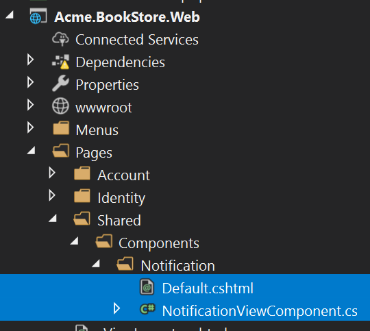

# ASP.NET Core MVC / Razor Pages UI: Toolbars

The Toolbar system is used to define **toolbars** on the user interface. Modules (or your application) can add **items** to a toolbar, then the [theme](Theming.md) renders the toolbar on the **layout**.

There is only one **standard toolbar** named "Main" (defined as a constant: `StandardToolbars.Main`). The [Basic Theme](Basic-Theme) renders the main toolbar as shown below:


In the screenshot above, there are two items added to the main toolbar: Language switch component & user menu. You can add your own items here.

## Example: Add a Notification Icon

In this example, we will add a **notification (bell) icon** to the left of the language switch item. A item in the toolbar should be a **view component**. So, first, create a new view component in your project:



**NotificationViewComponent.cs**

````csharp
public class NotificationViewComponent : AbpViewComponent
{
    public async Task<IViewComponentResult> InvokeAsync()
    {
        return View("/Pages/Shared/Components/Notification/Default.cshtml");
    }
}
````

**Default.cshtml**

````xml
<div id="MainNotificationIcon" style="color: white; margin: 8px;">
    <i class="far fa-bell"></i>
</div>
````

Now, we can create a class implementing the `IToolbarContributor` interface:

````csharp
public class MyToolbarContributor : IToolbarContributor
{
    public Task ConfigureToolbarAsync(IToolbarConfigurationContext context)
    {
        if (context.Toolbar.Name == StandardToolbars.Main)
        {
            context.Toolbar.Items
                .Insert(0, new ToolbarItem(typeof(NotificationViewComponent)));
        }

        return Task.CompletedTask;
    }
}
````

You can use the [authorization](../../Authorization.md) to decide whether to add a `ToolbarItem`.

````csharp
if (await context.IsGrantedAsync("MyPermissionName"))
{
    //...add Toolbar items
}
````

You can use `RequiredPermissionName` as a shortcut. It is also more performant, ABP optimizes the permission check for all the items.

````csharp
context.Toolbar.Items.Insert(0, new ToolbarItem(typeof(NotificationViewComponent), requiredPermissionName: "MyPermissionName"));
````

This class adds the `NotificationViewComponent` as the first item in the `Main` toolbar.

Finally, you need to add this contributor to the `AbpToolbarOptions`, in the `ConfigureServices` of your [module](../../Module-Development-Basics.md):

````csharp
Configure<AbpToolbarOptions>(options =>
{
    options.Contributors.Add(new MyToolbarContributor());
});
````

That's all, you will see the notification icon on the toolbar when you run the application:


`NotificationViewComponent` in this sample simply returns a view without any data. In real life, you probably want to **query database** (or call an HTTP API) to get notifications and pass to the view. If you need, you can add a `JavaScript` or `CSS` file to the global [bundle](Bundling-Minification.md) for your toolbar item.

## IToolbarManager

`IToolbarManager` is used to render the toolbar. It returns the toolbar items by a toolbar name. This is generally used by the [themes](Theming.md) to render the toolbar on the layout.
