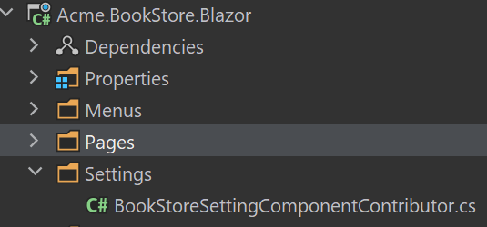

# Custom Setting Page

There are several settings tabs from different modules. You can add a custom setting page to your project.

### Create a Razor Component

Create `MySettingGroup` folder under the `Pages` folder. Add a new razor component. Name it as `MySettingGroupComponent`:


Open the `MySettingGroupComponent.razor` and change the whole content as shown below:

```csharp
<Row>
    <p>my setting group</p>
</Row>
```

### BookStoreSettingComponentContributor

Create a `BookStoreSettingComponentContributor.cs` file under the `Settings` folder:



The content of the file is shown below:

```csharp
public class BookStoreSettingComponentContributor : ISettingComponentContributor
{
    public Task ConfigureAsync(SettingComponentCreationContext context)
    {
        context.Groups.Add(
            new SettingComponentGroup(
                "Volo.Abp.MySettingGroup",
                "MySettingGroup",
                typeof(MySettingGroupComponent)
            )
        );

        return Task.CompletedTask;
    }

    public Task<bool> CheckPermissionsAsync(SettingComponentCreationContext context)
    {
        // You can check the permissions here
        return Task.FromResult(true);
    }
}
```

Open the `BookStoreBlazorModule.cs` file and add the following code:

```csharp
Configure<SettingManagementComponentOptions>(options =>
{
    options.Contributors.Add(new BookStoreSettingComponentContributor());
});
```

### Run the Application

Navigate to `/setting-management` route to see the changes:

