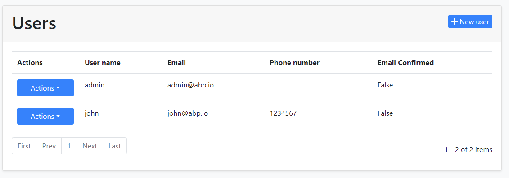
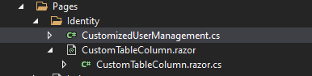
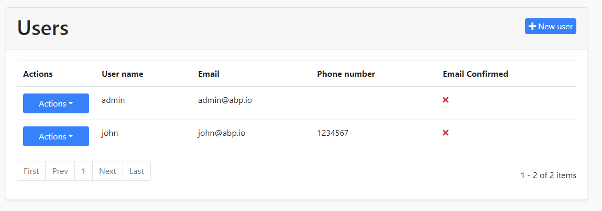

# Data Table Column Extensions for Blazor UI

Data table column extension system allows you to add a **new table column** on the user interface. The example below adds a new column with the "Email Confirmed" title:



You can use the standard column options to fine control the table column.

> Note that this is a low level API to find control the table column. If you want to show an extension property on the table, see the [module entity extension](../../Module-Entity-Extensions.md) document.

## How to Set Up

### Create a C# File

First, add a new C# file to your solution. We added inside the `/Pages/Identity/` folder of the `.Blazor` project:


We will use the [component override system](Customization-Overriding-Components.md) in the Blazor. After creating a class inherits from the `UserManagement` component, we will override the `SetTableColumnsAsync` method and add the table column programmatically.

Here, the content of the overridden `SetTableColumnsAsync` method.

```csharp
protected override async ValueTask SetTableColumnsAsync()
{
    await base.SetTableColumnsAsync();
    var confirmedColumn = new TableColumn
    {
        Title = "Email Confirmed",
        Data = nameof(IdentityUserDto.EmailConfirmed)
    };
    TableColumns.Get<UserManagement>().Add(confirmedColumn);
}
```
Here, the entire content of the file.

```csharp
using System.Threading.Tasks;
using Volo.Abp.AspNetCore.Components.Web.Extensibility.TableColumns;
using Volo.Abp.DependencyInjection;
using Volo.Abp.Identity;
using Volo.Abp.Identity.Blazor.Pages.Identity;

namespace MyCompanyName.MyProjectName.Blazor.Pages.Identity
{
    [ExposeServices(typeof(UserManagement))]
    [Dependency(ReplaceServices = true)]
    public class CustomizedUserManagement : UserManagement
    {
        protected override async ValueTask SetTableColumnsAsync()
        {
            await base.SetTableColumnsAsync();
            var confirmedColumn = new TableColumn
            {
                Title = "Email Confirmed",
                Data = nameof(IdentityUserDto.EmailConfirmed)
            };
            TableColumns.Get<UserManagement>().Add(confirmedColumn);
        }
    }
}
```

## Customizing Data Table Columns

This section explains how to customize data table columns using the properties in the `TableColumn` type.

* `Title`: Title of the column.
* `Data`: Name of the field in the supplied model.
* `Component`: Type of the component that you want to render. See the "Rendering Custom Components In The Data Table Columns" section for details.
* `Actions`: Action lists for the column. You can render additional action columns by adding actions to this collection.
* `ValueConverter`: Simple converter function that is being called before rendering the content.
* `Sortable`: A boolean field indicating whether the column is sortable or not.
* `DisplayFormat`: You can specify a custom format for the column.
* `DisplayFormatProvider` : You can provide a custom `IFormatProvider` for the column. Default value is `CultureInfo.CurrentCulture`.

## Rendering Custom Components In The Data Table Columns

This section explains how to render custom blazor components in data table columns. In this example, we're going to display custom icons instead of text representations of the property.

First of all, create a blazor component. We will name it `CustomTableColumn`.



Add an object parameter named `Data`.

```csharp
public class CustomTableColumn
{
    [Parameter]
    public object Data { get; set; }
}
```

Navigate to the razor file and paste the following code.

```csharp
@using System
@using Volo.Abp.Identity

@if (Data.As<IdentityUserDto>().EmailConfirmed)
{
    <Icon class="text-success" Name="IconName.Check" />
}
else
{
    <Icon class="text-danger" Name="IconName.Times" />
}
```

Navigate back to the `CustomizedUserManagement` class, and use `Component` property to specify the custom blazor component.

```csharp
protected override async ValueTask SetTableColumnsAsync()
{
    await base.SetTableColumnsAsync();
    var confirmedColumn = new TableColumn
    {
        Title = "Email Confirmed",
        Component = typeof(CustomTableColumn)
    };
    TableColumns.Get<UserManagement>().Add(confirmedColumn);
}
```

Run the project and you will see the icons instead of text fields.

