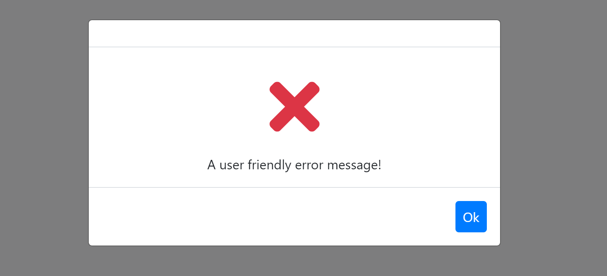
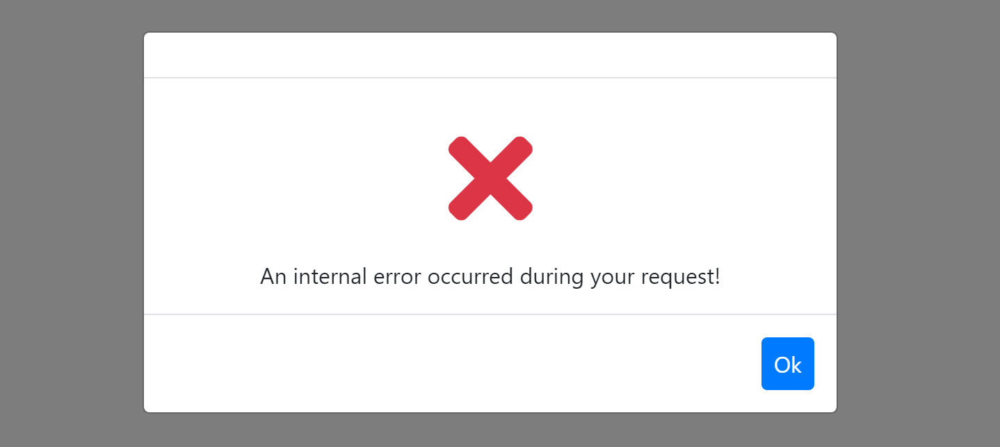

# Blazor UI: Error Handling

Blazor, by default, shows a yellow line at the bottom of the page if any unhandled exception occurs. However, this is not useful in a real application.

ABP provides an automatic error handling system for the Blazor UI.

* Handles all unhandled exceptions and shows nice and useful messages to the user.
* It distinguishes different kind of exceptions. Hides internal/technical error details from the user (shows a generic error message in these cases).
* It is well integrated to the [server side exception handling](../../Exception-Handling.md) system.

## Basic Usage

There are different type of `Exception` classes handled differently by the ABP Framework.

### UserFriendlyException

`UserFriendlyException` is a special type of exception. You can directly show a error message dialog to the user by throwing such an exception.

**Example**

````csharp
@page "/"
@using Volo.Abp

<Button Clicked="TestException">Throw test exception</Button>

@code
{
    private void TestException()
    {
        throw new UserFriendlyException("A user friendly error message!");
    }
}
````

ABP automatically handle the exception and show an error message to the user:



> You can derive from `UserFriendlyException` or directly implement `IUserFriendlyException` interface to create your own `Exception` class if you need.

> You can use the [localization system](Localization.md) to show localized error messages.

### BusinessException and Other Exception Types

See the [exception handling document](../../Exception-Handling.md) to understand different kind of Exception class and interfaces and other capabilities of the Exception Handling system.

## Generic Errors

If the thrown `Exception` is not a special type, it is considered as generic error and a generic error message is shown to the user:



> All error details (including stack trace) are still written in the browser's console.

## Server Side Errors

Errors (like Validation, Authorization and User Friendly Errors) sent by the server are processed as you expect and properly shown to the user. So, error handling system works end to end without need to manually handle exceptions or manually transfer server-to-client error messages.

## See Also

* [Exception Handling System](../../Exception-Handling.md)