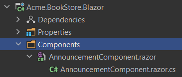

# Blazor UI: Layout Hooks

ABP Framework theming system places the page layout into the [theme](Theming.md) NuGet packages. That means the final application doesn't include a layout, so you can't directly change the layout code to customize it.

> If you create a Blazor WASM project, the `index.html` file will be included within the template. You can also customize it to your needs.

You can copy the theme code into your solution. In this case, you are completely free to customize it. However, then you won't be able to get automatic updates of the theme (by upgrading the theme NuGet package).

The **Layout Hook System** allows you to **add code** at some specific parts of the layout. All layouts of all themes should implement these hooks. Finally, you can add a **razor component** into a hook point.

## Example: Add a Simple Announcement Alert

Assume that you need to add a simple banner to the layout (that will be available for all the pages) to make an announcement about your new product. First, **create a razor component** in your project:



**AnnouncementComponent.razor.cs**

```csharp
using System.Threading.Tasks;
using Microsoft.AspNetCore.Components;
using Microsoft.JSInterop;

namespace Acme.BookStore.Blazor.Components;

public partial class AnnouncementComponent : ComponentBase
{
    private const string AnnouncementLocalStorageKey = "product-announcement-status";

    [Inject]
    public IJSRuntime JsRuntime { get; set; }

    public bool ShowBanner { get; set; }

    protected override async Task OnInitializedAsync()
    {
        ShowBanner = await ShowAnnouncementBannerAsync();
    }

    private async Task<bool> ShowAnnouncementBannerAsync()
    {
        var announcementLocalStorageValue = await JsRuntime.InvokeAsync<string>("localStorage.getItem", AnnouncementLocalStorageKey);

        return announcementLocalStorageValue != null && 
               bool.TryParse(announcementLocalStorageValue, out var showAnnouncementBanner) && showAnnouncementBanner;
    }

    private async Task HideAnnouncementBannerAsync()
    {
        await JsRuntime.InvokeVoidAsync("localStorage.setItem", AnnouncementLocalStorageKey, true);
        ShowBanner = false;
        StateHasChanged();
    }
}
```

**AnnouncementComponent.razor**

```html
@if(ShowBanner)
{
    <div class="alert alert-info">
        A brand new product is in sale. Click <a href="#">here</a> to learn more.
        <button @onclick="async () => { await HideAnnouncementBannerAsync(); }">Hide</button>
    </div>
}
```

Then, you can add this component to any of the hook points in the `ConfigureServices` of your module class:

```csharp
Configure<AbpLayoutHookOptions>(options =>
{
    options.Add(
        LayoutHooks.Body.Last, //The hook name
        typeof(AnnouncementComponent) //The component to add
    );
});
```

Now, the `AnnouncementComponent` will be rendered in the `body` of the page as the last item.

### Specifying the Layout

The configuration above adds the `AnnouncementComponent` to all layouts. You may want to only add it to a specific layout:

````csharp
Configure<AbpLayoutHookOptions>(options =>
{
    options.Add(
        LayoutHooks.Body.Last,
        typeof(AnnouncementComponent),
        layout: StandardLayouts.Application //Set the layout to add
    );
});
````

See the *Layouts* section below to learn more about the layout system.

## Layout Hook Points

There are some pre-defined layout hook points. The standard hook points are:

* `LayoutHooks.Body.First`: Used to add a component as the first item in the HTML body tag.
* `LayoutHooks.Body.Last`: Used to add a component as the last item in the HTML body tag.

> You (or the modules you are using) can add **multiple items to the same hook point**. All of them will be added to the layout in the order they were added.

## Layouts

The layout system allows themes to define the standard named layouts and allows any page to select a proper layout for its purpose. There is one pre-defined layout:

* "**Application**": The main (and the default) layout for an application. It typically contains a header, menu (sidebar), footer, toolbar... etc. 

This layout is defined in the `StandardLayouts` class as constants. You can definitely create your own layouts, but this layout is the standard layout and it's implemented by all the themes out of the box.

> If you don't specify the layout, your razor component will be rendered in all of the layouts.

### Layout Location

You can find the `MainLayout.razor` [here](https://github.com/abpframework/abp/blob/dev/modules/basic-theme/src/Volo.Abp.AspNetCore.Components.Web.BasicTheme/Themes/Basic/MainLayout.razor) for the basic theme. You can take it as a reference to build your own layouts or you can override it, if necessary.

## See Also

* [Customization / Overriding Components](Customization-Overriding-Components.md)
