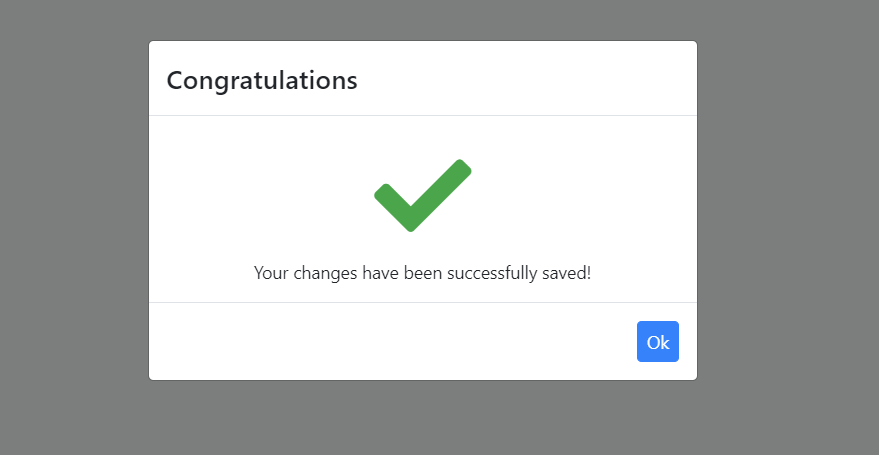
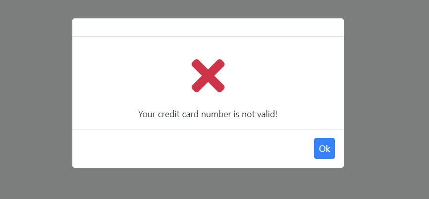
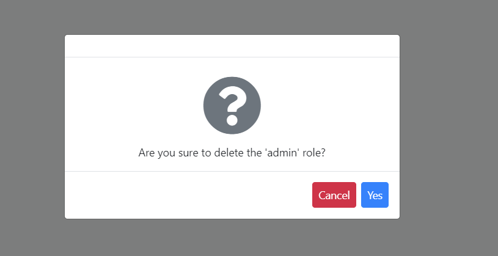

# Blazor: UI Message Service

UI message service is used to show nice-looking messages to the user as a blocking dialog.

## Quick Example

Simply inject `IUiMessageService` to your page or component and call the `Success` method to show a success message.

```csharp
namespace MyProject.Blazor.Pages
{
    public partial class Index
    {
        public IUiMessageService UiMessageService { get; set; }

        public async Task SaveAsync()
        {
            await UiMessageService.Success("Your changes have been successfully saved!", "Congratulations");
        }
    }
}
```

It will show a dialog on the UI:



## Informative Messages

There are four types of informative message functions:

* `Info(...)`
* `Success(...)`
* `Warn(...)`
* `Error(...)`

All of these methods get three parameters:

* `message`: The message (`string`) to be shown.
* `title`: An optional (`string`) title.
* `options`: An optional (`Action`) to configure UI message options.

**Example: Show an error message**

````csharp
UiMessageService.Error('Your credit card number is not valid!');
````




## Confirmation Message

`IUiMessage.Confirm(...)` method can be used to get a confirmation from the user.

**Example**

Use the following code to get a confirmation result from the user:

```csharp
public async Task DeleteAsync()
{
    var confirmed = await UiMessageService.Confirm("Are you sure to delete the 'admin' role?");
    if(confirmed)
    {
        //Delete the 'admin' role here.
    }
}
```

The resulting UI will be like shown below:



If the user has clicked the `Yes` button, the `Confirm` method's return value will be `true`.

## UI Message Configuration

It is easy to change default UI Message options if you like to customize messages. Provide an `action` to the `options` parameter and change the default values.

```csharp
await UiMessageService.Success("Your changes have been successfully saved!", "Congratulations", (options) =>
    {
        options.MessageIcon = "msg-icon-new";
        options.CenterMessage = false;
    });
```

List of the options that you can change by providing the `action` parameter.

* `CenterMessage` : (Default: true) If true, the message dialogue will be centered on the screen.
* `ShowMessageIcon` : (Default: true) If true, the message dialogue will show the large icon for the current message type.
* `MessageIcon` : Overrides the build-in message icon.
* `OkButtonText` : Custom text for the Ok button.
* `OkButtonIcon` : Custom icon for the Ok button.
* `ConfirmButtonText` : Custom text for the Confirmation button.
* `ConfirmButtonIcon` : Custom icon for the Confirmation button.
* `CancelButtonText` : Custom text for the Cancel button.
* `CancelButtonIcon` : Custom icon for the Cancel button.

> "Confirm", "Cancel" and "Yes" texts are automatically localized based on the current language.