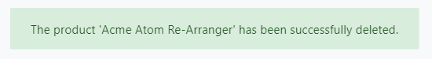

# Blazor: UI Notification Service

`IUiNotificationService` is used to show toastr style notifications on the user interface.

## Quick Example

Simply inject `IUiNotificationService` to your page or component and call the `Success` method to show a success message.

```csharp
namespace MyProject.Blazor.Pages
{
    public partial class Index
    {
        public IUiNotificationService UiNotificationService { get; }

        public Index(IUiNotificationService uiNotificationService)
        {
            UiNotificationService = uiNotificationService;
        }

        public async Task DeleteAsync()
        {
            //Delete entity
            await UiNotificationService.Success("The product 'Acme Atom Re-Arranger' has been successfully deleted.");
        }
    }
}
```



If you inherit your page or component from `AbpComponentBase` class, you can use the `Notify` property to access the `IUiNotificationService`.

```csharp
namespace MyProject.Blazor.Pages
{
    public partial class Index : AbpComponentBase
    {
        public async Task DeleteAsync()
        {
            //Delete entity
            await Notify.Success("The product 'Acme Atom Re-Arranger' has been successfully deleted.");
        }
    }
}
```

## Notification Types

There are four types of pre-defined notifications;

* `Info(...)`
* `Success(...)`
* `Warn(...)`
* `Error(...)`

All of the methods above gets the following parameters;

* `message`: The message (`string`) to be shown.
* `title`: An optional (`string`) title.
* `options`: An optional (`Action`) to configure notification options.

## Notification Configuration

It is easy to change default notification options if you like to customize notifications. Provide an `action` to the `options` parameter and change the default values.

```csharp
await UiNotificationService.Success("The product 'Acme Atom Re-Arranger' has been successfully deleted.", options: (options) =>
    {
        options.OkButtonIcon = "custom-icon";
        options.OkButtonText = L["CustomOK"];
    });
```

List of the options that you can change by providing the `action` parameter.

* `OkButtonText` : Custom text for the Ok button.
* `OkButtonIcon` : Custom icon for the Ok button