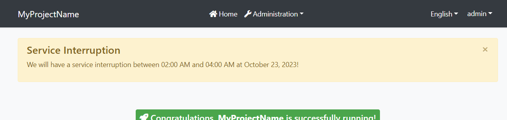

# Blazor UI: Page Alerts

It is common to show error, warning or information alerts to inform the user. An example *Service Interruption* alert is shown below:



## Quick Example

Simply [inject](../../Dependency-Injection.md) `IAlertManager` to your page or component and call the `Alerts.Warning` method to show a success message.

```csharp
namespace MyProject.Blazor.Pages
{
    public partial class Index
    {
        private readonly IAlertManager _alertManager;

        public Index(IAlertManager alertManager)
        {
            this._alertManager = alertManager;
        }

        protected override void OnInitialized()
        {
            _alertManager.Alerts.Warning(
                "We will have a service interruption between 02:00 AM and 04:00 AM at October 23, 2023!",
                "Service Interruption");
            base.OnInitialized();
        }
    }
}
```

If you inherit your page or component from the `AbpComponentBase` class, you can use the `Alerts` property to add alerts.

```csharp
namespace MyProject.Blazor.Pages
{
    public partial class Index : AbpComponentBase
    {
        protected override void OnInitialized()
        {
            Alerts.Warning(
                "We will have a service interruption between 02:00 AM and 04:00 AM at October 23, 2023!",
                "Service Interruption");
            base.OnInitialized();
        }
    }
}
```

> You typically use `@inherits AbpComponentBase` in the `.razor` file to inherit from the `AbpComponentBase`, instead of inheriting in the code behind file.

### Alert Types

`Warning` is used to show a warning alert. Other common methods are `Info`, `Danger` and `Success`.

Beside the standard methods, you can use the `Alerts.Add` method by passing an `AlertType` `enum` with one of these values: `Default`, `Primary`, `Secondary`, `Success`, `Danger`, `Warning`, `Info`, `Light`, `Dark`.

### Dismissible

All alert methods gets an optional `dismissible` parameter. Default value is `true` which makes the alert box dismissible. Set it to `false` to create a sticky alert box.
