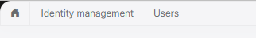

# Blazor UI: Page Header

You can use the`PageHeader` component to set the page title, the breadcrumb items and the toolbar items for a page. Before using the `PageHeader` component, you need to add a using statement for the `Volo.Abp.AspNetCore.Components.Web.Theming.Layout` namespace.

Once you add the `PageHeader` component to your page, you can control the related values using the parameters. 

## Page Title

 You can use the `Title` parameter to control the page header.

```csharp
<PageHeader Title="Book List">
</PageHeader>
```

## Breadcrumb

> **The [Basic Theme](Basic-Theme.md) currently doesn't implement the breadcrumbs.**

Breadcrumbs can be added using the `BreadcrumbItems` property.

**Example: Add Language Management to the breadcrumb items.**

Create a collection of `Volo.Abp.BlazoriseUI.BreadcrumbItem` objects and set the collection to the `BreadcrumbItems` parameter.

```csharp
public partial class Index
{
    protected List<BreadcrumbItem> BreadcrumbItems { get; } = new();

    protected override void OnInitialized()
    {
        BreadcrumbItems.Add(new BreadcrumbItem("Language Management"));
    }
}
```

Navigate back to the razor page.

```csharp
<PageHeader BreadcrumbItems="@BreadcrumbItems" /> 
```

The theme then renders the breadcrumb. An example render result can be:



* The Home icon is rendered by default. Set `BreadcrumbShowHome` to `false` to hide it.
* Breadcrumb items will be activated based on current navigation. Set `BreadcrumbShowCurrent` to `false` to disable it.

You can add as many items as you need. `BreadcrumbItem` constructor gets three parameters:

* `text`: The text to show for the breadcrumb item.
* `url` (optional): A URL to navigate to, if the user clicks to the breadcrumb item.
* `icon` (optional): An icon class (like `fas fa-user-tie` for Font-Awesome) to show with the `text`.

## Page Toolbar

Page toolbar can be set using the `Toolbar` property.

**Example: Add  a "New Item" toolbar item to the page toolbar.**

Create a `PageToolbar` object and define toolbar items using the `AddButton` extension method. 

```csharp
public partial class Index
{
    protected PageToolbar Toolbar { get; } = new();
    
    protected override void OnInitialized()
    {
        Toolbar.AddButton("New Item", () =>
        {
            //Write your click action here
            return Task.CompletedTask;
        }, icon:IconName.Add);
    }
}
```

Navigate back to the razor page and set the `Toolbar` parameter.

```csharp
<PageHeader Toolbar="@Toolbar"  /> 
```

An example render result can be:


---

## Options
Rendering can be enabled or disabled for each section of PageHeader via using `PageHeaderOptions`.

```csharp
    Configure<PageHeaderOptions>(options => 
    {
        options.RenderPageTitle = false;
        options.RenderBreadcrumbs = false;
        options.RenderToolbar = false;
    });
```

*All values are **true** by default. If the PageHeaderOptions isn't configured, each section will be rendered.*