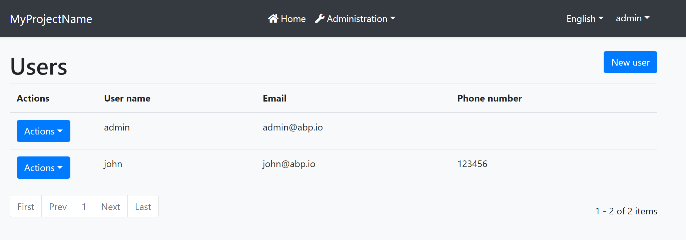
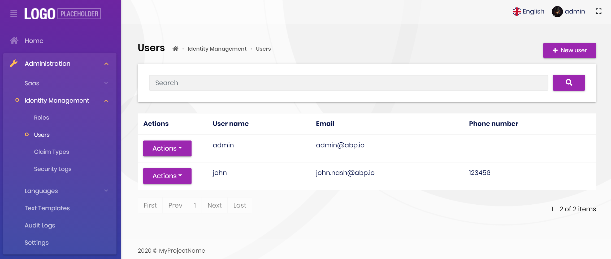

# Blazor UI: Theming

## Introduction

ABP Framework provides a complete **UI Theming** system with the following goals:

* Reusable [application modules](../../Modules/Index.md) are developed **theme-independent**, so they can work with any UI theme.
* UI theme is **decided by the final application**.
* The theme is distributed via a NuGet package, so it is **easily upgradable**.
* The final application can **customize** the selected theme.

In order to accomplish these goals, ABP Framework;

* Determines a set of **base libraries** used and adapted by all the themes. So, module and application developers can depend on and use these libraries without depending on a particular theme.
* Provides a system that consists of layout parts (like [navigation menus](Navigation-Menu.md) and [toolbars](Toolbars.md)) that is implemented by all the themes. So, the modules and the application to contribute to the layout to compose a consistent application UI.

### Current Themes

Currently, two themes are **officially provided**:

* The [Basic Theme](Basic-Theme.md) is the minimalist theme with the plain Bootstrap style. It is **open source and free**.
* The [Lepton Theme](https://commercial.abp.io/themes) is a **commercial** theme developed by the core ABP team and is a part of the [ABP Commercial](https://commercial.abp.io/) license.

## Overall

### The Base Libraries

All the themes must depend on the [Volo.Abp.AspNetCore.Components.WebAssembly.Theming](https://www.nuget.org/packages/Volo.Abp.AspNetCore.Components.WebAssembly.Theming) NuGet package, so they are indirectly depending on the following libraries:

* [Twitter Bootstrap](https://getbootstrap.com/) as the fundamental HTML/CSS framework.
* [Blazorise](https://github.com/stsrki/Blazorise) as a component library that supports the Bootstrap and adds extra components like Data Grid and Tree.
* [FontAwesome](https://fontawesome.com/) as the fundamental CSS font library.
* [Flag Icon](https://github.com/lipis/flag-icon-css) as a library to show flags of countries.

These libraries are selected as the base libraries and available to the applications and modules.

> Bootstrap's JavaScript part is not used since the Blazorise library already provides the necessary functionalities to the Bootstrap components in a native way.

### The Layout

All themes must define a layout for the application. The following image shows the user management page in the [Basic Theme](Basic-Theme.md) application layout:



And the same page is shown below with the [Lepton Theme](https://commercial.abp.io/themes) application layout:



As you can see, the page is the same, but the look is completely different in the themes above.

The application layout typically includes the following parts;

* A [main menu](Navigation-Menu.md)
* Main [Toolbar](Toolbars.md) with the following components;
  * User menu
  * Language switch dropdown
* [Page alerts](Page-Alerts.md)
* The page content (aka `@Body`)

## Implementing a Theme

A theme is simply a Razor Class Library.

### The Easy Way

The easiest way to create a new theme is to copy the [Basic Theme Source Code](https://github.com/abpframework/abp/blob/dev/modules/basic-theme/src/Volo.Abp.AspNetCore.Components.WebAssembly.BasicTheme) and customize it. Once you get a copy of the theme in your solution, remove the `Volo.Abp.AspNetCore.Components.WebAssembly.BasicTheme` NuGet package and reference to the local project.

### Global Styles / Scripts

A theme generally needs to add a global style to the page. ABP provides a system to manage the [Global Styles and Scripts](Global-Scripts-Styles.md). A theme can implement the `IBundleContributor` to add global style or script files to the page.

**Example: Adding a style to the page**

````csharp
using Volo.Abp.Bundling;

namespace MyTheme
{
    public class MyThemeBundleContributor : IBundleContributor
    {
        public void AddScripts(BundleContext context)
        {

        }

        public void AddStyles(BundleContext context)
        {
            context.Add("_content/MyTheme/styles.css");
        }
    }
}
````

`styles.css` file should be added into the `wwwroot` folder of the theme project for this example. When you use the `abp bundle` command, this class is automatically discovered and executed to add the style to the page.

See the [Global Styles and Scripts](Global-Scripts-Styles.md) document for more. 

### Layout Parts

A typical Layout consists of several parts. The theme should include the necessary parts in each layout.

**Example: The Basic Theme has the following parts for the Application Layout**


The application code and the modules can only show contents in the Page Content part. If they need to change the other parts (to add a menu item, to add a toolbar item, to change the application name in the branding area...) they should use the ABP Framework APIs.

The following sections explain the fundamental parts pre-defined by the ABP Framework and can be implemented by the themes.

> It is a good practice to split the layout into components/partials, so the final application can override them partially for customization purpose.

#### Branding

`IBrandingProvider` service should be used to get the name and the logo URL of the application to render in the Branding part.

The [Application Startup Template](../../Startup-Templates/Application.md) has an implementation of this interface to set the values by the application developer.

#### Main Menu

`IMenuManager` service is used to get the main menu items and render on the layout.

**Example: Get the Main Menu to render in a razor component**

```csharp
// Code behind file of a razor component
public partial class NavMenu
{
    private readonly IMenuManager _menuManager;

    public NavMenu(IMenuManager menuManager)
    {
        _menuManager = menuManager;
    }
    
    protected override async Task OnInitializedAsync()
    {
        var menu = await _menuManager.GetAsync(StandardMenus.Main);
        //...
    }
}
```

See the [Navigation / Menus](Navigation-Menu.md) document to learn more about the navigation system.

#### Main Toolbar

`IToolbarManager` service is used to get the Main Toolbar items and render on the layout. Each item of this toolbar is a Razor Component, so it may include any type of UI elements. Inject the `IToolbarManager` and use the `GetAsync` to get the toolbar items:

````csharp
var toolbar = await _toolbarManager.GetAsync(StandardToolbars.Main);
````

> See the [Toolbars](Toolbars.md) document to learn more on the toolbar system.

The theme has a responsibility to add two pre-defined items to the main toolbar: Language Selection and User Menu. To do that, create a class implementing the `IToolbarContributor` interface and add it to the `AbpToolbarOptions` as shown below:

```csharp
Configure<AbpToolbarOptions>(options =>
{
    options.Contributors.Add(new BasicThemeMainTopToolbarContributor());
});
```

##### Language Selection

Language Selection toolbar item is generally a dropdown that is used to switch between languages. `ILanguageProvider` is used to get the list of available languages and `CultureInfo.CurrentUICulture` is used to learn the current language.

Local Storage is used to get and set the current language with the `Abp.SelectedLanguage` key.

**Example: Get the currently selected language**

````csharp
var selectedLanguageName = await JsRuntime.InvokeAsync<string>(
    "localStorage.getItem",
    "Abp.SelectedLanguage"
    );
````

**Example: Set the selected language**

````csharp
await JsRuntime.InvokeVoidAsync(
    "localStorage.setItem",
    "Abp.SelectedLanguage",
    "en-US"
    );
````

The theme should reload the page after changing the language:

````csharp
await JsRuntime.InvokeVoidAsync("location.reload");
````

##### User Menu

User menu includes links related to the user account. `IMenuManager` is used just like the Main Menu, but this time with `StandardMenus.User` parameter like shown below:

````csharp
var menu = await _menuManager.GetAsync(StandardMenus.User);
````

[ICurrentUser](../../CurrentUser.md) and [ICurrentTenant](../../Multi-Tenancy.md) services can be used to obtain the current user and tenant names.

#### Page Alerts

`IAlertManager` service is used to get the current page alerts to render on the layout. See the [Page Alerts](Page-Alerts.md) document to learn more.