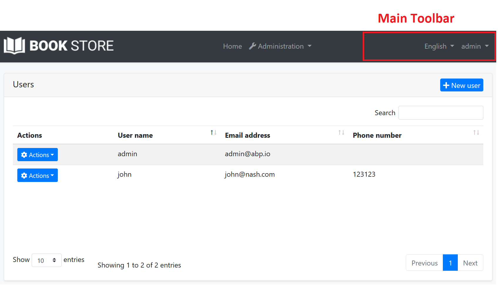
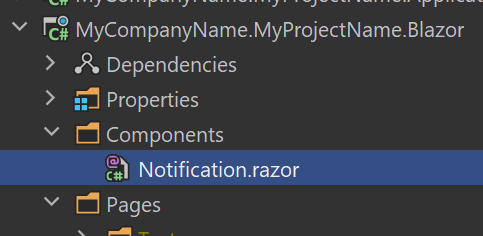
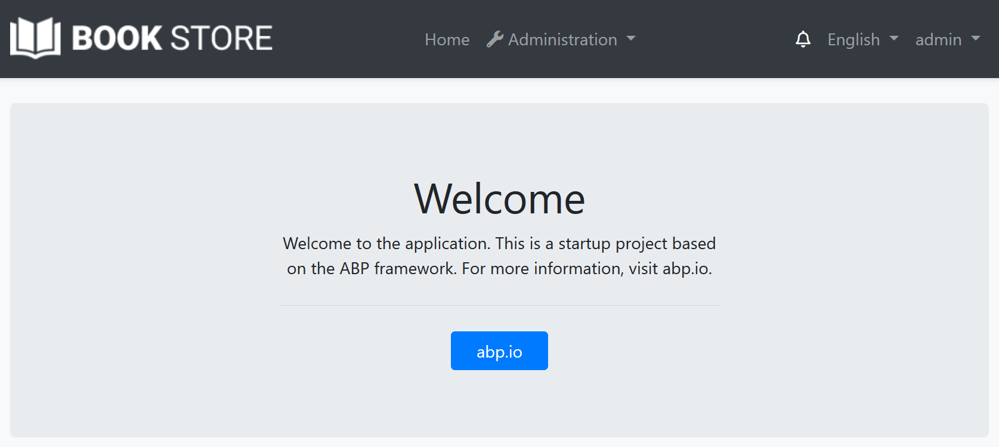

# Blazor UI: Toolbars

The Toolbar system is used to define **toolbars** on the user interface. Modules (or your application) can add **items** to a toolbar, then the [theme](Theming.md) renders the toolbar on the **layout**.

There is only one **standard toolbar** named "Main" (defined as a constant: `StandardToolbars.Main`). The [Basic Theme](Basic-Theme) renders the main toolbar as shown below:



In the screenshot above, there are two items added to the main toolbar: Language switch component & user menu. You can add your own items here.

## Example: Add a Notification Icon

In this example, we will add a **notification (bell) icon** to the left of the language switch item. A item in the toolbar should be a **Razor Component**. So, first, create a new razor component in your project (the location of the component doesn't matter):



The content of the `Notification.razor` is shown below:

````html
@inherits Volo.Abp.AspNetCore.Components.AbpComponentBase
<div style="color: white; margin: 8px;">
    <i class="far fa-bell" @onclick="ShowNotifications"></i>
</div>
@code {
    private async Task ShowNotifications()
    {
        await Message.Info("TODO: Show notifications");
    }
}
````

This sample simply shows a message. In real life, you probably want to call an HTTP API to get notifications and show on the UI.

Now, we can create a class implementing the `IToolbarContributor` interface:

````csharp
using System.Threading.Tasks;
using MyCompanyName.MyProjectName.Blazor.Components;
using Volo.Abp.AspNetCore.Components.WebAssembly.Theming.Toolbars;

namespace MyCompanyName.MyProjectName.Blazor
{
    public class MyToolbarContributor : IToolbarContributor
    {
        public Task ConfigureToolbarAsync(IToolbarConfigurationContext context)
        {
            if (context.Toolbar.Name == StandardToolbars.Main)
            {
                context.Toolbar.Items.Insert(0, new ToolbarItem(typeof(Notification)));
            }

            return Task.CompletedTask;
        }
    }
}
````

This class adds the `NotificationViewComponent` as the first item in the `Main` toolbar.

Finally, you need to add this contributor to the `AbpToolbarOptions`, in the `ConfigureServices` of your [module](../../Module-Development-Basics.md):

````csharp
Configure<AbpToolbarOptions>(options =>
{
    options.Contributors.Add(new MyToolbarContributor());
});
````

That's all, you will see the notification icon on the toolbar when you run the application:



## IToolbarManager

`IToolbarManager` is used to render the toolbar. It returns the toolbar items by a toolbar name. This is generally used by the [themes](Theming.md) to render the toolbar on the layout.