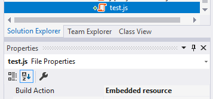

# Virtual File System

The Virtual File System makes it possible to manage files that do not physically exist on the file system (disk). It's mainly used to embed (js, css, image..) files into assemblies and use them like physical files at runtime.

## Installation

> Most of the times you don't need to manually install this package since it comes pre-installed with the [application startup template](Startup-Templates/Application.md).

[Volo.Abp.VirtualFileSystem](https://www.nuget.org/packages/Volo.Abp.VirtualFileSystem) is the main package of the Virtual File System.

Use the ABP CLI to add this package to your project:

* Install the [ABP CLI](https://docs.abp.io/en/abp/latest/CLI), if you haven't installed it.
* Open a command line (terminal) in the directory of the `.csproj` file you want to add the `Volo.Abp.VirtualFileSystem` package.
* Run `abp add-package Volo.Abp.VirtualFileSystem` command.

If you want to do it manually, install the [Volo.Abp.VirtualFileSystem](https://www.nuget.org/packages/Volo.Abp.VirtualFileSystem) NuGet package to your project and add `[DependsOn(typeof(AbpVirtualFileSystemModule))]` to the [ABP module](Module-Development-Basics.md) class inside your project.

## Working with the Embedded Files

### Embedding the Files

A file should be first marked as **embedded resource** to embed the file into the assembly. The easiest way to do it is to select the file from the **Solution Explorer** and set **Build Action** to **Embedded Resource** from the **Properties** window. Example:



If you want to add multiple files, this can be tedious. Alternatively, you can directly edit your `.csproj` file:

````C#
<ItemGroup>
  <EmbeddedResource Include="MyResources\**\*.*" />
  <Content Remove="MyResources\**\*.*" />
</ItemGroup>
````

This configuration recursively adds all files under the **MyResources** folder of the project (including the files you will add in the future).

Embedding a file in the project/assembly may cause problems if a file name contains some special chars. To overcome this limitation;

1. Add [Microsoft.Extensions.FileProviders.Embedded](https://www.nuget.org/packages/Microsoft.Extensions.FileProviders.Embedded) NuGet package to the project that contains the embedded resource(s).
2. Add `<GenerateEmbeddedFilesManifest>true</GenerateEmbeddedFilesManifest>` into the `<PropertyGroup>...</PropertyGroup>` section of your `.csproj` file.

> While these two steps are optional and ABP can work without these configuration, it is strongly suggested to make it.

### Configure the AbpVirtualFileSystemOptions

Use `AbpVirtualFileSystemOptions` [options class](Options.md) to register the embedded files to the virtual file system in the `ConfigureServices` method of your [module](Module-Development-Basics.md).

**Example: Add embedded files to the virtual file system**

````csharp
Configure<AbpVirtualFileSystemOptions>(options =>
{
    options.FileSets.AddEmbedded<MyModule>();
});
````

The `AddEmbedded` extension method takes a class, finds all embedded files from the **assembly of the given class** and registers them to the virtual file system.

`AddEmbedded` can get two optional parameters;

* `baseNamespace`: This may only needed if you didn't configure the `GenerateEmbeddedFilesManifest` step explained above and your root namespace is not empty. In this case, set your root namespace here.
* `baseFolder`: If you don't want to expose all embedded files in the project, but only want to expose a specific folder (and sub folders/files), then you can set the base folder relative to your project root folder.

**Example: Add files under the `MyResources` folder in the project**

````csharp
Configure<AbpVirtualFileSystemOptions>(options =>
{
    options.FileSets.AddEmbedded<MyModule>(
        baseNamespace: "Acme.BookStore",
        baseFolder: "/MyResources"
    );
});
````

This example assumes;

* Your project root (default) namespace is `Acme.BookStore`.
* Your project has a folder, named `MyResources`
* You only want to add `MyResources` folder to the virtual file system.

### IVirtualFileProvider

After embedding a file into an assembly and registering it to the virtual file system, the `IVirtualFileProvider` interface can be used to get the file or directory contents:

````C#
public class MyService : ITransientDependency
{
    private readonly IVirtualFileProvider _virtualFileProvider;

    public MyService(IVirtualFileProvider virtualFileProvider)
    {
        _virtualFileProvider = virtualFileProvider;
    }

    public void Test()
    {
        //Getting a single file
        var file = _virtualFileProvider
            .GetFileInfo("/MyResources/js/test.js");

        var fileContent = file.ReadAsString();

        //Getting all files/directories under a directory
        var directoryContents = _virtualFileProvider
            .GetDirectoryContents("/MyResources/js");
    }
}
````

## ASP.NET Core Integration

The Virtual File System is well integrated to ASP.NET Core:

* Virtual files can be used just like physical (static) files in a web application.
* Js, css, image files and all other web content types can be embedded into assemblies and used just like the physical files.
* An application (or another module) can **override a virtual file** of a module just like placing a file with the same name and extension into the same folder of the virtual file.

### UseVirtualFiles Middleware

The Virtual Files Middleware is used to serve embedded (js, css, image...) files to clients/browsers just like physical files in the **wwwroot** folder. It also covers the physical files.

Replace the `app.UseStaticFiles()` with the `app.UseVirtualFiles()` in your ASP.NET Core middleware configuration:

````C#
app.UseVirtualFiles();
````

> `UseVirtualFiles()` is already configured for the [application startup template](Startup-Templates/Application.md).

#### Static Virtual File Folders

By default, ASP.NET Core only allows the `wwwroot` folder to contain the static files consumed by the clients. When you use the `UseVirtualFiles` middleware, the following folders also can contain static files:

* Pages
* Views
* Components
* Themes

This allows to add `.js`, `.css`... files near to your `.cshtml` file that is easier to develop and maintain your project.

## Dealing With Embedded Files During Development

Embedding a file into an assembly and being able to use it from another project just by referencing the assembly (or adding a NuGet package) is invaluable for creating a re-usable module. However, it makes it a little bit harder to develop the module itself.

Let's assume that you're developing a module that contains an embedded JavaScript file. Whenever you change this file you must re-compile the project, re-start the application and refresh the browser page to take the change. Obviously, this is very time consuming and tedious.

What is needed is the ability for the application to directly use the physical file at development time and a browser refresh reflects any change made in the JavaScript file. The `ReplaceEmbeddedByPhysical` method makes all this possible. 

The example below shows an application that depends on a module (`MyModule`) that contains embedded files. The application can access to the source code of the module at development time. 

````C#
[DependsOn(typeof(MyModule))]
public class MyWebAppModule : AbpModule
{
    public override void ConfigureServices(ServiceConfigurationContext context)
    {
        var hostingEnvironment = context.Services.GetHostingEnvironment();

        if (hostingEnvironment.IsDevelopment()) //only for development time
        {
            Configure<AbpVirtualFileSystemOptions>(options =>
            {
                options.FileSets.ReplaceEmbeddedByPhysical<MyModule>(
                    Path.Combine(
                        hostingEnvironment.ContentRootPath,
                        string.Format(
                            "..{0}MyModuleProject",
                            Path.DirectorySeparatorChar
                        )
                    )
                );
            });
        }
    }
}
````

The code above assumes that `MyWebAppModule` and `MyModule` are two different projects in a Visual Studio solution and `MyWebAppModule` depends on the `MyModule`.

> The [application startup template](Startup-Templates/Application.md) already uses this technique for the localization files. So, when you change a localization file it automatically detects the change.

## Replacing/Overriding Virtual Files

Virtual File System creates a unified file system on runtime, where the actual files are distributed into different modules in the development time.

If two modules adds a file to the same virtual path (like `my-path/my-file.css`), the one added later overrides/replaces the previous one ([module dependency](Module-Development-Basics.md) order determines the order of the files being added).

This feature allows your application to override/replace any virtual file defined a module that is used by your application. This is one of the fundamental extensibility features of the ABP Framework.

So, if you need to replace a file of a module, just create the file in the exactly same path in your module/application

### Physical Files

Physical files always override the virtual files. That means if you put a file under the `/wwwroot/my-folder/my-file.css`, it will override the file in the same location of the virtual file system. So, you need to know the file paths defined in the modules to override them.
