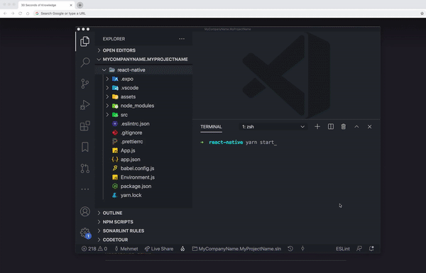

````json
//[doc-params]
{
  "Tiered": ["No", "Yes"]
}
````

# Getting Started with the React Native

ABP platform provide basic [React Native](https://reactnative.dev/) startup template to develop mobile applications **integrated to your ABP based backends**.



## How to Prepare Development Environment

Please follow the steps below to prepare your development environment for React Native.

1. **Install Node.js:** Please visit [Node.js downloads page](https://nodejs.org/en/download/) and download proper Node.js v16 or v18 installer for your OS. An alternative is to install [NVM](https://github.com/nvm-sh/nvm) and use it to have multiple versions of Node.js in your operating system.
2. **[Optional] Install Yarn:** You may install Yarn v1 (not v2) following the instructions on [the installation page](https://classic.yarnpkg.com/en/docs/install). Yarn v1 delivers an arguably better developer experience compared to npm v6 and below. You may skip this step and work with npm, which is built-in in Node.js, instead.
3. **[Optional] Install VS Code:** [VS Code](https://code.visualstudio.com/) is a free, open-source IDE which works seamlessly with TypeScript. Although you can use any IDE including Visual Studio or Rider, VS Code will most likely deliver the best developer experience when it comes to React Native projects.
4. **Install an Emulator:** React Native applications need an Android emulator or an iOS simulator to run on your OS. See the [Android Studio Emulator](https://docs.expo.io/workflow/android-simulator/) or [iOS Simulator](https://docs.expo.io/workflow/ios-simulator/) on expo.io documentation to learn how to set up an emulator.

## How to Start a New React Native Project

You have multiple options to initiate a new React Native project that works with ABP:

### 1. Using ABP CLI

ABP CLI is probably the most convenient and flexible way to initiate an ABP solution with a React Native application. Simply [install the ABP CLI](../cli/index.md) and run the following command in your terminal:

```shell
abp new MyCompanyName.MyProjectName -csf -u <angular or mvc> -m react-native
```

> To see further options in the CLI, please visit the [CLI manual](../cli/index.md).

This command will prepare a solution with an **Angular** or an **MVC** (depends on your choice), a **.NET Core**, and a **React Native** project in it.

### 2. Generating a CLI Command from Get Started Page

You can generate a CLI command on the [get started page of the abp.io website](https://abp.io/get-started). Then, use the command on your terminal to create a new [Startup Template](../solution-templates/index.md).

## How to Configure & Run the Backend

> React Native application does not trust the auto-generated .NET HTTPS certificate. You should use **HTTP** during the development.

> When you are using OpenIddict, You should remove 'clientSecret' on Environment.js (if exists) and disable "HTTPS-only" settings. (Openiddict has default since Version 6.0)

A React Native application running on an Android emulator or a physical phone **can not connect to the backend** on `localhost`. To fix this problem, it is necessary to run the backend application on your **local IP address**.

{{ if Tiered == "No"}}


- Open the `appsettings.json` file in the `.HttpApi.Host` folder. Replace the `localhost` address on the `SelfUrl` and `Authority` properties with your local IP address.
- Open the `launchSettings.json` file in the `.HttpApi.Host/Properties` folder. Replace the `localhost` address on the `applicationUrl` properties with your local IP address.

{{ else if Tiered == "Yes" }}


- Open the `appsettings.json` file in the `.AuthServer` folder. Replace the `localhost` address on the `SelfUrl` property with your local IP address.
- Open the `launchSettings.json` file in the `.AuthServer/Properties` folder. Replace the `localhost` address on the `applicationUrl` properties with your local IP address.
- Open the `appsettings.json` file in the `.HttpApi.Host` folder. Replace the `localhost` address on the `Authority` property with your local IP address.
- Open the `launchSettings.json` file in the `.HttpApi.Host/Properties` folder. Replace the `localhost` address on the `applicationUrl` properties with your local IP address.

{{ end }}

Run the backend application as described in the [getting started document](getting-started.md).

> You should turn off the "Https Restriction" if you're using OpenIddict as a central identity management solution. Because the IOS Simulator doesn't support self-signed certificates and OpenIddict is set to only work with HTTPS by default.

## How to disable the Https-only settings of OpenIddict

Open the {{ if Tiered == "No" }}`MyProjectNameHttpApiHostModule`{{ else if Tiered == "Yes" }}`MyProjectNameAuthServerModule`{{ end }} project and copy-paste the below code-block to the `PreConfigureServices` method:

```csharp
#if DEBUG
    PreConfigure<OpenIddictServerBuilder>(options =>
    {
        options.UseAspNetCore()
            .DisableTransportSecurityRequirement();
    });
#endif
```

## How to Configure & Run the React Native Application

1. Make sure the [database migration is complete](./Getting-Started?UI=NG&DB=EF&Tiered=No#create-the-database) and the [API is up and running](./Getting-Started?UI=NG&DB=EF&Tiered=No#run-the-application).
2. Open `react-native` folder and run `yarn` or `npm install` if you have not already.
3. Open the `Environment.js` in the `react-native` folder and replace the `localhost` address on the `apiUrl` and `issuer` properties with your local IP address as shown below:


{{ if Tiered == "Yes" }}

> Make sure that `issuer` matches the running address of the `.AuthServer` project, `apiUrl` matches the running address of the `.HttpApi.Host` or `.Web` project.

{{else}}

> Make sure that `issuer` and `apiUrl` matches the running address of the `.HttpApi.Host` or `.Web` project.

{{ end }}

4. Run `yarn start` or `npm start`. Wait for the Expo CLI to print the opitons.

> The React Native application was generated with [Expo](https://expo.io/). Expo is a set of tools built around React Native to help you quickly start an app and, while it has many features.


In the above image, you can start the application with an Android emulator, an iOS simulator or a physical phone by scanning the QR code with the [Expo Client](https://expo.io/tools#client) or choosing the option.

### Expo


### Android Studio

1. Start the emulator in **Android Studio** before running the `yarn start` or `npm start` command.
2. Press **a** to open in Android Studio.


Enter **admin** as the username and **1q2w3E\*** as the password to login to the application.

The application is up and running. You can continue to develop your application based on this startup template.

## See Also

- [React Native project structure](../solution-templates/layered-web-application#react-native)
