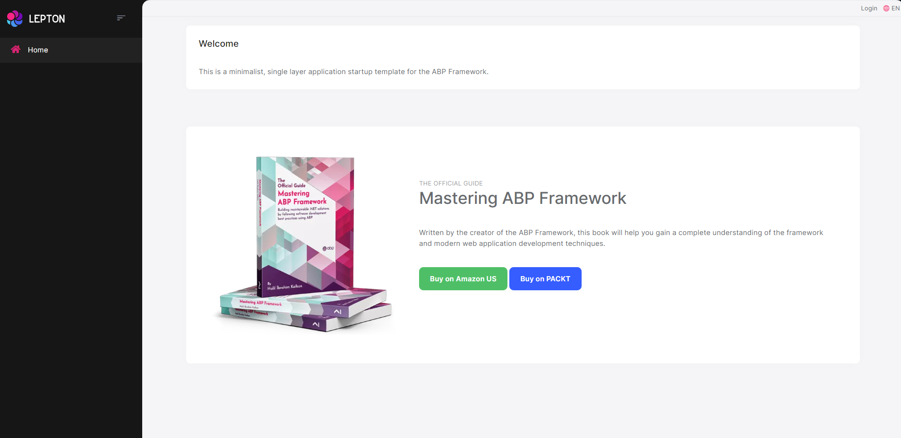

# Getting Started

````json
//[doc-params]
{
    "UI": ["MVC", "Blazor", "BlazorServer", "NG"],
    "DB": ["EF", "Mongo"]
}
````

````json
//[doc-nav]
{
  "Previous": {
    "Name": "Creating a new solution",
    "Path": "Getting-Started-Create-Solution-Single-Layer"
  }
}
````

> This document assumes that you prefer to use **{{ UI_Value }}** as the UI framework and **{{ DB_Value }}** as the database provider. For other options, please change the preference on top of this document.

## Create the Database

### Connection String

Check the **connection string** in the `appsettings.json` file under the `YourProject` project.

{{ if DB == "EF" }}

````json
"ConnectionStrings": {
  "Default": "Server=(LocalDb)\\MSSQLLocalDB;Database=BookStore;Trusted_Connection=True"
}
````

> **About the Connection Strings and Database Management Systems**
>
> The solution is configured to use **Entity Framework Core** with **MS SQL Server** by default. However, if you've selected another DBMS using the `-dbms` parameter on the ABP CLI `new` command (like `-dbms MySQL`), the connection string might be different for you.
>
> EF Core supports [various](https://docs.microsoft.com/en-us/ef/core/providers/) database providers and you can use any supported DBMS. See [the Entity Framework integration document](../framework/data/entity-framework-core) to learn how to [switch to another DBMS](../framework/data/entity-framework-core/other-dbms.md) if you need later.

{{ else if DB == "Mongo" }}

````json
"ConnectionStrings": {
  "Default": "mongodb://localhost:27017/BookStore"
}
````

The solution is configured to use **MongoDB** in your local computer, so you need to have a MongoDB server instance up and running or change the connection string to another MongoDB server.

{{ end }}

### Seed Initial Data

Before running the application, you need to create the database and seed the initial data. To do that, you can run the following command in the directory of your project (in the same folder of the `.csproj` file):

```bash
dotnet run --migrate-database
```

## Before Running the Application

### Installing the Client-Side Packages

[ABP CLI](../cli/index.md) runs the `abp install-libs` command behind the scenes to install the required NPM packages for your solution while creating the application. 

However, sometimes this command might need to be manually run. For example, you need to run this command, if you have cloned the application, or the resources from *node_modules* folder didn't copy to *wwwroot/libs* folder, or if you have added a new client-side package dependency to your solution.

For such cases, run the `abp install-libs` command on the root directory of your solution to install all required NPM packages:

```bash
abp install-libs
```

> We suggest you install [Yarn](https://classic.yarnpkg.com/) to prevent possible package inconsistencies, if you haven't installed it yet.

{{if UI=="Blazor" || UI=="BlazorServer"}}

### Bundling and Minification

`abp bundle` command offers bundling and minification support for client-side resources (JavaScript and CSS files) for Blazor projects. This command automatically run when you create a new solution with the [ABP CLI](../cli/index.md).

However, sometimes you might need to run this command manually. To update script & style references without worrying about dependencies, ordering, etc. in a project, you can run this command in the directory of your blazor application:

```bash
abp bundle
```

> For more details about managing style and script references in Blazor or MAUI Blazor apps, see [Managing Global Scripts & Styles](../framework/ui/blazor/global-scripts-styles.md).

{{end}}

## Run the Application

{{if UI=="MVC" || UI=="BlazorServer"}}

Running the application is pretty straight-forward, you can run the application with any IDE that supports .NET or by running the `dotnet run` CLI command in the directory of your project: 

{{else if UI=="Blazor"}}

Running the application is pretty straight-forward, you just need to run the `TodoApp.Host` application with any IDE that supports .NET or by running the `dotnet run` CLI command in the directory of your project.

> **Note:** The `host` application hosts and serves the `blazor` application. Therefore, you should run the `host` application only.

After the application runs, open the application in your default browser.

{{else if UI=="NG"}}

The solution has two main applications:

* `TodoApp` (in the .NET solution) hosts the server-side HTTP API, so the Angular application can consume it. (server-side application)
* `angular` folder contains the Angular application. (client-side application)

Firstly, run the `TodoApp` project in your favorite IDE (or run the `dotnet run` CLI command on your project directory) to see the server-side HTTP API on [Swagger UI](https://swagger.io/tools/swagger-ui/).


You can explore and test your HTTP API with this UI. If it works, then we can run the Angular client application.

You can run the application using the following (or `yarn start`) command:

````bash
npm start
````

This command takes time, but eventually runs and opens the application in your default browser.

{{end}}

After running the project, the index page should be seen as below:



Enter **admin** as the username and **1q2w3E*** as the password to login to the application. The application is up and running. You can start developing your application based on this startup template.

