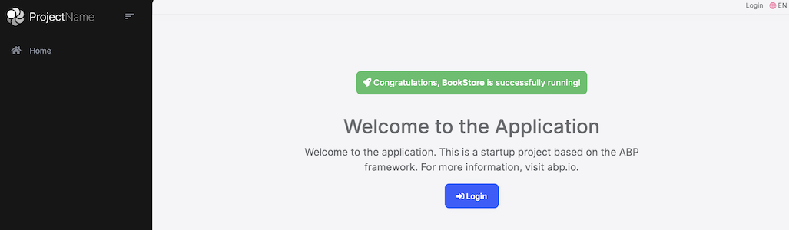
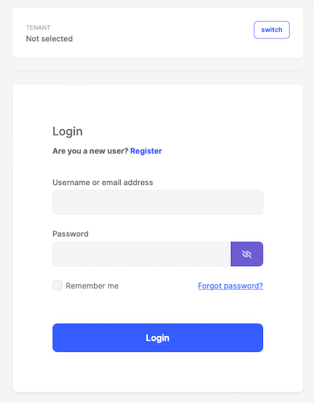

# Getting Started

````json
//[doc-params]
{
    "UI": ["MVC", "Blazor", "BlazorServer", "NG"],
    "DB": ["EF", "Mongo"],
    "Tiered": ["Yes", "No"]
}
````

````json
//[doc-nav]
{
  "Previous": {
    "Name": "Creating a new solution",
    "Path": "Getting-Started-Create-Solution"
  }
}
````

> This document assumes that you prefer to use **{{ UI_Value }}** as the UI framework and **{{ DB_Value }}** as the database provider. For other options, please change the preference on top of this document.

## Create the Database

### Connection String

Check the **connection string** in the `appsettings.json` file under the {{if Tiered == "Yes"}}`.AuthServer` and `.HttpApi.Host` projects{{else}}{{if UI=="MVC"}}`.Web` project{{else if UI=="BlazorServer"}}`.Blazor` project{{else}}`.HttpApi.Host` project{{end}}{{end}}.

{{ if DB == "EF" }}

````json
"ConnectionStrings": {
  "Default": "Server=(LocalDb)\\MSSQLLocalDB;Database=BookStore;Trusted_Connection=True"
}
````

> **About the Connection Strings and Database Management Systems**
>
> The solution is configured to use **Entity Framework Core** with **MS SQL Server** by default. However, if you've selected another DBMS using the `-dbms` parameter on the ABP CLI `new` command (like `-dbms MySQL`), the connection string might be different for you.
>
> EF Core supports [various](https://docs.microsoft.com/en-us/ef/core/providers/) database providers and you can use any supported DBMS. See [the Entity Framework integration document](../framework/data/entity-framework-core) to learn how to [switch to another DBMS](../framework/data/entity-framework-core/other-dbms.md) if you need later.

### Database Migrations

The solution uses the [Entity Framework Core Code First Migrations](https://docs.microsoft.com/en-us/ef/core/managing-schemas/migrations/?tabs=dotnet-core-cli). It comes with a `.DbMigrator` console application which **applies the migrations** and also **seeds the initial data**. It is useful on **development** as well as on **production** environment.

> `.DbMigrator` project has its own `appsettings.json`. So, if you have changed the connection string above, you should also change this one. 

### The Initial Migration

`.DbMigrator` application automatically **creates the Initial migration** on first run. 

**If you are using Visual Studio, you can skip to the *Running the DbMigrator* section.** However, other IDEs (e.g. Rider) may have problems for the first run since it adds the initial migration and compiles the project. In this case, open a command line terminal in the folder of the `.DbMigrator` project and run the following command:

````bash
dotnet run
````

For the next time, you can just run it in your IDE as you normally do.

### Running the DbMigrator

Right click to the `.DbMigrator` project and select **Set as StartUp Project**


 Hit F5 (or Ctrl+F5) to run the application. It will have an output like shown below:

 

> Initial [seed data](../framework/infrastructure/data-seeding.md) creates the `admin` user in the database (with the password is `1q2w3E*`) which is then used to login to the application. So, you need to use `.DbMigrator` at least once for a new database.

{{ else if DB == "Mongo" }}

````json
"ConnectionStrings": {
  "Default": "mongodb://localhost:27017/BookStore"
}
````

The solution is configured to use **MongoDB** in your local computer, so you need to have a MongoDB server instance up and running or change the connection string to another MongoDB server.

### Seed Initial Data

The solution comes with a `.DbMigrator` console application which **seeds the initial data**. It is useful on **development** as well as on **production** environment.

> `.DbMigrator` project has its own `appsettings.json`. So, if you have changed the connection string above, you should also change this one. 

Right click to the `.DbMigrator` project and select **Set as StartUp Project**


 Hit F5 (or Ctrl+F5) to run the application. It will have an output like shown below:

 

> Initial [seed data](../framework/infrastructure/data-seeding.md) creates the `admin` user in the database (with the password is `1q2w3E*`) which is then used to login to the application. So, you need to use `.DbMigrator` at least once for a new database.

{{ end }}

## Before Running the Application

### Installing the Client-Side Packages

[ABP CLI](../cli/index.md) runs the `abp install-libs` command behind the scenes to install the required NPM packages for your solution while creating the application. 

However, sometimes this command might need to be manually run. For example, you need to run this command, if you have cloned the application, or the resources from *node_modules* folder didn't copy to *wwwroot/libs* folder, or if you have added a new client-side package dependency to your solution.

For such cases, run the `abp install-libs` command on the root directory of your solution to install all required NPM packages:

```bash
abp install-libs
```

> We suggest you install [Yarn](https://classic.yarnpkg.com/) to prevent possible package inconsistencies, if you haven't installed it yet.

{{if UI=="Blazor" || UI=="BlazorServer"}}

### Bundling and Minification

`abp bundle` command offers bundling and minification support for client-side resources (JavaScript and CSS files) for Blazor projects. This command automatically run when you create a new solution with the [ABP CLI](../cli/index.md).

However, sometimes you might need to run this command manually. To update script & style references without worrying about dependencies, ordering, etc. in a project, you can run this command in the directory of your blazor application:

```bash
abp bundle
```

> For more details about managing style and script references in Blazor or MAUI Blazor apps, see [Managing Global Scripts & Styles](../framework/ui/blazor/global-scripts-styles.md).

{{end}}

## Run the Application

{{ if UI == "MVC" || UI == "BlazorServer" }}

> **Note**: Before starting the application, run `abp install-libs` command in your Web directory to restore the client-side libraries. This will populate the `libs` folder.

{{ if UI == "BlazorServer" }}

> **Important:**  The `.AuthServer` application serves as the **Authentication Server** for the `.Blazor` application. It is essential to have the `.AuthServer` application running in the background to ensure the proper functioning of the `.Blazor` application.

To do this, open terminal in `.AuthServer` project folder and run the following command.

````bash
dotnet run
````

Once the `.AuthServer`application has started, it is time to run `.HttpApi.Host` application.

> **Important:** Prior to launching the `.Blazor` project, it is essential to execute the `.HttpApi.Host` application as well.

To do this, open terminal in `.HttpApi.Host` project folder and run the following command.

````bash
dotnet run
````
Once the `.AuthServer` and `.HttpApi.Host` applications has started, you can proceed to run the `.Blazor` project.

{{ end # UI }}

{{ if Tiered == "Yes" }}

> Tiered solutions use **Redis** as the distributed cache. Ensure that it is installed and running in your local computer. If you are using a remote Redis Server, set the configuration in the `appsettings.json` files of the projects below.

1. Ensure that the `.AuthServer` project is the startup project. Run this application that will open a **login** page in your browser.

> Use Ctrl+F5 in Visual Studio (instead of F5) to run the application without debugging. If you don't have a debug purpose, this will be faster.

You can login, but you cannot enter to the main application here. This is **just the authentication server**.

2. Ensure that the `.HttpApi.Host` project is the startup project and run the application which will open a **Swagger UI** in your browser.


This is the HTTP API that is used by the web application.

3. Lastly, ensure that the {{if UI=="MVC"}}`.Web`{{else}}`.Blazor`{{end}} project is the startup project and run the application which will open a **welcome** page in your browser



Click to the **login** button which will redirect you to the *authentication server* to login to the application:



{{ else # Tiered != "Yes" }}

Ensure that the {{if UI=="MVC"}}`.Web`{{else}}`.Blazor`{{end}} project is the startup project. Run the application which will open the **login** page in your browser:

> Use Ctrl+F5 in Visual Studio (instead of F5) to run the application without debugging. If you don't have a debug purpose, this will be faster.


{{ end # Tiered }}

{{ else # UI != MVC || BlazorServer }}

### Running the HTTP API Host (Server Side)

{{ if Tiered == "Yes" }}

> Tiered solutions use Redis as the distributed cache. Ensure that it is installed and running in your local computer. If you are using a remote Redis Server, set the configuration in the `appsettings.json` files of the projects below.

Ensure that the `.AuthServer` project is the startup project. Run the application which will open a **login** page in your browser.

> Use Ctrl+F5 in Visual Studio (instead of F5) to run the application without debugging. If you don't have a debug purpose, this will be faster.

You can login, but you cannot enter to the main application here. This is **just the authentication server**.

Ensure that the `.HttpApi.Host` project is the startup project and run the application which will open a Swagger UI:

{{ else # Tiered == "No" }}

Ensure that the `.HttpApi.Host` project is the startup project and run the application which will open a Swagger UI:

> Use Ctrl+F5 in Visual Studio (instead of F5) to run the application without debugging. If you don't have a debug purpose, this will be faster.

{{ end # Tiered }}


You can see the application APIs and test them here. Get [more info](https://swagger.io/tools/swagger-ui/) about the Swagger UI.

{{ end # UI }}

{{ if UI == "Blazor" }}

### Running the Blazor Application (Client Side)

> **Important:**  The `.HttpApi.Host` application serves as the **Authentication Server** for the `.Blazor` application. It is essential to have the `.HttpApi.Host` application running in the background to ensure the proper functioning of the `.Blazor` application.

To do this, you can open terminal in `.HttpApi.Host` project folder and run the following command.

````bash
dotnet run
````

Once the `.HttpApi.Host` application has started, you can proceed to run the `.Blazor` application.

Ensure that the `.Blazor` project is the startup project and run the application.

> Use Ctrl+F5 in Visual Studio (instead of F5) to run the application without debugging. If you don't have a debug purpose, this will be faster.

Once the application starts, click to the **Login** link on to header, which redirects you to the authentication server to enter a username and password:


{{ else if UI == "NG" }}

### Running the Angular Application (Client Side)

Go to the `angular` folder, open a command line terminal, type the `yarn` command (we suggest to the [yarn](https://yarnpkg.com/) package manager while `npm install` will also work)

```bash
yarn
```

Once all node modules are loaded, execute `yarn start` (or `npm start`) command:

```bash
yarn start
```

It may take a longer time for the first build. Once it finishes, it opens the Angular UI in your default browser with the [localhost:4200](http://localhost:4200/) address.


{{ end }}

Enter **admin** as the username and **1q2w3E*** as the password to login to the application. The application is up and running. You can start developing your application based on this startup template.