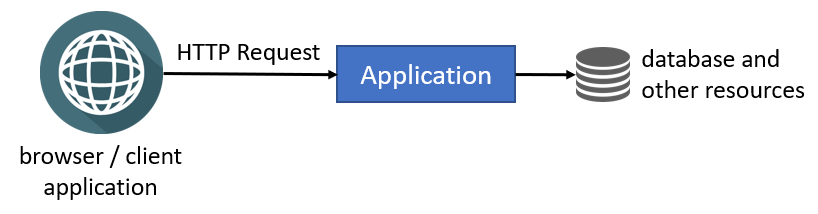
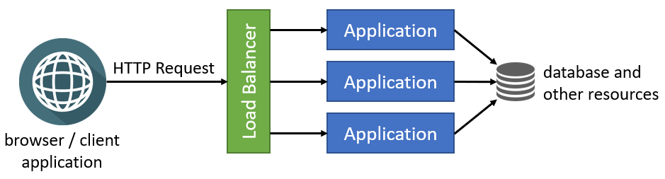

# Deploying to a Clustered Environment

This document explains the topics that you should consider when deploying your application to a clustered environment where multiple instances of your application run concurrently. 
It explains how you can deal with these topics in your ABP application.

> This document is eligible for both monolith and microservice solutions.
> The Application term is used for a process. An application can be a monolith web application, a service in a microservice solution, a console application, or another executable process.
> For example, if you are deploying your application to Kubernetes and configuring your application or service to run in multiple pods, then your application or service runs in a clustered environment.

## Understanding the Clustered Environment

> You can skip this section if you are familiar with clustered deployment and load balancers.

### Single Instance Deployment

Consider an application deployed as a **single instance**, as illustrated in the following figure:

Browsers and other client applications can directly make HTTP requests to your application. 
You can locate a web server (e.g. IIS or NGINX) between the clients and your application, but you still have a single application instance running in a single server or container. 
A single instance configuration is **limited by scale** because it runs on a single server, and the capacity of the server may limit the application's performance.

### Clustered Deployment

**Clustered deployment** is the way of running **multiple instances** of your application **concurrently** in a single or multiple servers. 
In this architecture, different instances can serve different requests, and you can scale them by adding new servers to the system. 
The following figure shows a typical implementation of clustering using a **load balancer**:

### Load Balancers

[Load balancers](https://en.wikipedia.org/wiki/Load_balancing_(computing)) have a lot of features, but they fundamentally **forward an incoming HTTP request** to an instance of your application and return your response back to the client application.

Load balancers can use different algorithms to route the requests to an application instance. [Round Robin](https://en.wikipedia.org/wiki/Round-robin_scheduling) is one of the simplest and most used algorithms. Requests are delivered to the application instances in rotation. The first instance gets the first request; the second instance gets the second, and so on. It returns to the first instance after all the instances are used, and the algorithm iterates like this until the next request.

### Potential Problems

Once multiple instances of your application run in parallel, you should carefully consider the following topics:

* Any **state (data) stored in memory** of your application will become a problem when you have multiple instances. A state stored in the memory of an application instance may not be available in the next request since the next request will be handled by a different application instance. While there are some solutions (like sticky sessions) to overcome this problem on a user basis, it is a **best practice to design your application as stateless** if you want to run it in a cluster, container or/and cloud.
* **In-memory caching** is a kind of in-memory state and should not be used in a clustered application. You should use **distributed caching** instead.
* You shouldn't store data in the **local file system**. It should be available to all instances of your application. Different application instance may run in different containers or servers and they may not be able to have access to the same file system. You can use a **cloud or external storage provider** as a solution.
* If you have **background workers** or **job queue managers**, you should be careful since multiple instances may try to execute the same job or perform the same work concurrently. As a result, you may have the same work done multiple times, or you may get a lot of errors while trying to access and change the same resources.

You may have more problems with clustered deployment, but these are the most common ones. ABP has been designed to be compatible with the clustered deployment scenario. The following sections explain what you should do when you are deploying your ABP based application to a clustered environment.

## Switching to a Distributed Cache

ASP.NET Core provides different kinds of caching features. [In-memory cache](https://docs.microsoft.com/en-us/aspnet/core/performance/caching/memory) stores your objects in the memory of the local server and is only available to the application that stores the object. Non-sticky sessions in a clustered environment should use the [distributed caching](https://docs.microsoft.com/en-us/aspnet/core/performance/caching/distributed) except for some specific scenarios (for example, you can cache a local CSS file into memory. It is read-only data and it is the same in all application instances. You can cache it in memory for performance reasons without any problem).

[ABP's Distributed Cache](../framework/fundamentals/caching.md) extends [ASP.NET Core's distributed cache](https://docs.microsoft.com/en-us/aspnet/core/performance/caching/distributed) infrastructure. It works in memory by default. You should configure an actual distributed cache provider when you want to deploy your application to a clustered environment.

> You should configure the cache provider for clustered deployment, even if your application doesn't directly use `IDistributedCache`.
> The ABP and the pre-built [application modules](../modules) use distributed cache.

ASP.NET Core provides multiple integrations to use as your distributed cache provider, like [Redis](https://redis.io/) and [NCache](https://www.alachisoft.com/ncache/). You can follow [Microsoft's documentation](https://docs.microsoft.com/en-us/aspnet/core/performance/caching/distributed) to learn how to use them in your applications.

If you decided to use Redis as your distributed cache provider, **follow [ABP's Redis Cache Integration document](../framework/fundamentals/redis-cache.md)** for the steps you need to follow to install it into your application and setup your Redis configuration.

> Depending on your preferences when creating a new ABP solution, Redis cache might be pre-installed.
> For example, if you select the *Tiered* option with the MVC UI, the Redis cache will be pre-installed by default.
> Because, in this case, you have two applications in your solution that should use the same cache source to be consistent.

## Using a Proper BLOB Storage Provider

If you use ABP's [BLOB Storing](../framework/infrastructure/blob-storing) feature with the [File System provider](../framework/infrastructure/blob-storing/file-system.md), you should use another provider in your clustered environment since the File System provider uses the application's local file system.

The [Database BLOB provider](../framework/infrastructure/blob-storing/database.md) is the easiest way since it uses your application's main database (or another database if you configure it) to store BLOBs. However, you should remember that BLOBs are large objects and may quickly increase your database's size.

> [ABP](https://abp.io/) startup solution templates come with the database BLOB provider as pre-installed and store BLOBs in the application's database.

Check the [BLOB Storing](../framework/infrastructure/blob-storing) document to see all the available BLOB storage providers.

## Configuring Background Jobs

ABP's [background job system](../framework/infrastructure/background-jobs) queues tasks to be executed in the background. The background job queue is persistent, and a queued task is guaranteed to be executed (it will retry if it fails).

ABP's default background job manager is compatible with clustered environments. It uses a [distributed lock](../framework/infrastructure/distributed-locking.md) to ensure that the jobs are executed only in a single application instance at a time. See the *Configuring a Distributed Lock Provider* section below to learn how to configure a distributed lock provider for your application. Hence, the default background job manager properly works in a clustered environment.

If you don't want to use a distributed lock provider, you may go with the following options:

* Stop the background job manager (set `AbpBackgroundJobOptions.IsJobExecutionEnabled` to `false`) in all application instances except one of them, so only the single instance executes the jobs (while other application instances can still queue jobs).
* Stop the background job manager (set `AbpBackgroundJobOptions.IsJobExecutionEnabled` to `false`)  in all application instances and create a dedicated application (maybe a console application running in its own container or a Windows Service running in the background) to execute all the background jobs. This can be a good option if your background jobs consume high system resources (CPU, RAM, disk), you can deploy that background application to a dedicated server and your background jobs don't affect your application's performance.

> If you are using an external background job integration (e.g. [Hangfire](../framework//infrastructure/background-workers/hangfire.md) or [Quartz](../framework//infrastructure/background-workers/quartz.md)) instead of the default background job manager, then please refer to your provider's documentation to learn how it should be configured for a clustered environment.

## Configuring a Distributed Lock Provider

ABP provides a distributed locking abstraction with an implementation made with the [DistributedLock](https://github.com/madelson/DistributedLock) library. A distributed lock is used to control concurrent access to a shared resource by multiple applications to prevent corruption of the resource because of concurrent writes. The ABP and some pre-built [application modules](../modules) are using distributed locking for several reasons.

However, the distributed lock system works in-process by default. That means it is not actually distributed unless you configure a distributed lock provider. So, please follow the [distributed lock](../framework/infrastructure/distributed-locking.md) document to configure a provider for your application if it is not already configured.

## Configuring SignalR

ABP provides [SignalR](../framework/real-time/signalr.md) integration packages to simplify integration and usage. SignalR can be used whenever you need to add real-time web functionality (real-time messaging, real-time notification etc.) into your application. 

SignalR requires that all HTTP requests for a specific connection be handled (needs to keep track of all its connections) using the same server process. So, when SignalR is running on a clustered environment (with multiple servers), **"sticky sessions"** must be used.

If you are considering [scaling out](https://learn.microsoft.com/en-us/aspnet/core/signalr/scale?view=aspnetcore-6.0#scale-out) your servers and don't want to have inconsistency with the active socket connections, you can use [Azure SignalR Service](https://learn.microsoft.com/en-us/aspnet/core/signalr/scale?view=aspnetcore-6.0#azure-signalr-service) or [Redis backplane](https://learn.microsoft.com/en-us/aspnet/core/signalr/scale?view=aspnetcore-6.0#redis-backplane).

> To learn more about how to host and scale SignalR in a clustered environment, please check the [ASP.NET Core SignalR hosting and scaling](https://learn.microsoft.com/en-us/aspnet/core/signalr/scale?view=aspnetcore-6.0).

## Implementing Background Workers

ASP.NET Core provides [hosted services](https://docs.microsoft.com/en-us/aspnet/core/fundamentals/host/hosted-services) and ABP provides [background workers](../framework/infrastructure/background-workers) to perform tasks in background threads in your application.

If your application has tasks running in the background, you should consider how they will behave in a clustered environment, especially if your background tasks are using the same resources. You should design your background tasks so that they continue to work properly in the clustered environment.

Suppose your SaaS application checks user subscriptions in the background and sends emails to those whose subscription renewal dates are approaching. If the background task runs on multiple application instances, users may get duplicate e-mails. 

Use one of the following approaches to overcome the **multiple workers same pool problem**:

* Implement your background workers so that they work in a clustered environment without any problems. Using the [distributed lock](../framework/infrastructure/distributed-locking.md) to ensure concurrency control is a way of doing that. A background worker in an application instance may handle a distributed lock, so the workers in other application instances will wait for the lock. In this way, only one worker does the actual work while others wait in an idle state. If you implement this, your workers run safely without caring about how the application is deployed.
* Stop the background workers (set `AbpBackgroundWorkerOptions.IsEnabled` to `false`) in all application instances except one of them, so only the single instance runs the workers.
* Stop the background workers (set `AbpBackgroundWorkerOptions.IsEnabled` to `false`) in all application instances and create a dedicated application (maybe a console application running in its own container or a Windows Service running in the background) to execute all the background tasks. This can be a good option if your background workers consume high system resources (CPU, RAM, disk), so you can deploy that background application to a dedicated server and your background tasks don't affect your application's performance.
