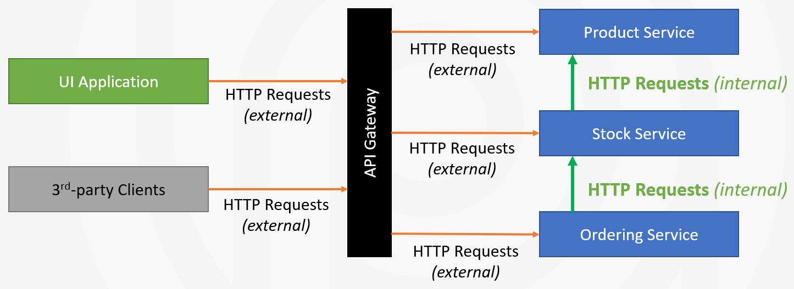

# Integration Services

The *Integration Service* concept was created to distinguish the [application services](../architecture/domain-driven-design/application-services.md) that are built for inter-module (or inter-microservice) communication from the application services that are intended to be consumed from a UI or a client application.

The following figure shows a few microservices behind an API Gateway that is consumed by a UI application and 3rd-party client applications:



HTTP requests coming from out of the API Gateway can be called as *external request*, while the HTTP requests performed between microservices can be considered as *internal requests*. The application services that are designed to respond to these internal requests are called as *integration services*, because their purpose is to integrate microservices in the system, rather than respond to user requests.

## Marking an Application Service as Integration Service

Assume that you have an application service named `ProductAppService`, and you want to use that application service as an integration service. In that case, you can use the `[IntegrationService]` attribute on top of the application service class as shown below:

```csharp
[IntegrationService]
public class ProductAppService : ApplicationService, IProductAppService
{
    // ...
}
```

If your application service has an interface, like `IProductService` in this example, you can use it on the service interface:

```csharp
[IntegrationService]
public interface IProductAppService : IApplicationService
{
    // ...
}
```

> If you've used the `[IntegrationService]` on top of your service interface, it is *not needed* to use on the service class too.

That's all. From now, ABP will handle your application service as integration service and implement the followings by convention:

* That service is **not exposed** by default, unless you explicitly set `ExposeIntegrationServices` options (see the *Exposing Integration Services* section).
* If you are using the [Auto API Controllers](./auto-controllers.md) feature in your application, the **URL prefix** will be `/integration-api` instead of `/api` for your integration services. Thus, you can distinguish internal and external service communications and take additional actions, such as preventing REST API calls for integration services out of API Gateway.
* **Audit logging** is disabled by default for the integration services. See the next section if you want to enable it.

## Marking an MVC Controller as Integration Service

In addition to application services, you can mark a regular MVC Controller as integration service, using the same `IntegrationService` attribute, or inheriting an interface that has the `IntegrationService` attribute.

**Example:**

````csharp
[IntegrationService] // Mark as integration service
[Route("integration-api/products")]
public class ProductController : AbpControllerBase
{
    //...
}
````

When you use the `IntegrationService` attribute, ABP will handle your controller as integration service and implement the followings by convention:

* That controller is **not exposed** to clients by default, unless you explicitly set `ExposeIntegrationServices` options (see the *Exposing Integration Services* section).
* **Audit logging** is disabled by default for controller. See the next section if you want to enable it.

## Configuration

### Exposing Integration Services

Integration services and controllers are not exposed by default for security reasons. They typically don't require authorization, so you should **carefully and explicitly** allow them to be visible and usable to client applications.

To expose integration services and controllers, set `AbpAspNetCoreMvcOptions.ExposeIntegrationServices` to `true` in the `ConfigureServices` method of your [module class](../architecture/modularity/basics.md):

````csharp
Configure<AbpAspNetCoreMvcOptions>(options =>
{
    options.ExposeIntegrationServices = true;
});
````

> Hiding integration services is useful when you are building reusable application modules, where they may be used in a monolith application or in a microservice system. In a monolith application, integration services don't need to be exposed outside since the modules may in-process communicate with each other. On the other hand, if you build a microservice solution and use that module as a service, it will be proper to expose the integration services, so other microservices can consume them remotely inside your private network (or Kubernetes cluster). In that case, be careful to not accidently expose the integration services out of your private network. Configuring your API Gateway so that it blocks requests to `integration-api` prefixed URLs from outside of your network will be a good option.

### Enabling/Disabling the Audit Logging

Audit Logging is disabled by default for integration services but it can be enabled by configuring the `AbpAuditingOptions` [options class](../fundamentals/options.md) in the `ConfigureServices` method of your [module class](../architecture/modularity/basics.md):

```csharp
Configure<AbpAuditingOptions>(options =>
{
    options.IsEnabledForIntegrationService = true;
});
```

> Please refer to the [audit logging document](../infrastructure/audit-logging.md) for other options and details.

### Filtering Auto API Controllers

You can filter integration services (or non-integration services) while creating [Auto API Controllers](./auto-controllers.md), using the `ApplicationServiceTypes` option of the `ConventionalControllerSetting` by configuring the `AbpAspNetCoreMvcOptions` as shown below:

```csharp
PreConfigure<AbpAspNetCoreMvcOptions>(options =>
{
    options.ConventionalControllers.Create(
        typeof(MyApplicationModule).Assembly,
        conventionalControllerSetting =>
        {
            conventionalControllerSetting.ApplicationServiceTypes = 
                ApplicationServiceTypes.IntegrationServices;
        });
});
```

Tip: You can call the `options.ConventionalControllers.Create` multiple times to configure regular application services and integration services with different options.

> Please refer to the [Auto API Controllers document](./auto-controllers.md) for more information about the Auto API Controller system.

## See Also

* [Application Services](../architecture/domain-driven-design/application-services.md)
* [Auto API Controllers](./auto-controllers.md)
* [Audit Logging](../infrastructure/audit-logging.md)
