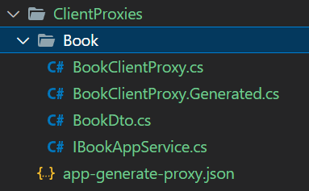
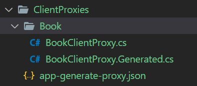

# Static C# API Client Proxies

ABP can create C# API client proxy code to call your remote HTTP services (REST APIs). In this way, you don't need to deal with `HttpClient` and other low level details to call remote services and get results.

Static C# proxies automatically handle the following stuff for you;

* Maps C# **method calls** to remote server **HTTP calls** by considering the HTTP method, route, query string parameters, request payload and other details.
* **Authenticates** the HTTP Client by adding access token to the HTTP header.
* **Serializes** to and deserialize from JSON.
* Handles HTTP API **versioning**.
* Add **correlation id**, current **tenant** id and the current **culture** to the request.
* Properly **handles the error messages** sent by the server and throws proper exceptions.

This system can be used by any type of .NET client to consume your HTTP APIs.

## Static vs Dynamic Client Proxies

ABP provides **two types** of client proxy generation system. This document explains the **static client proxies**, which generates client-side code in your development time. You can also see the [Dynamic C# API Client Proxies](./dynamic-csharp-clients.md) documentation to learn how to use proxies generated on runtime.

Development-time (static) client proxy generation has a **performance advantage** since it doesn't need to obtain the HTTP API definition on runtime. However, you should **re-generate** the client proxy code whenever you change your API endpoint definition. On the other hand, dynamic client proxies are generated on runtime and provides an **easier development experience**.

## Service Interface

Your service/controller should implement an interface that is shared between the server and the client. So, first define a service interface in a shared library project, typically in the `Application.Contracts` project if you've created your solution using the startup templates.

Example:

````csharp
public interface IBookAppService : IApplicationService
{
    Task<List<BookDto>> GetListAsync();
}
````

> Your interface should implement the `IRemoteService` interface to be automatically discovered. Since the `IApplicationService` inherits the `IRemoteService` interface, the `IBookAppService` above satisfies this condition.

Implement this class in your service application. You can use [auto API controller system](./auto-controllers.md) to expose the service as a REST API endpoint.

## With Contracts or Without Contracts

`Without Contracts` depending on target service's `application.contracts` package, so they can reuse the DTOs and other related classes. However, that can be a problem when we want to create fully independently developed and deployed microservices. We want to use the static proxy generation even without depending target service's application.contracts package.

`With Contracts` generate all the `classes/enums/other` types in the client side (including application service interfaces) , This is also the default behavior of the `generate-proxy` command.

## Client Proxy Generation

First, add [Volo.Abp.Http.Client](https://www.nuget.org/packages/Volo.Abp.Http.Client) nuget package to your client project:

````
Install-Package Volo.Abp.Http.Client
````

Then add `AbpHttpClientModule` dependency to your module:

````csharp
[DependsOn(typeof(AbpHttpClientModule))] //add the dependency
public class MyClientAppModule : AbpModule
{
}
````

Now, it's ready to configure the application for the static client proxy generation.

### With Contracts Example

````csharp
[DependsOn(
    typeof(AbpHttpClientModule), //used to create client proxies
    typeof(AbpVirtualFileSystemModule) //virtual file system
)]
public class MyClientAppModule : AbpModule
{
    public override void ConfigureServices(ServiceConfigurationContext context)
    {
        // Prepare for static client proxy generation
        context.Services.AddStaticHttpClientProxies(
            typeof(MyClientAppModule).Assembly
        );

        // Include the generated app-generate-proxy.json in the virtual file system
        Configure<AbpVirtualFileSystemOptions>(options =>
        {
            options.FileSets.AddEmbedded<MyClientAppModule>();
        });
    }
}
````

### Without Contracts Example

````csharp
[DependsOn(
    typeof(AbpHttpClientModule), //used to create client proxies
    typeof(AbpVirtualFileSystemModule), //virtual file system
    typeof(BookStoreApplicationContractsModule) //contains the application service interfaces
)]
public class MyClientAppModule : AbpModule
{
    public override void ConfigureServices(ServiceConfigurationContext context)
    {
        // Prepare for static client proxy generation
        context.Services.AddStaticHttpClientProxies(
            typeof(BookStoreApplicationContractsModule).Assembly
        );

        // Include the generated app-generate-proxy.json in the virtual file system
        Configure<AbpVirtualFileSystemOptions>(options =>
        {
            options.FileSets.AddEmbedded<MyClientAppModule>();
        });
    }
}
````

`AddStaticHttpClientProxies` method gets an assembly, finds all service interfaces in the given assembly, and prepares for static client proxy generation.

> The [application startup template](../../solution-templates/layered-web-application) comes pre-configured for the **dynamic** client proxy generation, in the `HttpApi.Client` project. If you want to switch to the **static** client proxies, change `context.Services.AddHttpClientProxies` to `context.Services.AddStaticHttpClientProxies` in the module class of your `HttpApi.Client` project.

### Endpoint Configuration

`RemoteServices` section in the `appsettings.json` file is used to get remote service address by default. The simplest configuration is shown below:

```json
{
  "RemoteServices": {
    "Default": {
      "BaseUrl": "http://localhost:53929/"
    } 
  } 
}
```

See the *AbpRemoteServiceOptions* section below for more detailed configuration.

### Code Generation

Server side must be up and running while generating the client proxy code. So, run your application that serves the HTTP APIs on the `BaseUrl` that is configured like explained in the *Endpoint Configuration* section.

Open a command-line terminal in the root folder of your client project (`.csproj`) and type the following command:

#### With Contracts

````bash
abp generate-proxy -t csharp -u http://localhost:53929/
````

> If you haven't installed yet, you should install the [ABP CLI](../../cli/index.md).

This command should generate the following files under the `ClientProxies` folder:



* `BookClientProxy.Generated.cs` is the actual generated proxy class in this example. `BookClientProxy` is a `partial` class * where you can write your custom code (ABP won't override it). 
* `IBookAppService.cs` is the app service.
* `BookDto.cs` is the Dto class which uses by app service.
* `app-generate-proxy.json` contains information about the remote HTTP endpoint, so ABP can properly perform HTTP requests. This file must be configured as an embedded resource in your project, so that it can be found by the virtual file system.

#### Without Contracts

````bash
abp generate-proxy -t csharp -u http://localhost:53929/ --without-contracts
````

This command should generate the following files under the `ClientProxies` folder:



* `BookClientProxy.Generated.cs` is the actual generated proxy class in this example. `BookClientProxy` is a `partial` class where you can write your custom code (ABP won't override it). 
* `app-generate-proxy.json` contains information about the remote HTTP endpoint, so ABP can properly perform HTTP requests. This file must be configured as an embedded resource in your project, so that it can be found by the virtual file system.

> `generate-proxy` command generates proxies for only the APIs you've defined in your application. If you are developing a modular application, you can specify the `-m` (or `--module`) parameter to specify the module you want to generate proxies. See the *generate-proxy* section in the [ABP CLI](../../cli/index.md) documentation for other options.

## Usage

It's straightforward to use the client proxies. Just inject the service interface in the client application code:

````csharp
public class MyService : ITransientDependency
{
    private readonly IBookAppService _bookService;

    public MyService(IBookAppService bookService)
    {
        _bookService = bookService;
    }

    public async Task DoItAsync()
    {
        var books = await _bookService.GetListAsync();
        foreach (var book in books)
        {
            Console.WriteLine($"[BOOK {book.Id}] Name={book.Name}");
        }
    }
}
````

This sample injects the `IBookAppService` service interface defined above. The static client proxy implementation makes an HTTP call whenever a service method is called by the client.

## Configuration

### AbpRemoteServiceOptions

`AbpRemoteServiceOptions` is automatically set from the `appsettings.json` by default. Alternatively, you can configure it in the `ConfigureServices` method of your [module](../architecture/modularity/basics.md) to set or override it. Example:

````csharp
public override void ConfigureServices(ServiceConfigurationContext context)
{
    context.Services.Configure<AbpRemoteServiceOptions>(options =>
    {
        options.RemoteServices.Default =
            new RemoteServiceConfiguration("http://localhost:53929/");
    });
    
    //...
}
````

### Multiple Remote Service Endpoints

The examples above have configured the "Default" remote service endpoint. You may have different endpoints for different services (as like in a microservice approach where each microservice has different endpoints). In this case, you can add other endpoints to your configuration file:

````json
{
  "RemoteServices": {
    "Default": {
      "BaseUrl": "http://localhost:53929/"
    },
    "BookStore": {
      "BaseUrl": "http://localhost:48392/"
    } 
  } 
}
````

`AddStaticHttpClientProxies` method can get an additional parameter for the remote service name. Example:

````csharp
context.Services.AddStaticHttpClientProxies(
    typeof(BookStoreApplicationContractsModule).Assembly,
    remoteServiceConfigurationName: "BookStore"
);
````

`remoteServiceConfigurationName` parameter matches the service endpoint configured via `AbpRemoteServiceOptions`. If the `BookStore` endpoint is not defined then it fallbacks to the `Default` endpoint.

### Retry/Failure Logic & Polly Integration

If you want to add retry logic for the failing remote HTTP calls for the client proxies, you can configure the `AbpHttpClientBuilderOptions` in the `PreConfigureServices` method of your module class.

**Example: Use the [Polly](https://github.com/App-vNext/Polly) library to re-try 3 times on a failure**

````csharp
public override void PreConfigureServices(ServiceConfigurationContext context)
{
    PreConfigure<AbpHttpClientBuilderOptions>(options =>
    {
        options.ProxyClientBuildActions.Add((remoteServiceName, clientBuilder) =>
        {
            clientBuilder.AddTransientHttpErrorPolicy(policyBuilder =>
                policyBuilder.WaitAndRetryAsync(
                    3,
                    i => TimeSpan.FromSeconds(Math.Pow(2, i))
                )
            );
        });
    });
}
````

This example uses the [Microsoft.Extensions.Http.Polly](https://www.nuget.org/packages/Microsoft.Extensions.Http.Polly) package. You also need to import the `Polly` namespace (`using Polly;`) to be able to use the `WaitAndRetryAsync` method.

## See Also

* [Dynamic C# Client Proxies](./dynamic-csharp-clients.md)
