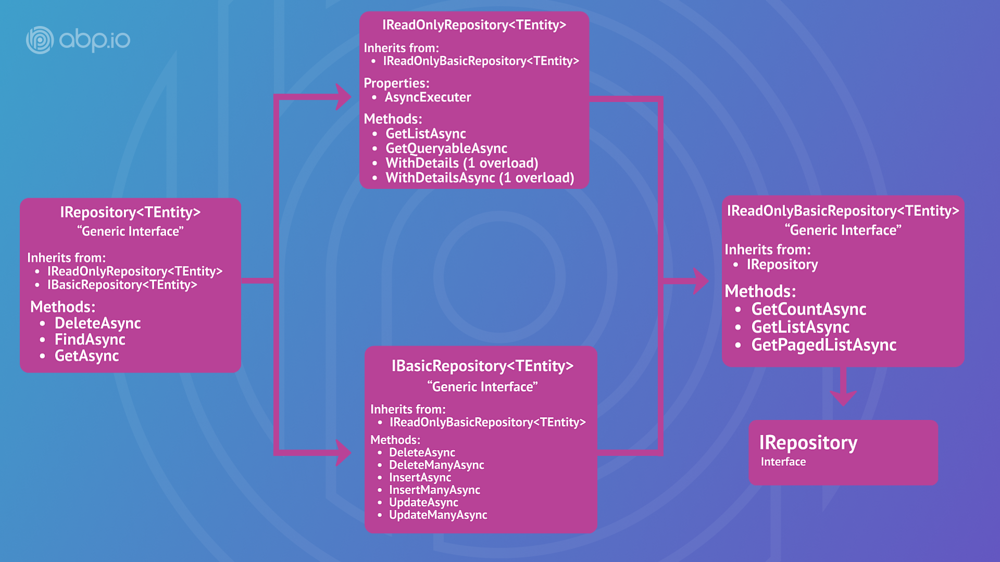

# Repositories

"*Mediates between the domain and data mapping layers using a collection-like interface for accessing domain objects*" (Martin Fowler).

Repositories, in practice, are used to perform database operations for domain objects (see [Entities](./entities.md)). Generally, a separate repository is used for each **aggregate root** or entity.

## Generic Repositories

ABP can provide a **default generic repository** for each aggregate root or entity. You can [inject](../../fundamentals/dependency-injection.md) `IRepository<TEntity, TKey>` into your service and perform standard **CRUD** operations.

> The database provider layer should be properly configured to be able to use the default generic repositories. It is **already done** if you've created your project using the startup templates. If not, refer to the database provider documents ([EF Core](../../data/entity-framework-core) / [MongoDB](../../data/mongodb)) to configure it.

**Example usage of a default generic repository:**

````C#
using System;
using System.Threading.Tasks;
using Volo.Abp.Application.Services;
using Volo.Abp.Domain.Repositories;

namespace Demo
{
    public class PersonAppService : ApplicationService
    {
        private readonly IRepository<Person, Guid> _personRepository;

        public PersonAppService(IRepository<Person, Guid> personRepository)
        {
            _personRepository = personRepository;
        }

        public async Task CreateAsync(CreatePersonDto input)
        {
            var person = new Person(input.Name);

            await _personRepository.InsertAsync(person);
        }

        public async Task<int> GetCountAsync(string filter)
        {
            return await _personRepository.CountAsync(p => p.Name.Contains(filter));
        }
    }
}
````

In this example;

* `PersonAppService` simply injects `IRepository<Person, Guid>` in it's constructor.
* `CreateAsync` method uses `InsertAsync` to save the new entity.
* `GetCountAsync` method gets a filtered count of all people in the database.

### Standard Repository Methods

Generic Repositories provide some standard CRUD features out of the box:

* `GetAsync`: Returns a single entity by its `Id` or a predicate (lambda expression).
  * Throws `EntityNotFoundException` if the requested entity was not found.
  * Throws `InvalidOperationException` if there are multiple entities with the given predicate.
* `FindAsync`: Returns a single entity by its `Id` or a predicate (lambda expression).
  * Returns `null` if the requested entity was not found.
  * Throws `InvalidOperationException` if there are multiple entities with the given predicate.
* `InsertAsync`: Inserts a new entity into the database.
* `UpdateAsync`: Updates an existing entity in the database.
* `DeleteAsync`: Deletes the given entity from the database.
  * This method has an overload that takes a predicate (lambda expression) to delete multiple entities to satisfy the given condition.
* `GetListAsync`: Returns the list of all entities in the database.
* `GetPagedListAsync`: Returns a limited list of entities. Gets `skipCount`, `maxResultCount`, and `sorting` parameters.
* `GetCountAsync`: Gets the count of all entities in the database.

There are overloads of these methods.

* Provides `UpdateAsync` and `DeleteAsync` methods to update or delete an entity by entity object or its id.
* Provides `DeleteAsync` method to delete multiple entities by a filter.

### Querying / LINQ over the Repositories

Repositories provide the `GetQueryableAsync()` method that returns an `IQueryable<TEntity>` object. You can use this object to perform LINQ queries on the entities in the database.

**Example: Use LINQ with the repositories**

````csharp
using System;
using System.Linq;
using System.Collections.Generic;
using System.Threading.Tasks;
using Volo.Abp.Application.Services;
using Volo.Abp.Domain.Repositories;

namespace Demo
{
    public class PersonAppService : ApplicationService
    {
        private readonly IRepository<Person, Guid> _personRepository;

        public PersonAppService(IRepository<Person, Guid> personRepository)
        {
            _personRepository = personRepository;
        }

        public async Task<List<PersonDto>> GetListAsync(string filter)
        {
            //Obtain the IQueryable<Person>
            IQueryable<Person> queryable = await _personRepository.GetQueryableAsync();

            //Create a query
            var query = from person in queryable
                where person.Name == filter
                orderby person.Name
                select person;

            //Execute the query to get list of people
            var people = query.ToList();

            //Convert to DTO and return to the client
            return people.Select(p => new PersonDto {Name = p.Name}).ToList();
        }
    }
}
````

You could also use the LINQ extension methods:

````csharp
public async Task<List<PersonDto>> GetListAsync(string filter)
{
    //Obtain the IQueryable<Person>
    IQueryable<Person> queryable = await _personRepository.GetQueryableAsync();

    //Execute a query
    var people = queryable
        .Where(p => p.Name.Contains(filter))
        .OrderBy(p => p.Name)
        .ToList();

    //Convert to DTO and return to the client
    return people.Select(p => new PersonDto {Name = p.Name}).ToList();
}
````

Any standard LINQ method can be used over the `IQueryable` returned from the repository.

> This sample uses `ToList()` method, but it is **strongly suggested to use the asynchronous methods** to perform database queries, like `ToListAsync()` for this example. See the **`IQueryable` & Async Operations** section to learn how you can do it.

> **Exposing `IQueryable` outside of a repository** class may leak your data access logic to the application layer. If you want to strictly follow the **layered architecture** principles, you can consider to implement a custom repository class and wrap your data access logic inside your repository class. You can see the ***Custom Repositories*** section to learn how to create custom repository classes for your application.

### Bulk Operations

There are some methods to perform bulk operations in the database;

* `InsertManyAsync`
* `UpdateManyAsync`
* `DeleteManyAsync`

These methods work with multiple entities and can take advantage of bulk operations if supported by the underlying database provider.

> Optimistic concurrency control may not be possible when you use `UpdateManyAsync` and `DeleteManyAsync` methods.

### Soft / Hard Delete

`DeleteAsync` method of the repository doesn't delete the entity if the entity is a **soft-delete** entity (that implements `ISoftDelete`). Soft-delete entities are marked as "deleted" in the database. The Data Filter system ensures that the soft deleted entities are not retrieved from the database normally.

If your entity is a soft-delete entity, you can use the `HardDeleteAsync` method to physically delete the entity from the database in case you need it.

> See the [Data Filtering](../../infrastructure/data-filtering.md) documentation for more about soft-delete.

### Delete Direct

`DeleteDirectAsync` method of the repository deletes all entities that fit to the given predicate. It directly deletes entities from the database, without fetching them. 

Some features (like soft-delete, multi-tenancy, and audit logging) won't work, so use this method carefully when you need it. Use the `DeleteAsync` method if you need these features.

> Currently only [EF Core supports it](https://learn.microsoft.com/en-us/ef/core/what-is-new/ef-core-7.0/whatsnew#basic-executedelete-examples), For the ORMs that don't support direct delete, we will fall back to the existing `DeleteAsync` method.

### Ensure Entities Exist

The `EnsureExistsAsync` extension method accepts entity id or entities query expression to ensure entities exist, otherwise, it will throw `EntityNotFoundException`.

### Enabling / Disabling the Change Tracking

ABP provides repository extension methods and attributes that can be used to control the change-tracking behavior for queried entities in the underlying database provider.

Disabling change tracking can gain performance if you query many entities from the database for read-only purposes. Querying single or a few entities won't make much performance difference, but you are free to use it whenever you like.

> If the underlying database provider doesn't support change tracking, then this system won't have any effect. [Entity Framework Core](../../data/entity-framework-core) supports change tracking, for example, while the [MongoDB](../../data/mongodb) provider doesn't support it.

#### Repository Extension Methods for Change Tracking

Change tracking is enabled unless you explicitly disable it.

**Example: Using the `DisableTracking` extension method**

````csharp
public class MyDemoService : ApplicationService
{
    private readonly IRepository<Person, Guid> _personRepository;

    public MyDemoService(IRepository<Person, Guid> personRepository)
    {
        _personRepository = personRepository;
    }

    public async Task DoItAsync()
    {
        // Change tracking is enabled in that point (by default)
        
        using (_personRepository.DisableTracking())
        {
            // Change tracking is disabled in that point
            var list = await _personRepository.GetPagedListAsync(0, 100, "Name ASC");
        }
        
        // Change tracking is enabled in that point (by default)
    }
}
````

> `DisableTracking` extension method returns an `IDisposable` object, so you can safely **restore** the change tracking behavior to the **previous state** once the `using` block ends. Basically, `DisableTracking` method ensures that the change tracking is disabled inside the `using` block, but doesn't affect outside of the `using` block. That means, if change tracking was already disabled, `DisableTracking` and the disposable return value do nothing. 

`EnableTracking()` method works exactly opposite to the `DisableTracking()` method. You typically won't use it (because the change tracking is already enabled by default), but it is there in case you need that.

#### Attributes for Change Tracking

You typically use the `DisableTracking()` method for the application service methods that only return data, but don't make any change to entities. For such cases, you can use the `DisableEntityChangeTracking` attribute on your method/class as a shortcut to disable the change tracking for the whole method body.

**Example: Using the `DisableEntityChangeTracking` attribute on a method**

````csharp
[DisableEntityChangeTracking]
public virtual async Task<List<PersonDto>> GetListAsync()
{
    /* We disabled the change tracking in this method
       because we won't change the people objects */
    var people = await _personRepository.GetListAsync();
    return ObjectMapper.Map<List<Person>, List<PersonDto>(people);
}
````

`EnableEntityChangeTracking` can be used for the opposite purpose, and it ensures that the change tracking is enabled for a given method. Since the change tracking is enabled by default, `EnableEntityChangeTracking` may be needed only if you know that your method is called from a context that disables the change tracking.

`DisableEntityChangeTracking` and `EnableEntityChangeTracking` attributes can be used on a **method** or on a **class** (which affects all of the class methods).

ABP uses dynamic proxying to make these attributes work. There are some rules here:

* If you are **not injecting** the service over an interface (like `IPersonAppService`), then the methods of the service must be `virtual`. Otherwise, [dynamic proxy / interception](../../../dynamic-proxying-interceptors.md) system can not work.
* Only `async` methods (methods returning a `Task` or `Task<T>`) are intercepted.

> Change tracking behavior doesn't affect tracking entity objects returned from `InsertAsync` and `UpdateAsync` methods. The objects returned from these methods are always tracked (if the underlying provider has the change tracking feature) and any change you make to these objects are saved into the database.

## Other Generic Repository Types

Standard `IRepository<TEntity, TKey>` interface exposes the standard `IQueryable<TEntity>` and you can freely query using the standard LINQ methods. This is fine for most of the applications. However, some ORM providers or database systems may not support standard `IQueryable` interface. If you want to use such providers, you can't rely on the `IQueryable`.

### Basic Repositories

ABP provides `IBasicRepository<TEntity, TPrimaryKey>` and `IBasicRepository<TEntity>` interfaces to support such scenarios. You can extend these interfaces (and optionally derive from `BasicRepositoryBase`) to create custom repositories for your entities.

Depending on `IBasicRepository` but not depending on `IRepository` has the advantage of making it possible to work with all data sources even if they don't support `IQueryable`.

Major vendors, like Entity Framework, NHibernate, or MongoDB already support `IQueryable`. So, working with `IRepository` is the **suggested** way for typical applications. However reusable module developers may consider `IBasicRepository` to support a wider range of data sources.

### Read Only Repositories

There are also `IReadOnlyRepository<TEntity, TKey>` and `IReadOnlyBasicRepository<Tentity, TKey>` interfaces for those who only want to depend on the querying capabilities of the repositories.

The `IReadOnlyRepository<TEntity, TKey>` derives the `IReadOnlyBasicRepository<Tentity, TKey>` and provides the following properties and methods as well:

Properties:

`AsyncExecuter`: a service that is used to execute an `IQueryable<T>` object asynchronously **without depending on the actual database provider**.

Methods:

- `GetListAsync()`
- `GetQueryableAsync()`
- `WithDetails()` 1 overload
- `WithDetailsAsync()` 1 overload

Whereas the `IReadOnlyBasicRepository<Tentity, TKey>` provides the following methods:

- `GetCountAsync()`
- `GetListAsync()`
- `GetPagedListAsync()`

They can all be seen below:



#### Read Only Repositories behavior in Entity Framework Core

Entity Framework Core read-only repository implementation uses [EF Core's No-Tracking feature](https://learn.microsoft.com/en-us/ef/core/querying/tracking#no-tracking-queries). That means the entities returned from the repository will not be tracked by the EF Core [change tracker](https://learn.microsoft.com/en-us/ef/core/change-tracking/) because it is expected that you won't update entities queried from a read-only repository. If you need to track the entities, you can still use the [AsTracking()](https://learn.microsoft.com/en-us/dotnet/api/microsoft.entityframeworkcore.entityframeworkqueryableextensions.astracking) extension method on the LINQ expression, or `EnableTracking()` extension method on the repository object (See *Enabling / Disabling the Change Tracking* section in this document).

> This behavior works only if the repository object is injected with one of the read-only repository interfaces (`IReadOnlyRepository<...>` or `IReadOnlyBasicRepository<...>`). It won't work if you have injected a standard repository (e.g. `IRepository<...>`) and then cast it to a read-only repository interface.

### Generic Repository without a Primary Key

If your entity does not have an Id primary key (it may have a composite primary key for instance) then you cannot use the `IRepository<TEntity, TKey>` (or basic/readonly versions) defined above. In that case, you can inject and use `IRepository<TEntity>` for your entity.

> `IRepository<TEntity>` has a few missing methods that normally work with the `Id` property of an entity. Because the entity has no `Id` property in that case, these methods are not available. One example is the `Get` method which gets an id and returns the entity with the given id. However, you can still use `IQueryable<TEntity>` features to query entities by standard LINQ methods.

## Custom Repositories

Default generic repositories will be sufficient for most cases. However, you may need to create a custom repository class for your entity.

### Custom Repository Example

ABP does not force you to implement any interface or inherit from any base class for a repository. It can be just a simple POCO class. However, it's suggested to inherit existing repository interfaces and classes to make your work easier and get the standard methods out of the box.

#### Custom Repository Interface

First, define an interface in your domain layer:

```c#
public interface IPersonRepository : IRepository<Person, Guid>
{
    Task<Person> FindByNameAsync(string name);
}
```

This interface extends `IRepository<Person, Guid>` to take advantage of pre-built repository functionality.

#### Custom Repository Implementation

A custom repository is tightly coupled to the data access tool type you are using. In this example, we will use Entity Framework Core:

````C#
public class PersonRepository : EfCoreRepository<MyDbContext, Person, Guid>, IPersonRepository
{
    public PersonRepository(IDbContextProvider<TestAppDbContext> dbContextProvider) 
        : base(dbContextProvider)
    {

    }

    public async Task<Person> FindByNameAsync(string name)
    {
        var dbContext = await GetDbContextAsync();
        return await dbContext.Set<Person>()
            .Where(p => p.Name == name)
            .FirstOrDefaultAsync();
    }
}
````

You can directly access the data access provider (`DbContext` in this case) to perform operations.

> See [EF Core](../../data/entity-framework-core) or [MongoDb](../../data/mongodb) document for more info about the custom repositories.

## IQueryable & Async Operations

`IRepository` provides `GetQueryableAsync()` to obtain an `IQueryable`, which means you can **directly use LINQ extension methods** on it, as shown in the example of the "*Querying / LINQ over the Repositories*" section above.

**Example: Using the `Where(...)` and the `ToList()` extension methods**

````csharp
var queryable = await _personRepository.GetQueryableAsync();
var people = queryable
    .Where(p => p.Name.Contains(nameFilter))
    .ToList();
````

`.ToList`, `Count()`... are standard extension methods defined in the `System.Linq` namespace ([see all](https://docs.microsoft.com/en-us/dotnet/api/system.linq.queryable)).

You normally want to use `.ToListAsync()`, `.CountAsync()`... instead, to be able to write a **truly async code**.

However, you see that you can't use all the async extension methods in your application or domain layer when you create a new project using the standard [application startup template](../../../solution-templates/layered-web-application), because;

* These async methods **are not standard LINQ methods** and they are defined in the [Microsoft.EntityFrameworkCore](https://www.nuget.org/packages/Microsoft.EntityFrameworkCore) NuGet package.
* The standard template **doesn't have a reference** to the EF Core package from the domain and application layers, to be independent from the database provider.

Based on your requirements and development model, you have the following options to be able to use the async methods.

> Using async methods is strongly suggested! Don't use sync LINQ methods while executing database queries to be able to develop a scalable application.

### Option-1: Reference to the Database Provider Package

**The easiest solution** is to directly add the EF Core package from the project you want to use these async methods.

> Add the [Volo.Abp.EntityFrameworkCore](https://www.nuget.org/packages/Volo.Abp.EntityFrameworkCore) NuGet package to your project, which indirectly references the EF Core package. This ensures that you use the correct version of the EF Core compatible with the rest of your application.

When you add the NuGet package to your project, you can take full power of the EF Core extension methods.

**Example: Directly using the `ToListAsync()` after adding the EF Core package**

````csharp
var queryable = await _personRepository.GetQueryableAsync();
var people = queryable
    .Where(p => p.Name.Contains(nameFilter))
    .ToListAsync();
````

This method is suggested;

* If you are developing an application and you **don't plan to change** EF Core in the future, or you can **tolerate** it if you need to change it later. We believe that's reasonable if you are developing a final application.

#### MongoDB Case

If you are using [MongoDB](../../data/mongodb), you need to add the [Volo.Abp.MongoDB](https://www.nuget.org/packages/Volo.Abp.MongoDB) NuGet package to your project. Even in this case, you can't directly use async LINQ extensions (like `ToListAsync`) because MongoDB doesn't provide async extension methods for `IQueryable<T>`, but provides for `IMongoQueryable<T>`. You need to cast the query to `IMongoQueryable<T>` first to be able to use the async extension methods.

**Example: Cast `IQueryable<T>` to `IMongoQueryable<T>` and use `ToListAsync()`**

````csharp
var queryable = await _personRepository.GetQueryableAsync();
var people = ((IMongoQueryable<Person>) queryable
    .Where(p => p.Name.Contains(nameFilter)))
    .ToListAsync();
````

### Option-2: Use the IRepository Async Extension Methods

ABP provides async extension methods for the repositories, just similar to async LINQ extension methods.

**Example: Use `CountAsync` and `FirstOrDefaultAsync` methods on the repositories**

````csharp
var countAll = await _personRepository
    .CountAsync();

var count = await _personRepository
    .CountAsync(x => x.Name.StartsWith("A"));

var book1984 = await _bookRepository
    .FirstOrDefaultAsync(x => x.Name == "John");    
````

The standard LINQ extension methods are supported: *AllAsync, AnyAsync, AverageAsync, ContainsAsync, CountAsync, FirstAsync, FirstOrDefaultAsync, LastAsync, LastOrDefaultAsync, LongCountAsync, MaxAsync, MinAsync, SingleAsync, SingleOrDefaultAsync, SumAsync, ToArrayAsync, ToListAsync*.

This approach still **has a limitation**. You need to call the extension method directly on the repository object. For example, the below usage is **not supported**:

```csharp
var queryable = await _bookRepository.GetQueryableAsync();
var count = await queryable.Where(x => x.Name.Contains("A")).CountAsync();
```

This is because the `CountAsync()` method in this example is called on an `IQueryable` interface, not on the repository object. See the other options for such cases.

This method is suggested **wherever possible**.

### Option-3: IAsyncQueryableExecuter

`IAsyncQueryableExecuter` is a service that is used to execute an `IQueryable<T>` object asynchronously **without depending on the actual database provider**.

**Example: Inject & use the `IAsyncQueryableExecuter.ToListAsync()` method**

````csharp
using System;
using System.Collections.Generic;
using System.Linq;
using System.Threading.Tasks;
using Volo.Abp.Application.Dtos;
using Volo.Abp.Application.Services;
using Volo.Abp.Domain.Repositories;
using Volo.Abp.Linq;

namespace AbpDemo
{
    public class ProductAppService : ApplicationService, IProductAppService
    {
        private readonly IRepository<Product, Guid> _productRepository;
        private readonly IAsyncQueryableExecuter _asyncExecuter;

        public ProductAppService(
            IRepository<Product, Guid> productRepository,
            IAsyncQueryableExecuter asyncExecuter)
        {
            _productRepository = productRepository;
            _asyncExecuter = asyncExecuter;
        }

        public async Task<ListResultDto<ProductDto>> GetListAsync(string name)
        {
            //Obtain the IQueryable<T>
            var queryable = await _productRepository.GetQueryableAsync();
            
            //Create the query
            var query = queryable
                .Where(p => p.Name.Contains(name))
                .OrderBy(p => p.Name);

            //Run the query asynchronously
            List<Product> products = await _asyncExecuter.ToListAsync(query);

            //...
        }
    }
}
````

> `ApplicationService` and `DomainService` base classes already have `AsyncExecuter` properties pre-injected and usable without needing an explicit constructor injection.

ABP executes the query asynchronously using the actual database provider's API. While that is not the usual way to execute a query, it is the best way to use the async API without depending on the database provider.

This method is suggested;

* If you want to develop your application code **without depending** on the database provider.
* If you are building a **reusable library** that doesn't have a database provider integration package, but needs to execute an `IQueryable<T>` object in some case.

For example, ABP uses the `IAsyncQueryableExecuter` in the `CrudAppService` base class (see the [application services](./application-services.md) document).

### Option-4: Custom Repository Methods

You can always create custom repository methods and use the database provider-specific APIs, like async extension methods here. See [EF Core](../../data/entity-framework-core) or [MongoDb](../../data/mongodb) document for more info about the custom repositories.

This method is suggested;

* If you want to **completely isolate** your domain & application layers from the database provider.
* If you develop a **reusable [application module](../../../modules)** and don't want to force to a specific database provider, which should be done as a [best practice](../best-practices).

## See Also

* [Video tutorial](https://abp.io/video-courses/essentials/generic-repositories)
