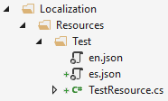

```json
//[doc-seo]
{
    "Description": "Learn how to effectively use ABP's localization system, enhancing your applications with features from Microsoft.Extensions.Localization."
}
```

# Localization

ABP's localization system is seamlessly integrated to the `Microsoft.Extensions.Localization` package and compatible with the [Microsoft's localization documentation](https://docs.microsoft.com/en-us/aspnet/core/fundamentals/localization). It adds some useful features and enhancements to make it easier to use in real life application scenarios.

## Installation

> This package is already installed by default with the startup template. So, most of the time, you don't need to install it manually.

You can use the [ABP CLI](../../cli) to install the Volo.Abp.Localization package to your project. Execute the following command in the folder of the .csproj file that you want to install the package on:

```bash
abp add-package Volo.Abp.Localization
```

> If you haven't done it yet, you first need to install the [ABP CLI](../../cli). For other installation options, see [the package description page](https://abp.io/package-detail/Volo.Abp.Localization).

Then you can add **AbpLocalizationModule** dependency to your module:

```c#
using Volo.Abp.Modularity;
using Volo.Abp.Localization;

namespace MyCompany.MyProject
{
    [DependsOn(typeof(AbpLocalizationModule))]
    public class MyModule : AbpModule
    {
        //...
    }
}
```

## Creating A Localization Resource

A localization resource is used to group related localization strings together and separate them from other localization strings of the application. A [module](../architecture/modularity/basics.md) generally defines its own localization resource. Localization resource is just a plain class. Example:

````C#
public class TestResource
{
}
````

Then it should be added using `AbpLocalizationOptions` as shown below:

````C#
[DependsOn(typeof(AbpLocalizationModule))]
public class MyModule : AbpModule
{
    public override void ConfigureServices(ServiceConfigurationContext context)
    {
        Configure<AbpVirtualFileSystemOptions>(options =>
        {
            // "YourRootNameSpace" is the root namespace of your project. It can be empty if your root namespace is empty.
            options.FileSets.AddEmbedded<MyModule>("YourRootNameSpace");
        });

        Configure<AbpLocalizationOptions>(options =>
        {
            //Define a new localization resource (TestResource)
            options.Resources
                .Add<TestResource>("en")
                .AddVirtualJson("/Localization/Resources/Test");
        });
    }
}
````

In this example;

* Added a new localization resource with "en" (English) as the default culture.
* Used JSON files to store the localization strings.
* JSON files are embedded into the assembly using `AbpVirtualFileSystemOptions` (see [virtual file system](../infrastructure/virtual-file-system.md)).

JSON files are located under "/Localization/Resources/Test" project folder as shown below:



A JSON localization file content is shown below:

````json
{
  "culture": "en",
  "texts": {
    "HelloWorld": "Hello World!"
  }
}
````

* Every localization file should define the `culture` code for the file (like "en" or "en-US").
* `texts` section just contains key-value collection of the localization strings (keys may have spaces too).

> ABP will ignore (skip) the JSON file if the `culture` section is missing.

You can also use nesting or array in localization files, like this:

````json
{
  "culture": "en",
  "texts": {
    "HelloWorld": "Hello World!",
    "Hello": {
        "World": "Hello World!"
    },
    "Hi": [
      "Bye World!",
      "Hello World!"
    ]
  }
}
````

Then you can use it like this:

> The double underscore (`__`) is used to separate the parent key from the child key.

````csharp
var str = L["Hello__World"]; // Hello World!
var str2 = L["Hi__0"]; // Bye World!
var str3 = L["Hi__1"]; // Hello World!
````

You can have more than one localization file with the same culture: files will be merged. This is useful for large modules where splitting translations by feature keeps each file manageable.

**Example file structure:**

```
Localization/
└── MyResource/
    ├── en.json            ← base / shared strings
    ├── en_Authors.json    ← Author feature strings
    ├── en_Books.json      ← Book feature strings
    └── en_Users.json      ← User feature strings
```

Files are sorted by name (ordinal order) before merging, so the effective merge order is `en.json` → `en_Authors.json` → `en_Books.json` → `en_Users.json`.

```
en.json            en_Authors.json    en_Books.json
┌─────────────────┐ ┌───────────────┐ ┌──────────────────┐
│ DisplayName=Name│ │ Author.Id=Id  │ │ Book.Id=ISBN     │
│ SaveButton=Save │ │ Author.Bio=.. │ │ Book.Title=Title │
└─────────────────┘ └───────────────┘ └──────────────────┘
         │                  │                  │
         └──────────────────┴──────────────────┘
                            │ merge (later file wins on duplicate keys)
                            ▼
                 ┌────────────────────┐
                 │ DisplayName = Name │
                 │ SaveButton  = Save │
                 │ Author.Id   = Id   │
                 │ Author.Bio  = ...  │
                 │ Book.Id     = ISBN │
                 │ Book.Title  = Title│
                 └────────────────────┘
```

> Note: If the same key is defined in multiple files, the value from the last file (in sort order) wins.

### Default Resource

`AbpLocalizationOptions.DefaultResourceType` can be set to a resource type, so it is used when the localization resource was not specified:

````csharp
Configure<AbpLocalizationOptions>(options =>
{
    options.DefaultResourceType = typeof(TestResource);
});
````

> The [application startup template](../../solution-templates/layered-web-application) sets `DefaultResourceType` to the localization resource of the application.

### Short Localization Resource Name

Localization resources are also available in the client (JavaScript) side. So, setting a short name for the localization resource makes it easy to use localization texts. Example:

````C#
[LocalizationResourceName("Test")]
public class TestResource
{
}
````

See the Getting Localized Test / Client Side section below.

### Non-Typed Resources

Most localization resources are represented by a class, which allows you to inject `IStringLocalizer<TResource>`. You can also register a resource by name without creating a resource class. This is useful when a resource is identified only by its name. An external localization store can also return a non-typed resource for a resource name discovered at runtime.

````csharp
Configure<AbpLocalizationOptions>(options =>
{
    options.Resources
        .Add("CountryNames", "en")
        .AddVirtualJson("/Localization/Resources/CountryNames");
});
````

Use `IStringLocalizerFactory` to access a non-typed resource, as described in the *Creating A Localizer By Resource Name* section below.

### Inherit From Other Resources

A resource can inherit from other resources which makes possible to re-use existing localization strings without referring the existing resource. Example:

````C#
[InheritResource(typeof(AbpValidationResource))]
public class TestResource
{
}
````

Alternative inheritance by configuring the `AbpLocalizationOptions`:

````C#
services.Configure<AbpLocalizationOptions>(options =>
{
    options.Resources
        .Add<TestResource>("en") //Define the resource by "en" default culture
        .AddVirtualJson("/Localization/Resources/Test") //Add strings from virtual json files
        .AddBaseTypes(typeof(AbpValidationResource)); //Inherit from an existing resource
});
````

* A resource may inherit from multiple resources.
* If the new resource defines the same localized string, it overrides the string.

A resource can also inherit from a typed or non-typed resource by its resource name:

````csharp
Configure<AbpLocalizationOptions>(options =>
{
    options.Resources
        .Add<TestResource>("en")
        .AddVirtualJson("/Localization/Resources/Test")
        .AddBaseResources("CountryNames");
});
````

### Extending Existing Resource

Inheriting from a resource creates a new resource without modifying the existing one. In some cases, you may want to not create a new resource but directly extend an existing resource. Example:

````C#
services.Configure<AbpLocalizationOptions>(options =>
{
    options.Resources
        .Get<TestResource>()
        .AddVirtualJson("/Localization/Resources/Test/Extensions");
});
````

* If an extension file defines the same localized string, it overrides the string.

### Culture Fallback

ABP searches for a localized string in the following order:

1. The requested culture of the current resource, such as `en-US`.
2. The base culture, such as `en`, when `TryToGetFromBaseCulture` is enabled.
3. The default culture configured for the resource when `TryToGetFromDefaultCulture` is enabled.
4. The inherited resources, in their configured order. Each inherited resource applies the same culture fallback rules.
5. The localization key itself, returned with `ResourceNotFound` set to `true`.

Both fallback options are enabled by default. You can disable them independently:

````csharp
Configure<AbpLocalizationOptions>(options =>
{
    options.TryToGetFromBaseCulture = false;
    options.TryToGetFromDefaultCulture = false;
});
````

### Global Resource Contributors

`AbpLocalizationOptions.GlobalContributors` adds an `ILocalizationResourceContributor` implementation to every localization resource:

````csharp
Configure<AbpLocalizationOptions>(options =>
{
    options.GlobalContributors.Add<MyLocalizationResourceContributor>();
});
````

The contributor type must have a parameterless constructor. Its `Initialize` method receives a `LocalizationResourceInitializationContext`, which provides the resource and the application service provider.

Contributors are order-sensitive. A lookup starts with the last registered contributor, so a later contributor overrides an earlier contributor when both provide the same key. Global contributors are appended after contributors configured directly on a resource.

### External Localization Stores

Replace `IExternalLocalizationStore` when localization resources need to be discovered at runtime or loaded from an external system. The default `NullExternalLocalizationStore` does not provide any resources.

The string localizer factory first searches the resources registered in `AbpLocalizationOptions.Resources`. If it cannot find the requested resource name, it queries `IExternalLocalizationStore`. The store exposes synchronous and asynchronous methods for retrieving a resource by name, and asynchronous methods for enumerating resource names and resources.

The factory caches the localizer after it resolves a resource name. Changing the resource object returned by the store does not make the factory resolve that name again. Use dynamic contributors when the localization values themselves need to change while the application is running.

Use the standard [dependency injection service replacement](dependency-injection.md#replace-a-service) mechanism to replace the default implementation.

## Getting the Localized Texts

Getting the localized text is pretty standard.

### Simplest Usage In A Class

Just inject the `IStringLocalizer<TResource>` service and use it like shown below:

````csharp
public class MyService : ITransientDependency
{
    private readonly IStringLocalizer<TestResource> _localizer;

    public MyService(IStringLocalizer<TestResource> localizer)
    {
        _localizer = localizer;
    }

    public void Foo()
    {
        var str = _localizer["HelloWorld"];
    }
}
````

### Creating A Localizer By Resource Name

Use `IStringLocalizerFactory` when the resource type is not available or the resource is registered by name:

````csharp
public class MyService : ITransientDependency
{
    private readonly IStringLocalizerFactory _localizerFactory;

    public MyService(IStringLocalizerFactory localizerFactory)
    {
        _localizerFactory = localizerFactory;
    }

    public string GetCountryName()
    {
        var localizer = _localizerFactory.CreateByResourceName("CountryNames");
        return localizer["USA"];
    }
}
````

`CreateByResourceName` throws an `AbpException` when the resource cannot be found. Use `CreateByResourceNameOrNull` when a missing resource is expected. `CreateByResourceNameAsync` and `CreateByResourceNameOrNullAsync` are available for external stores that load resources asynchronously.

### Serializing Localizable Strings

Use `ILocalizableStringSerializer` when an `ILocalizableString` needs to be stored as a string and reconstructed later:

````csharp
var serialized = localizableStringSerializer.Serialize(
    LocalizableString.Create<TestResource>("HelloWorld")
);

var localizableString = localizableStringSerializer.Deserialize(serialized!);
````

The default serializer uses `L:<resource-name>,<key>` for `LocalizableString` and `F:<value>` for `FixedLocalizableString`. A value without a recognized prefix is deserialized as a `FixedLocalizableString`; values too short to carry both a prefix and content (like the literal `L:`) are treated the same way. An `L:` value without a comma or with an empty or whitespace-only key throws an `AbpException`. Serializing `null` returns `null`; serializing another `ILocalizableString` implementation throws an `AbpException`.

### Format Arguments

Format arguments can be passed after the localization key. If your message is `Hello {0}, welcome!`, then you can pass the `{0}` argument to the localizer like `_localizer["HelloMessage", "John"]`.

> Refer to the [Microsoft's localization documentation](https://docs.microsoft.com/en-us/aspnet/core/fundamentals/localization) for details about using the localization.

### Getting All Localization Strings

The standard `GetAllStrings(includeParentCultures)` method can include values from the resource's default and base cultures. ABP also provides an overload to control inherited resources and dynamic contributors independently:

````csharp
var strings = localizer.GetAllStrings(
    includeParentCultures: true,
    includeBaseLocalizers: true,
    includeDynamicContributors: false
);
````

* `includeParentCultures` includes values from the resource's default culture and the base culture of the current UI culture. Values from the current UI culture override them.
* `includeBaseLocalizers` includes strings from inherited resources. Values from the current resource override inherited values.
* `includeDynamicContributors` includes contributors whose `IsDynamic` property is `true`.

`includeParentCultures` controls this bulk enumeration independently of `TryToGetFromBaseCulture` and `TryToGetFromDefaultCulture`, which control single-string lookups.

Use `GetAllStringsAsync` with the same flags when a contributor retrieves strings asynchronously.

### Using In A Razor View/Page

Use `IHtmlLocalizer<T>` in razor views/pages;

````c#
@inject IHtmlLocalizer<TestResource> Localizer

<h1>@Localizer["HelloWorld"]</h1>
````

### Special Base Classes

Some ABP base classes provide a `L` property to use the localizer even easier.

**Example: Localize a text in an application service method**

```csharp
using System.Threading.Tasks;
using MyProject.Localization;
using Volo.Abp.Application.Services;

namespace MyProject
{
    public class TestAppService : ApplicationService
    {
        public TestAppService()
        {
            LocalizationResource = typeof(MyProjectResource);
        }

        public async Task DoIt()
        {
            var str = L["HelloWorld"];
        }
    }
}
```

When you set the `LocalizationResource` in the constructor, the `ApplicationService` class uses that resource type when you use the `L` property, just like in the `DoIt()` method.

Setting `LocalizationResource` in every application service can be tedious. You can create an abstract base application service class, set it there and derive your application services from that base class. This is already implemented when you create a new project with the [startup templates](../../solution-templates/layered-web-application). So, you can simply inherit from the base class directly use the `L` property:

```csharp
using System.Threading.Tasks;

namespace MyProject
{
    public class TestAppService : MyProjectAppService
    {
        public async Task DoIt()
        {
            var str = L["HelloWorld"];
        }
    }
}
```

The `L` property is also available for some other base classes like `AbpController` and `AbpPageModel`.

## Supported Languages

You can configure the `AbpLocalizationOptions`'s `Languages` property to add the languages supported by the application. The template already sets common languages, but you can add new languages as shown below:

```csharp
Configure<AbpLocalizationOptions>(options =>
{
    options.Languages.Add(new LanguageInfo("uz", "uz", "Uzbek"));
});
```

### Mapping Culture Names For Client Packages

Client libraries sometimes use a culture name or localization file name that differs from the application's culture name. Use `AddLanguagesMapOrUpdate` to map the culture passed to a package, and `AddLanguageFilesMapOrUpdate` to map the package's localization file name:

```csharp
Configure<AbpLocalizationOptions>(options =>
{
    options.AddLanguagesMapOrUpdate(
        "MyClientPackage",
        new NameValue("zh-Hans", "zh-CN")
    );

    options.AddLanguageFilesMapOrUpdate(
        "MyClientPackage",
        new NameValue("zh-Hans", "zh-CN")
    );
});
```

Mappings are scoped by package name. When a mapping is not defined, ABP uses the original culture name.

The `NameValue` name is the application culture and its value is the culture or file name expected by the client package. Use the package's own package-name constant when it provides one.

## URL-Based Localization

ABP supports embedding the culture code directly in the URL path (e.g. `/en/products`, `/zh-Hans/about`), which is useful for SEO-friendly and shareable localized URLs. See the [URL-Based Localization](./url-based-localization.md) document for details.

## The Client Side

See the following documents to learn how to reuse the same localization texts in the JavaScript side;

* [Localization for the MVC / Razor Pages UI](../ui/mvc-razor-pages/javascript-api/localization)
* [Localization for the Blazor UI](../ui/blazor/localization.md)
* [Localization for the Angular UI](../ui/angular/localization.md)
* [Video tutorial](https://abp.io/video-courses/essentials/localization)
