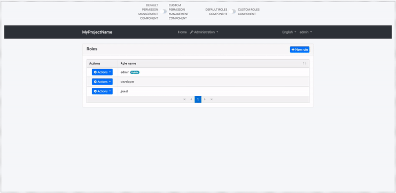
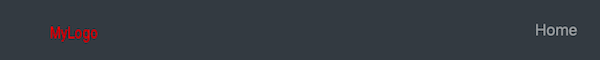
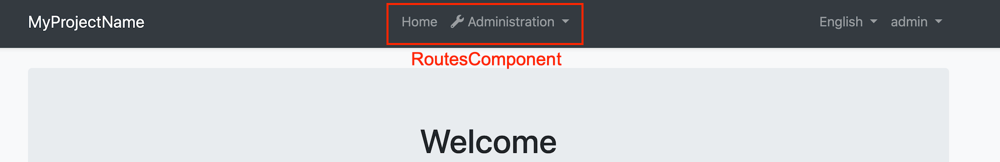
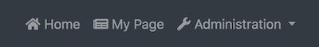
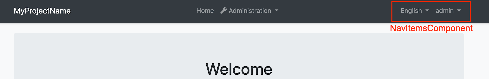

# Component Replacement

You can replace some ABP components with your custom components.

The reason that you **can replace** but **cannot customize** default ABP components is disabling or changing a part of that component can cause problems. So we named those components as _Replaceable Components_.

## How to Replace a Component

Create a new component that you want to use instead of an ABP component. Add that component to `declarations` and `entryComponents` in the `AppModule`.

Then, open the `app.component.ts` and execute the `add` method of `ReplaceableComponentsService` to replace your component with an ABP component as shown below:

```js
import { ReplaceableComponentsService } from '@abp/ng.core'; // imported ReplaceableComponentsService
import { eIdentityComponents } from '@abp/ng.identity'; // imported eIdentityComponents enum
//...

@Component(/* component metadata */)
export class AppComponent {
  constructor(
    private replaceableComponents: ReplaceableComponentsService, // injected the service
  ) {
    this.replaceableComponents.add({
      component: YourNewRoleComponent,
      key: eIdentityComponents.Roles,
    });
  }
}
```



## How to Replace a Layout

Each ABP theme module has 3 layouts named `ApplicationLayoutComponent`, `AccountLayoutComponent`, `EmptyLayoutComponent`. These layouts can be replaced the same way.

> A layout component template should contain `<router-outlet></router-outlet>` element.

The example below describes how to replace the `ApplicationLayoutComponent`:

Run the following command to generate a layout in `angular` folder:

```bash
yarn ng generate component my-application-layout
```

Add the following code in your layout template (`my-application-layout.component.html`) where you want the page to be loaded.

```html
<router-outlet></router-outlet>
```

Open `app.component.ts` in `src/app` folder and modify it as shown below:

```js
import { ReplaceableComponentsService } from '@abp/ng.core'; // imported ReplaceableComponentsService
import { eThemeBasicComponents } from '@abp/ng.theme.basic'; // imported eThemeBasicComponents enum for component keys
import { MyApplicationLayoutComponent } from './my-application-layout/my-application-layout.component'; // imported MyApplicationLayoutComponent

@Component(/* component metadata */)
export class AppComponent {
  constructor(
    private replaceableComponents: ReplaceableComponentsService, // injected the service
  ) {
    this.replaceableComponents.add({
      component: MyApplicationLayoutComponent,
      key: eThemeBasicComponents.ApplicationLayout,
    });
  }
}
```

> If you like to replace a layout component at runtime (e.g: changing the layout by pressing a button), pass the second parameter of the `add` method of `ReplaceableComponentsService` as true. DynamicLayoutComponent loads content using a router-outlet. When the second parameter of the `add` method is true, the route will be refreshed, so use it with caution. Your component state will be gone and any initiation logic (including HTTP requests) will be repeated.

### Layout Components


### How to Add a New Layout Component

To add a new layout component, you need to follow these steps:

#### Step 1: Create a New Angular Component

This component should have a 'router-outlet' for dynamic content loading. You can create a new component using the Angular CLI. Run the following command in your terminal:

```bash
ng generate component new-layout
```

This command will create a new component named `new-layout`. Now, open the new-layout.component.html file and add a `router-outlet` to it:

```html
<router-outlet></router-outlet>
```

This 'router-outlet' will act as a placeholder that Angular dynamically fills based on the current router state.

note: (don't forget: you should add the app in the app.module.ts file)

#### Step 2: Define a Variable for the Layout Component

Although this step is optional, it can be useful if you're going to use the layout component's value multiple times. You can define a variable for the layout component like this:

```javascript
export const eCustomLayout = {
  key: "CustomLayout",
  component: "CustomLayoutComponent",
};
```

In this variable, `key` is a unique identifier for the layout component, and `component` is the name of the layout component.
You can use this variable when you need to refer to the layout component.

#### Step 3: Add the Layout Component to the ABP Replaceable-System

Next, you need to add the new layout component to the `ReplaceableComponentsService`. This service allows you to replace a component with another one dynamically.

You can do this by defining a provider for `APP_INITIALIZER` that uses a factory function. In this function, you inject the `ReplaceableComponentsService` and use its `add` method to add the new layout component.

Here's how you can do it:

```javascript
export const CUSTOM_LAYOUT_PROVIDERS = [
  {
    provide: APP_INITIALIZER,
    useFactory: configureLayoutFn,
    deps: [ReplaceableComponentsService],
    multi: true,
  },
];
function configureLayoutFn() {
  const service = inject(ReplaceableComponentsService);
  return () => {
    service.add({
      key: eCustomLayout.component,
      component: CustomLayoutComponent,
    });
  };
}
```

In this code, `configureLayoutFn` is a factory function that adds the new layout component to the `ReplaceableComponentsService`. The `APP_INITIALIZER` provider runs this function when the application starts.

note: (don't forget: you should add the CUSTOM_LAYOUT_PROVIDERS in the app.module.ts file)

#### Step 4: Define the Application's Dynamic Layouts

Finally, you need to define the application's dynamic layouts. This is a map where the keys are the layout keys and the values are the layout components.

You can add the new layout to the existing layouts like this:

```javascript
export const myDynamicLayouts = new Map<string, string>([...DEFAULT_DYNAMIC_LAYOUTS, [eCustomLayout.key, eCustomLayout.component]]);
```

#### Step 5: Pass the Dynamic Layouts to the CoreModule

The final step is to pass the dynamic layouts to the `provideAbpCore` using the `withOptions` method. This method allows you to configure the module with a static method.

Here's how you can do it:

```ts
@NgModule({
  providers: [
    // ...
    provideAbpCore(
      withOptions({
        dynamicLayouts: myDynamicLayouts,
        environment,
        registerLocaleFn: registerLocale(),
      }),
    ),
  ],
})
export class AppModule {}
```

In this code, `myDynamicLayouts` is the map of dynamic layouts you defined earlier. We pass this map to the `provideAbpCore` using the `withOptions` method.

Now that you have defined the new layout, you can use it in the router definition. You do this by adding a new route that uses the new layout.

Here's how you can do it:

```javascript
// route.provider.ts
import { eCustomLayout } from './custom-layout/custom-layout.provider';
import { RoutesService, eLayoutType } from '@abp/ng.core';
import { APP_INITIALIZER } from '@angular/core';

export const APP_ROUTE_PROVIDER = [
  { provide: APP_INITIALIZER, useFactory: configureRoutes, deps: [RoutesService], multi: true },
];

function configureRoutes(routes: RoutesService) {
  return () => {
    routes.add([
      {
        path: '/',
        name: '::Menu:Home',
        iconClass: 'fas fa-home',
        order: 1,
        layout: eLayoutType.application,
      },
      {
        path: '/dashboard',
        name: '::Menu:Dashboard',
        iconClass: 'fas fa-chart-line',
        order: 2,
        layout: eCustomLayout.key as eLayoutType,
        requiredPolicy: 'MyProjectName.Dashboard.Host  || MyProjectName.Dashboard.Tenant',
      },
    ]);
  };
}
```

#### How to Replace LogoComponent


Run the following command in `angular` folder to create a new component called `LogoComponent`.

```bash
yarn ng generate component logo --inlineTemplate --inlineStyle
```

Open the generated `logo.component.ts` in `src/app/logo` folder and replace its content with the following:

```js
import { Component } from "@angular/core";

@Component({
  selector: "app-logo",
  template: `
    <a class="navbar-brand" routerLink="/">
      <!-- Change the img src -->
      
    </a>
  `,
})
export class LogoComponent {}
```

Open `app.component.ts` in `src/app` folder and modify it as shown below:

```js
import { ..., ReplaceableComponentsService } from '@abp/ng.core'; // imported ReplaceableComponentsService
import { LogoComponent } from './logo/logo.component'; // imported LogoComponent
import { eThemeBasicComponents } from '@abp/ng.theme.basic'; // imported eThemeBasicComponents
//...

@Component(/* component metadata */)
export class AppComponent implements OnInit {
  constructor(..., private replaceableComponents: ReplaceableComponentsService) {} // injected ReplaceableComponentsService

  ngOnInit() {
    //...

    this.replaceableComponents.add({
        component: LogoComponent,
        key: eThemeBasicComponents.Logo,
      });
  }
}
```

The final UI looks like below:



#### How to Replace RoutesComponent



Run the following command in `angular` folder to create a new component called `RoutesComponent`.

```bash
yarn ng generate component routes
```

Open the generated `routes.component.ts` in `src/app/routes` folder and replace its content with the following:

```js
import { Component, HostBinding } from "@angular/core";

@Component({
  selector: "app-routes",
  templateUrl: "routes.component.html",
})
export class RoutesComponent {
  @HostBinding("class.mx-auto")
  marginAuto = true;

  get smallScreen() {
    return window.innerWidth < 992;
  }
}
```

Import the `SharedModule` to the `imports` array of `AppModule`:

```js
// app.module.ts

import { SharedModule } from './shared/shared.module';

@NgModule({
  imports: [
    //...
    SharedModule
  ]
)}
```

Open the generated `routes.component.html` in `src/app/routes` folder and replace its content with the following:

```html
<ul class="navbar-nav">
  <li class="nav-item">
    <a class="nav-link" routerLink="/"
      ><i class="fas fa-home"></i> </a
    >
  </li>
  <li class="nav-item">
    <a class="nav-link" routerLink="/my-page"
      ><i class="fas fa-newspaper mr-1"></i>My Page</a
    >
  </li>
  <li
    #navbarRootDropdown
    [abpVisibility]="routeContainer"
    class="nav-item dropdown"
    display="static"
    (click)="
      navbarRootDropdown.expand
        ? (navbarRootDropdown.expand = false)
        : (navbarRootDropdown.expand = true)
    "
  >
    <a
      class="nav-link dropdown-toggle"
      data-toggle="dropdown"
      href="javascript:void(0)"
    >
      <i class="fas fa-wrench"></i>
      
    </a>
    <div
      #routeContainer
      class="dropdown-menu border-0 shadow-sm"
      (click)="$event.preventDefault(); $event.stopPropagation()"
      [class.d-block]="smallScreen && navbarRootDropdown.expand"
    >
      <div
        class="dropdown-submenu"
        ngbDropdown
        #dropdownSubmenu="ngbDropdown"
        placement="right-top"
        [autoClose]="true"
        *abpPermission="'AbpIdentity.Roles || AbpIdentity.Users'"
      >
        <div ngbDropdownToggle [class.dropdown-toggle]="false">
          <a
            abpEllipsis="210px"
            [abpEllipsisEnabled]="!smallScreen"
            role="button"
            class="btn d-block text-start dropdown-toggle"
          >
            <i class="fa fa-id-card-o"></i>
            
          </a>
        </div>
        <div
          #childrenContainer
          class="dropdown-menu border-0 shadow-sm"
          [class.d-block]="smallScreen && dropdownSubmenu.isOpen()"
        >
          <div class="dropdown-submenu" *abpPermission="'AbpIdentity.Roles'">
            <a class="dropdown-item" routerLink="/identity/roles">
              </a
            >
          </div>
          <div class="dropdown-submenu" *abpPermission="'AbpIdentity.Users'">
            <a class="dropdown-item" routerLink="/identity/users">
              </a
            >
          </div>
        </div>
      </div>

      <div
        class="dropdown-submenu"
        ngbDropdown
        #dropdownSubmenu="ngbDropdown"
        placement="right-top"
        [autoClose]="true"
        *abpPermission="'AbpTenantManagement.Tenants'"
      >
        <div ngbDropdownToggle [class.dropdown-toggle]="false">
          <a
            abpEllipsis="210px"
            [abpEllipsisEnabled]="!smallScreen"
            role="button"
            class="btn d-block text-start dropdown-toggle"
          >
            <i class="fa fa-users"></i>
            
          </a>
        </div>
        <div
          #childrenContainer
          class="dropdown-menu border-0 shadow-sm"
          [class.d-block]="smallScreen && dropdownSubmenu.isOpen()"
        >
          <div
            class="dropdown-submenu"
            *abpPermission="'AbpTenantManagement.Tenants'"
          >
            <a class="dropdown-item" routerLink="/tenant-management/tenants">
              </a
            >
          </div>
        </div>
      </div>
    </div>
  </li>
</ul>
```

Open `app.component.ts` in `src/app` folder and modify it as shown below:

```js
import { ..., ReplaceableComponentsService } from '@abp/ng.core'; // imported ReplaceableComponentsService
import { RoutesComponent } from './routes/routes.component'; // imported RoutesComponent
import { eThemeBasicComponents } from '@abp/ng.theme.basic'; // imported eThemeBasicComponents
//...

@Component(/* component metadata */)
export class AppComponent implements OnInit {
  constructor(..., private replaceableComponents: ReplaceableComponentsService) {} // injected ReplaceableComponentsService

  ngOnInit() {
    //...

    this.replaceableComponents.add({
        component: RoutesComponent,
        key: eThemeBasicComponents.Routes,
      });
  }
}
```

The final UI looks like below:



#### How to Replace NavItemsComponent



Run the following command in `angular` folder to create a new component called `NavItemsComponent`.

```bash
yarn ng generate component nav-items
```

Open the generated `nav-items.component.ts` in `src/app/nav-items` folder and replace the content with the following:

```js
import {
  AuthService,
  ConfigStateService,
  CurrentUserDto,
  LanguageInfo,
  NAVIGATE_TO_MANAGE_PROFILE,
  SessionStateService,
} from '@abp/ng.core';
import { Component, Inject } from '@angular/core';
import { Observable } from 'rxjs';
import { map } from 'rxjs/operators';
import snq from 'snq';

@Component({
  selector: 'app-nav-items',
  templateUrl: 'nav-items.component.html',
})
export class NavItemsComponent {
  currentUser$: Observable<CurrentUserDto> = this.configState.getOne$('currentUser');
  selectedTenant$ = this.sessionState.getTenant$();

  languages$: Observable<LanguageInfo[]> = this.configState.getDeep$('localization.languages');

  get smallScreen(): boolean {
    return window.innerWidth < 992;
  }

  get defaultLanguage$(): Observable<string> {
    return this.languages$.pipe(
      map(
        languages =>
          snq(
            () => languages.find(lang => lang.cultureName === this.selectedLangCulture).displayName
          ),
        ''
      )
    );
  }

  get dropdownLanguages$(): Observable<LanguageInfo[]> {
    return this.languages$.pipe(
      map(
        languages =>
          snq(() => languages.filter(lang => lang.cultureName !== this.selectedLangCulture)),
        []
      )
    );
  }

  get selectedLangCulture(): string {
    return this.sessionState.getLanguage();
  }

  constructor(
    @Inject(NAVIGATE_TO_MANAGE_PROFILE) public navigateToManageProfile,
    private configState: ConfigStateService,
    private authService: AuthService,
    private sessionState: SessionStateService
  ) {}

  onChangeLang(cultureName: string) {
    this.sessionState.setLanguage(cultureName);
  }

  navigateToLogin() {
    this.authService.navigateToLogin();
  }

  logout() {
    this.authService.logout().subscribe();
  }
}
```

Import the `SharedModule` to the `imports` array of `AppModule`:

```js
// app.module.ts

import { SharedModule } from './shared/shared.module';

@NgModule({
  imports: [
    //...
    SharedModule
  ]
)}
```

Open the generated `nav-items.component.html` in `src/app/nav-items` folder and replace the content with the following:

```html
<ul class="navbar-nav">
  <input
    type="search"
    placeholder="Search"
    class="bg-transparent border-0 text-white"
  />
  <li class="nav-item d-flex align-items-center">
    <div
      *ngIf="(dropdownLanguages$ | async)?.length > 0"
      class="dropdown"
      ngbDropdown
      #languageDropdown="ngbDropdown"
      display="static"
    >
      <a
        ngbDropdownToggle
        class="nav-link"
        href="javascript:void(0)"
        role="button"
        id="dropdownMenuLink"
        data-toggle="dropdown"
        aria-haspopup="true"
        aria-expanded="false"
      >
        
      </a>
      <div
        class="dropdown-menu dropdown-menu-right border-0 shadow-sm"
        aria-labelledby="dropdownMenuLink"
        [class.d-block]="smallScreen && languageDropdown.isOpen()"
      >
        <a
          *ngFor="let lang of dropdownLanguages$ | async"
          href="javascript:void(0)"
          class="dropdown-item"
          (click)="onChangeLang(lang.cultureName)"
          ></a
        >
      </div>
    </div>
  </li>
  <li class="nav-item d-flex align-items-center">
    <ng-template #loginBtn>
      <a role="button" class="nav-link pointer" (click)="navigateToLogin()"
        ></a
      >
    </ng-template>
    <div
      *ngIf="(currentUser$ | async)?.isAuthenticated; else loginBtn"
      ngbDropdown
      class="dropdown"
      #currentUserDropdown="ngbDropdown"
      display="static"
    >
      <a
        ngbDropdownToggle
        class="nav-link"
        href="javascript:void(0)"
        role="button"
        id="dropdownMenuLink"
        data-toggle="dropdown"
        aria-haspopup="true"
        aria-expanded="false"
      >
        <small *ngIf="(selectedTenant$ | async)?.name as tenantName"
          ><i></i>\</small
        >
        <strong></strong>
      </a>
      <div
        class="dropdown-menu dropdown-menu-right border-0 shadow-sm"
        aria-labelledby="dropdownMenuLink"
        [class.d-block]="smallScreen && currentUserDropdown.isOpen()"
      >
        <a class="dropdown-item pointer" (click)="navigateToManageProfile()"
          ><i class="fa fa-cog mr-1"></i></a
        >
        <a class="dropdown-item" href="javascript:void(0)" (click)="logout()"
          ><i class="fa fa-power-off mr-1"></i></a
        >
      </div>
    </div>
  </li>
</ul>
```

Open `app.component.ts` in `src/app` folder and modify it as shown below:

```js
import { ..., ReplaceableComponentsService } from '@abp/ng.core'; // imported ReplaceableComponentsService
import { NavItemsComponent } from './nav-items/nav-items.component'; // imported NavItemsComponent
import { eThemeBasicComponents } from '@abp/ng.theme.basic'; // imported eThemeBasicComponents
//...

@Component(/* component metadata */)
export class AppComponent implements OnInit {
  constructor(..., private replaceableComponents: ReplaceableComponentsService) {} // injected ReplaceableComponentsService

  ngOnInit() {
    //...

    this.replaceableComponents.add({
        component: NavItemsComponent,
        key: eThemeBasicComponents.NavItems,
      });
  }
}
```

The final UI looks like below:


## See Also

- [How Replaceable Components Work with Extensions](./how-replaceable-components-work-with-extensions.md)
- [How to Replace PermissionManagementComponent](./permission-management-component-replacement.md)
