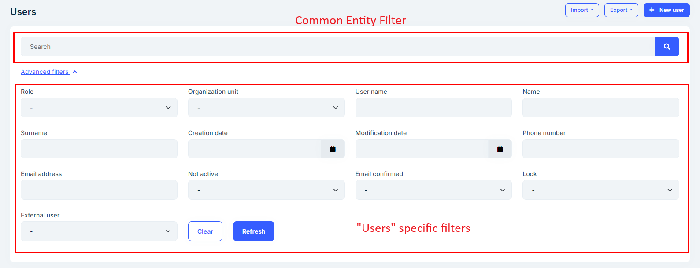
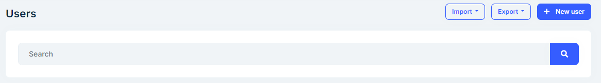
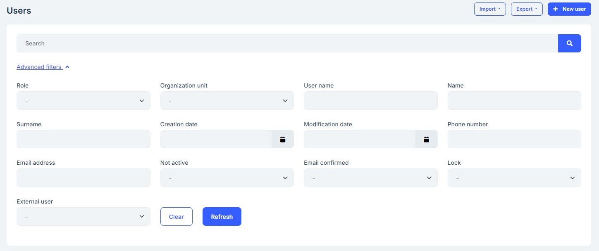
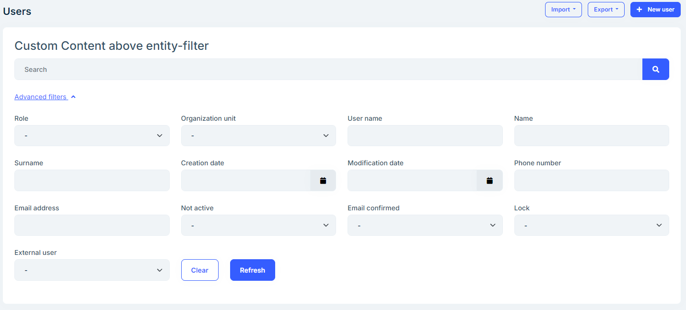

# Entity Filters

Every CRUD page includes some sort of inputs to filter the listed data. Some of the inputs are common among all of the entities like the `Search` box. In addition, every entity has its own advanced filters depending on its fields. To reduce the amount of code written on every CRUD page, the Angular UI of ABP Commercial introduces a new type of component called `abp-advanced-entity-filters`

## Setup

The components are in the _@volo/abp.commercial.ng.ui_ package, which is included in the ABP templates. So, as long as your project is a product of these templates and unless you delete the package, you have access to the entity filter components.
You can either import the `CommercialUiModule` which contains other components as well as `AdvancedEntityFilters` or you can directly import the `AdvancedEntityFiltersModule` if you do not need other components. Here is how you import them in your Angular module:

```javascript
import {
  CommercialUiModule,
  AdvancedEntityFiltersModule,
} from "@volo/abp.commercial.ng.ui";

@NgModule({
  imports: [
    // other imports
    CommercialUiModule,

    // OR

    AdvancedEntityFiltersModule,
  ],
  // rest of the module metadata
})
export class YourModule {}
```

## Usage

Let's take a look at the `Users` page from the `Identity` module.



As shown in the screenshot, `abp-advanced-entity-filters` usually contain two parts, an entity filter (common among entities), i.e. `abp-entity-filter`, and entity-specific filters which are encapsulated within the `abp-advanced-entity-filters-form` component.

`users.component.html`

```html
<abp-advanced-entity-filters [list]="list" localizationSourceName="AbpIdentity">
  <abp-advanced-entity-filters-form>
    <form #filterForm (keyup.enter)="list.get()">
      <div class="row">
        <!-- Form elements are omitted -->

        <div class="col-12 col-sm-auto align-self-end mb-3">
          <div class="row">
            <div class="col-6 col-sm-auto d-grid">
              <button
                type="button"
                class="btn btn-outline-primary"
                (click)="clearFilters()"
              >
                <span></span>
              </button>
            </div>
            <div class="col-6 col-sm-auto d-grid">
              <button
                type="button"
                class="btn btn-primary"
                (click)="list.get()"
              >
                <span></span>
              </button>
            </div>
          </div>
        </div>
      </div>
    </form>
  </abp-advanced-entity-filters-form>
</abp-advanced-entity-filters>
```

The `abp-advanced-entity-filters` already contains the `abp-entity-filter` component so you do not need to pass it. However, the `abp-entity-filter` component needs an instance of `ListService` which is usually stored in the `list` field of the page. You can also change the placeholder of the component via `entityFilterPlaceholder` input which is passed into the `abpLocalization` pipe so that it uses the translated text. Default is `'AbpUi::PagerSearch'`

E.g

```html
<abp-advanced-entity-filters
  [list]="list"
  entityFilterPlaceholder="AbpUi::PagerSearch"
>
  <!-- ... -->
</abp-advanced-entity-filters>
```

### Inputs

- `list`: an instance of `ListService`
- `entityFilterPlaceholder`: the placeholder of `abp-entity-filter` component. Default: `'AbpUi::PagerSearch'`
- `localizationSourceName`: the localization source of the current page. E.g: `AbpIdentity`

### Inner components

Some entities are simple and do not require any filter other than the `abp-entity-filter`. In this case, you can simply use the `abp-advanced-entity-filters` without anything in between.

E.g.

Let's remove `form` from the `Users` page

```html
<abp-advanced-entity-filters [list]="list" localizationSourceName="AbpIdentity">
</abp-advanced-entity-filters>
```



If your component needs other filters, you can pass your own `form` within the `abp-advanced-entity-filters-form` component. This will render your form as well as a toggle (`abp-advanced-entity-filters-toggle`) to show and hide the form

E.g.

```html
<abp-advanced-entity-filters [list]="list" localizationSourceName="AbpIdentity">
  <abp-advanced-entity-filters-form>
    <form>
      <!-- Content is omitted for sake of simplicity -->
    </form>
  </abp-advanced-entity-filters-form>
</abp-advanced-entity-filters>
```



Last but not least, if you need to render some content above the `abp-entity-filter` component, you can use the `abp-advanced-entity-filters-above-search`.

E.g.

```html
<abp-advanced-entity-filters [list]="list" localizationSourceName="AbpIdentity">
  <abp-advanced-entity-filters-above-search>
    <h3>Custom Content above entity-filter</h3>
  </abp-advanced-entity-filters-above-search>

  <abp-advanced-entity-filters-form>
    <form>
      <!-- Content is omitted for sake of simplicity -->
    </form>
  </abp-advanced-entity-filters-form>
</abp-advanced-entity-filters>
```


