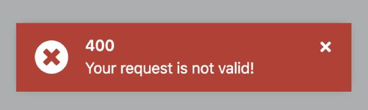

# HTTP Error Handling

### Error Configurations

ABP offers a configurations for errors handling like below

```ts
import { ThemeSharedModule } from '@abp/ng.theme.shared';
import { MyCustomRouteErrorComponent } from './my-custom-route.component';

@NgModule({
  imports: [
    ThemeSharedModule.forRoot({
      httpErrorConfig: {
        skipHandledErrorCodes: [403],
        errorScreen: {
          forWhichErrors: [404],
          component: CustomErrorComponent,
          hideCloseIcon: false
        }
      }
    }),
    ...
  ],
})
export class AppModule {}
```

- `ErrorScreenErrorCodes` the error codes that you can pass to `skipHandledErrorCodes` and `forWhichErrors`.
- `skipHandledErrorCodes` the error codes those you don't want to handle it.
- `errorScreen` the screen that you want to show when a route error occurs.
  - `component` component that you want to show.
  - `forWhichErrors` same as `ErrorScreenErrorCodes`
  - `hideCloseIcon` hides close icon in default ABP component.

## Custom HTTP Error Handler
When the `RestService` is used, all HTTP errors are reported to the [`HttpErrorReporterService`](./http-error-reporter-service.md), and then `ErrorHandler`, a service exposed by the `@abp/ng.theme.shared` package automatically handles the errors.

### Function Method `Deprecated`

A custom HTTP error handler can be registered to an injection token named `HTTP_ERROR_HANDLER`. If a custom handler function is registered, the `ErrorHandler` executes that function.

See an example:

```ts
// http-error-handler.ts
import { ContentProjectionService, PROJECTION_STRATEGY } from '@abp/ng.core';
import { ToasterService } from '@abp/ng.theme.shared';
import { HttpErrorResponse } from '@angular/common/http';
import { Injector } from '@angular/core';
import { of, EMPTY } from 'rxjs';
import { Error404Component } from './error404/error404.component';

export function handleHttpErrors(injector: Injector, httpError: HttpErrorResponse) {
  if (httpError.status === 400) {
    const toaster = injector.get(ToasterService);
    toaster.error(httpError.error?.error?.message || 'Bad request!', '400');
    return EMPTY;
  }

  if (httpError.status === 404) {
    const contentProjection = injector.get(ContentProjectionService);
    contentProjection.projectContent(PROJECTION_STRATEGY.AppendComponentToBody(Error404Component));
    return EMPTY;
  }

  return of(httpError);
}

// app.module.ts
import { Error404Component } from './error404/error404.component';
import { handleHttpErrors } from './http-error-handling';
import { HTTP_ERROR_HANDLER, ... } from '@abp/ng.theme.shared';

@NgModule({
  // ...
  providers: [
    // ...
    { provide: HTTP_ERROR_HANDLER, useValue: handleHttpErrors }
  ],
  declarations: [
   //...
   Error404Component],
})
export class AppModule {}
```

In the example above:

- Created a function named `handleHttpErrors` and defined as value of the `HTTP_ERROR_HANDLER` provider in app.module. After this, the function executes when an HTTP error occurs.
- 400 bad request errors is handled. When a 400 error occurs.

- Since `of(httpError)` is returned at bottom of the `handleHttpErrors`, the `ErrorHandler` will handle the HTTP errors except 400 and 404 errors.

**Note 1:** If you put `return EMPTY` to next line of handling an error, default error handling will not work for that error. [EMPTY](https://rxjs.dev/api/index/const/EMPTY) can be imported from `rxjs`.

```ts
export function handleHttpErrors(
  injector: Injector,
  httpError: HttpErrorResponse
) {
  if (httpError.status === 403) {
    // handle 403 errors here
    return EMPTY; // put return EMPTY to skip default error handling
  }
}
```

**Note 2:** If you put `return of(httpError)`, default error handling will work.

- `of` is a function. It can be imported from `rxjs`.
- `httpError` is the second parameter of the error handler function which is registered to the `HTTP_ERROR_HANDLER` provider. Type of the `httpError` is `HttpErrorResponse`.

```ts
import { of } from "rxjs";

export function handleHttpErrors(
  injector: Injector,
  httpError: HttpErrorResponse
) {
  if (httpError.status === 500) {
    // handle 500 errors here
  }

  // you can return the of(httpError) at bottom of the function to run the default handler of ABP for HTTP errors that you didn't handle above.
  return of(httpError);
}
```

### Service Method

You can provide **more than one handler** with services, a custom HTTP error handler service can be registered with injection token named **`CUSTOM_ERROR_HANDLERS`**. ABP has some default [error handlers](https://github.com/abpframework/abp/blob/dev/npm/ng-packs/packages/theme-shared/src/lib/providers/error-handlers.provider.ts).

### How To Add New Handler Service

ABP error handler services are implements the interface of **CustomHttpErrorHandlerService**.

**Interface of `CUSTOM_ERROR_HANDLERS`**

```ts
interface CustomHttpErrorHandlerService {
  readonly priority: number;
  canHandle(error: unknown): boolean;
  execute(): void;
}
```

- **`priority`** ABP sorts the services according to the number of the priority variable. Higher priority will be checked first.
- **`canHandle`** Check if the service can handle the error. Returns boolean.
- **`execute`** If the service can handle the error, then run the execute method.

**In Summary**

- Services are sorted by their priority number.
- Start from highest priority service and run canHandle() method. Pick the service if can handle the error, if not check next service.
- If the service found, run the execute method of a service. Done.

See an example:

```ts
// custom-error-handler.service.ts
import { inject, Injectable } from "@angular/core";
import { HttpErrorResponse } from "@angular/common/http";
import { CustomHttpErrorHandlerService } from "@abp/ng.theme.shared";
import { CUSTOM_HTTP_ERROR_HANDLER_PRIORITY } from "@abp/ng.theme.shared";
import { ToasterService } from "@abp/ng.theme.shared";

@Injectable({ providedIn: "root" })
export class MyCustomErrorHandlerService
  implements CustomHttpErrorHandlerService
{
  // You can write any number here, ex: 9999
  readonly priority = CUSTOM_HTTP_ERROR_HANDLER_PRIORITY.veryHigh;
  protected readonly toaster = inject(ToasterService);
  private error: HttpErrorResponse | undefined = undefined;

  // What kind of error should be handled by this service? You can decide it in this method. If error is suitable to your case then return true; otherwise return false.
  canHandle(error: unknown): boolean {
    if (error instanceof HttpErrorResponse && error.status === 400) {
      this.error = error;
      return true;
    }
    return false;
  }

  // If this service is picked from ErrorHandler, this execute method will be called.
  execute() {
    this.toaster.error(
      this.error.error?.error?.message || "Bad request!",
      "400"
    );
  }
}
```

```ts

// app.module.ts
import { CUSTOM_ERROR_HANDLERS, ... } from '@abp/ng.theme.shared';
import { MyCustomErrorHandlerService } from './custom-error-handler.service';

@NgModule({
  // ...
  providers: [
    // ...
    {
      provide: CUSTOM_ERROR_HANDLERS,
      useExisting: MyCustomErrorHandlerService,
      multi: true,
    }
  ]
})
export class AppModule {}
```

In the example above:

- Created a service named `MyCustomErrorHandlerService`, and provided via `useExisting` key because we dont want another instance of it. And set `multi` key to true because ABP default error handlers are also provided with **CUSTOM_ERROR_HANDLERS** injection token.

- 400 errors are handled from custom `MyCustomErrorHandlerService`. When a 400 error occurs, backend error message will be displayed as shown below:



### Notes

- If your service cannot handle the error. Then ABP will check the next Error Service.
- If none of the service handle the error. Then basic confirmation message about the error will be shown to the user.
- You can provide more than one service, with CUSTOM_ERROR_HANDLER injection token.
- If you want your custom service to be evaluated (checked) earlier, set the priority variable high.
