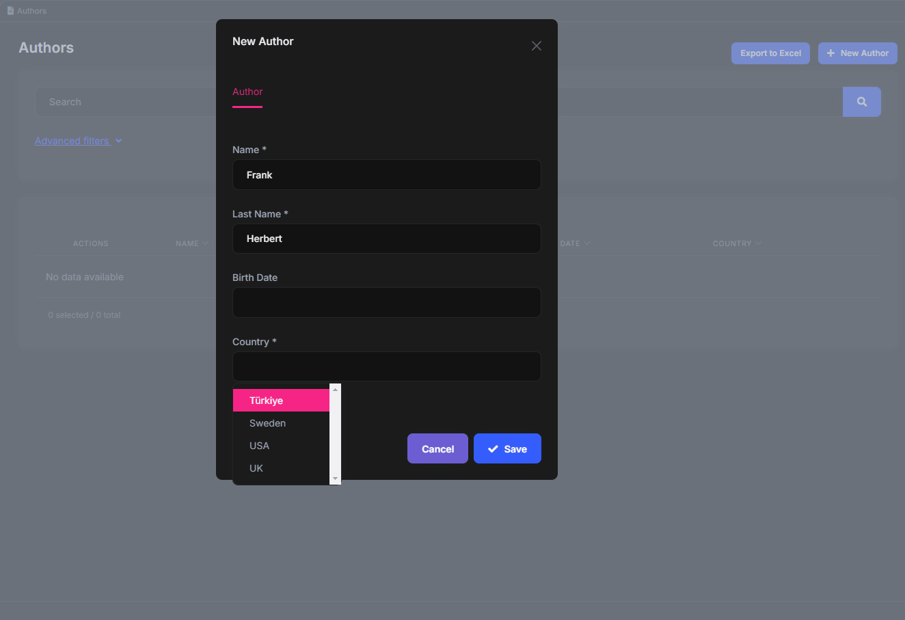
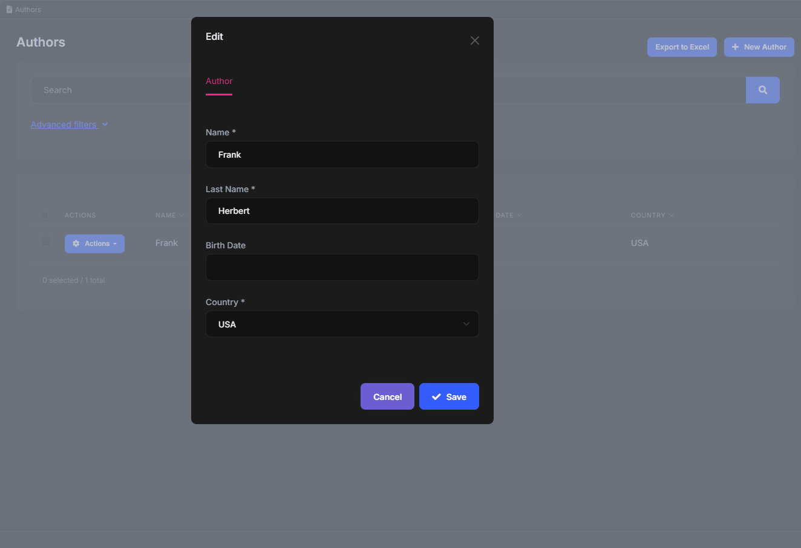

# Lookup Components

The Angular UI of ABP Commercial introduces some components with `abp-lookup-...` selector prefix. These components are used for retrieving relational entity data.

## Setup

The components are in the _@volo/abp.commercial.ng.ui_ package, which is included in the ABP templates. So, as long as your project is a product of these templates and unless you delete the package, you have access to the lookup components. Here is how you import them in your Angular module:

```javascript
import { CommercialUiModule } from '@volo/abp.commercial.ng.ui';

@NgModule({
  imports: [
    // other imports
    CommercialUiModule,
  ],
  // rest of the module metadata
})
export class YourModule {}
```

Now you can use the lookup components in your components declared by this module.

## Lookup HTTP Requests

The lookup requests are used by all lookup components to get the related entity records. Because of lexical this, _they must be arrow functions_.

```javascript
@Injectable({
  providedIn: 'root'
})
export class AuthorService {
  getCountryLookup = (input: LookupRequestDto) =>
    this.restService.request<any, PagedResultDto<LookupDto<string>>>({
      method: 'GET',
      url: '/api/app/authors/country-lookup',
      params: { filter: input.filter, skipCount: input.skipCount, maxResultCount: input.maxResultCount },
    },
    { apiName: this.apiName });

  // rest of the service is removed for brevity
}
```

## Lookup Typeahead Component

Typeahead is a good choice when you have an unknown number of records for the related entity or you want to improve the UX with a search ability. Although not the best scenario, the country picker below shows how the lookup typeahead works:



Here is how it is used in the template.

```html
<abp-lookup-typeahead
  cid="author-country-id"
  formControlName="countryId"
  displayNameProp="name"
  [editingData]="selected?.country"
  [getFn]="service.getCountryLookup"
></abp-lookup-typeahead>
```

The available properties are as follows:

- **cid:** The id of the form control (e.g. an input or a select element) inside the lookup component. Lets form controls respond to `<label>` events.
- **editingData:** The related entity data if a record is being updated.
- **displayNameProp:** The property of the updated record to use as a display name in the form control.
- **lookupNameProp:** The property of the entity to use as a display name in options. Should macth the lookup HTTP request interface. _(default: displayName)_
- **lookupIdProp:** The property of the entity to use as the unique key in options. Should macth the lookup HTTP request interface. _(default: id)_
- **maxResultCount:** The maximum number of options to display. _(default: 10)_
- **getFn:** A function to get the related entity records with HTTP requests. Because of lexical this, _it must be a an arrow function_.
- **disabled:** This property lets you disable/enable a lookup component. _(default: false)_.

## Lookup Select Component

Select is a good choice when you have a low (and usually fixed) number of records for the related entity and search is not necessary. The country picker below shows how the lookup select works:



Here is how it is used in the template.

```html
<abp-lookup-select
  cid="author-country-id"
  formControlName="countryId"
  displayNameProp="name"
  [getFn]="service.getCountryLookup"
></abp-lookup-select>
```

The available properties are as follows:

- **cid:** The id of the form control (e.g. an input or a select element) inside the lookup component. Lets form controls respond to `<label>` events.
- **displayNameProp:** The property of the updated record to use as a display name in the form control.
- **lookupNameProp:** The property of the entity to use as a display name in options. Should macth the lookup HTTP request interface. _(default: displayName)_
- **lookupIdProp:** The property of the entity to use as the unique key in options. Should macth the lookup HTTP request interface. _(default: id)_
- **getFn:** A function to get the related entity records with HTTP requests. Because of lexical this, _it must be a an arrow function_.
- **disabled:** This property lets you disable/enable a lookup component. _(default: false)_.
